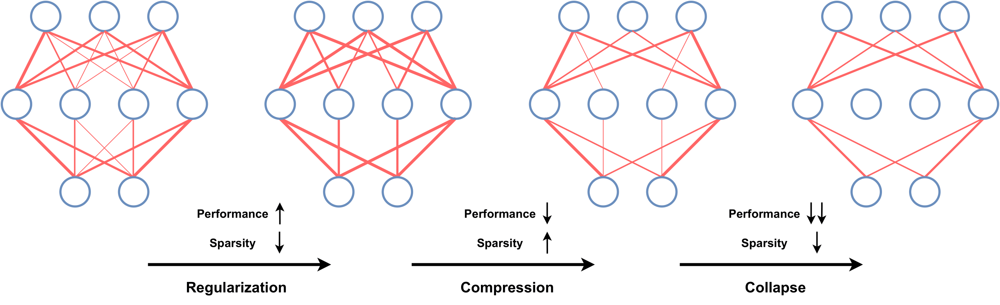
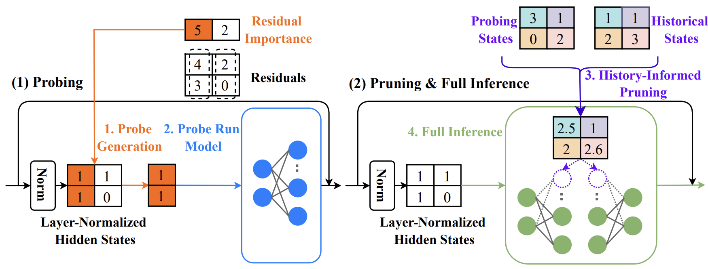

# 9. Efficient Deployment Strategies


Large Language Models (LLMs) are rapidly advancing in their ability to tackle human-centric tasks. Deploying these models in real-world tasks remains challenging due to the computational and memory demands for inference, especially with extensive contextual information. 


## Knowledge Distillation

Knowledge distillation is a technique where a smaller, simpler model (student) learns to replicate the behavior of a larger, more complex model (teacher). This process aims to reduce the computational resources required for inference while maintaining similar performance levels.

### Process
1. **Train the Teacher Model**: Train a large, complex model on the target task.
2. **Generate Predictions**: Use the trained teacher model to generate predictions (soft labels) on the training data.
3. **Train the Student Model**: Train a smaller model using the soft labels from the teacher model, aiming to match the teacher's behavior.


### Case study: binary classification

The teacher is represented as a linear classifier:

$$
h_0(x) = 1(w_0^T x \geq 0)
$$

for some \( w_0 \in \mathbb{R}^d \). The student model is also a linear classifier:

$$
h(x) = 1(w^T x \geq 0).
$$

For distillation, we first gather a transfer set \( \{(x_i, y_i)\}_{i=1, \ldots, n} \), where inputs \( x_i \) are sampled i.i.d. from the distribution \( P_x \), and soft labels \( y_i = \sigma(w_0^T x_i) \) are provided by the teacher. Here, \( \sigma \) is the sigmoid function defined as:

$$
\sigma(x) = \frac{1}{1 + \exp(-x)}.
$$

The student model is trained by minimizing the cross-entropy loss:

$$
L(w) = \frac{1}{n} \sum_{i=1}^n \left[ y_i \log \sigma(w^T x_i) + (1 - y_i) \log(1 - \sigma(w^T x_i)) \right].
$$

The performance of the trained student model is evaluated using the consistency loss:

$$
\ell(h) = \mathbb{P}_{x \sim P_x} (h(x) \neq h_0(x)),
$$

which serves as a counterpart to the classical 0/1 loss, but references the teacher's outcome instead of ground truth labels. It is important to note that while the teacher may not be infallible, we use it as our benchmark for comparison.


#### Theoretical insight

Existing work has theoretically investigated knowledge distillation for binary classification problems. For example, this [paper](https://proceedings.mlr.press/v97/phuong19a/phuong19a.pdf) shows that if the student uses gradient descent with a sufficiently small learning rate at each step \( t \), then:

$$
\hat{w}_t \rightarrow \hat{w} \text{ almost surely with } \hat{w} =
\begin{cases}
w_0, & \text{if } n \geq d, \\
X(X^T X)^{-1} X^T w_0, & \text{if } n < d.
\end{cases}
$$

Additionally, under reasonable conditions, the expected loss of the student (over training data) is bounded as follows:

$$
\mathbb{E} \, \ell(\hat{h}_n) \leq \gamma^n.
$$

This result highlights the effectiveness of knowledge distillation by showing that the student model can approximate the teacher's decision boundary very fast.


### Experimental Study

Use a pretrained large model as teacher to train a student. Compare the student's performance under training from scratch versus from teacher's guidance.

```python
import torch
import torch.nn as nn
import torch.optim as optim
import torch.nn.functional as F
from torch.utils.data import DataLoader, random_split
import torchvision.models as models
from torchvision import datasets, transforms
import matplotlib.pyplot as plt

class StudentModel(nn.Module):
    def __init__(self):
        super(StudentModel, self).__init__()
        self.fc1 = nn.Linear(784, 128)
        self.fc2 = nn.Linear(128, 10)
    
    def forward(self, x):
        x = F.relu(self.fc1(x))
        return F.log_softmax(self.fc2(x), dim=1)

# Load MNIST data
transform = transforms.Compose([transforms.ToTensor(), transforms.Normalize((0.5,), (0.5,))])
train_data = datasets.MNIST(root='./data', train=True, download=True, transform=transform)
test_data = datasets.MNIST(root='./data', train=False, download=True, transform=transform)
train_loader = DataLoader(train_data, batch_size=64, shuffle=True)
test_loader = DataLoader(test_data, batch_size=1000)

# Define distillation loss function
def distillation_loss(student_logits, teacher_logits, temperature):
    student_softmax = F.log_softmax(student_logits / temperature, dim=1)
    teacher_softmax = F.softmax(teacher_logits / temperature, dim=1)
    return F.kl_div(student_softmax, teacher_softmax, reduction='batchmean') * (temperature ** 2)

# Training loop with knowledge distillation
def train_student_with_distillation(teacher, student, dataloader, optimizer, temperature=3.0):
    teacher.eval()
    student.train()
    total_loss = 0
    for data, target in dataloader:
        optimizer.zero_grad()
        with torch.no_grad():
            teacher_output = teacher(data)
        
        data = data.view(data.size(0), -1)  # Flatten MNIST images
        student_output = student(data)
        loss = distillation_loss(student_output, teacher_output, temperature)
        loss.backward()
        optimizer.step()
        total_loss += loss.item()
    return total_loss / len(dataloader)

# Training loop from scratch
def train_student_from_scratch(student, dataloader, optimizer):
    student.train()
    total_loss = 0
    criterion = nn.CrossEntropyLoss()
    for data, target in dataloader:
        optimizer.zero_grad()
        data = data.view(data.size(0), -1)  # Flatten MNIST images
        output = student(data)
        loss = criterion(output, target)
        loss.backward()
        optimizer.step()
        total_loss += loss.item()
    return total_loss / len(dataloader)

# Evaluation function
def test_accuracy(model, dataloader):
    model.eval()
    correct = 0
    with torch.no_grad():
        for data, target in dataloader:
            data = data.view(data.size(0), -1)  # Flatten MNIST images
            output = model(data)
            pred = output.argmax(dim=1, keepdim=True)
            correct += pred.eq(target.view_as(pred)).sum().item()
    return correct / len(dataloader.dataset)


# Load pretrained ResNet18 model and modify for MNIST
teacher = models.resnet18(pretrained=True)
teacher.conv1 = nn.Conv2d(1, 64, kernel_size=7, stride=2, padding=3, bias=False)  # Modify input layer for single channel
teacher.fc = nn.Linear(teacher.fc.in_features, 10)  # Modify output layer for 10 classes (MNIST)

# Freeze teacher parameters since it's pretrained
for param in teacher.parameters():
    param.requires_grad = False
teacher.eval()

# Experiment setup

student = StudentModel()
distilled_student = StudentModel()
optim_scratch = optim.Adam(student.parameters(), lr=0.001)
optim_distill = optim.Adam(distilled_student.parameters(), lr=0.001)

sample_sizes = [1000, 2000, 4000, 8000, 16000, 32000]
scratch_accuracies = []
distill_accuracies = []

# Run experiments for different sample sizes
for n in sample_sizes:
    # Subsample training data
    subset_train_data, _ = random_split(train_data, [n, len(train_data) - n])
    subset_loader = DataLoader(subset_train_data, batch_size=64, shuffle=True)
    
    # Train from scratch
    for epoch in range(5):
        train_student_from_scratch(student, subset_loader, optim_scratch)
    scratch_accuracies.append(test_accuracy(student, test_loader))
    
    # Train with distillation
    for epoch in range(5):
        train_student_with_distillation(teacher, distilled_student, subset_loader, optim_distill)
    distill_accuracies.append(test_accuracy(distilled_student, test_loader))

# Plot the results
print(f"scratch_accuracies: {scratch_accuracies}")
print(f"distill_accuracies: {distill_accuracies}")
plt.plot(sample_sizes, scratch_accuracies, label='Training from Scratch')
plt.plot(sample_sizes, distill_accuracies, label='Teacher-Guided Training')
plt.xlabel('Training Sample Size')
plt.ylabel('Test Accuracy')
plt.title('Test Accuracy: Distillation vs Training from Scratch')
plt.legend()
plt.show()
```


### Knowledge Distillation in LLMs


While traditional knowledge distillation—where a smaller model directly mimics a larger model's outputs—has not been widely successful with LLMs due to their immense scale and complexity, the principle has inspired innovative approaches in LLM development and deployment.

One prominent application involves using large, powerful models like GPT-4 to generate high-quality, task-specific data. This data is then used to train smaller, more specialized models:

1. **Domain-Specific Training**: Large models generate $(X, Y)$ pairs for particular domain tasks. These synthetic datasets are used to train smaller, domain-specific models that are more efficient and targeted.  

2. **Prompt Engineering**: LLMs are used to generate (prompt, response) pairs that meet specific criteria, such as maintaining conversational context or adhering to safety guidelines. This data is then used to fine-tune smaller models, enhancing their performance in specific areas.

In brief, these approaches use large LLMs into effective "teachers" for specialized, deployable models.


## Optimizing Memory and Precision for Efficient LLM Deployment

Managing memory requirements is critical for LLMs, as these models consist of billions of parameters stored in formats like `float32`, `bfloat16`, or `float16`. In practice, developers often turn to precision optimization and quantization techniques to reduce memory demands, enabling models to run efficiently on resource-constrained devices without substantially sacrificing performance.


### Memory Requirements and Precision Formats

LLMs are typically stored and deployed in formats that balance memory efficiency with model accuracy. Full `float32` precision is now rarely used for LLM training, as it consumes excessive memory and does not offer significant performance advantages over lower-precision formats. Instead, `bfloat16` has become the standard. A general rule of thumb for estimating memory requirements is as follows:

For text inputs shorter than 1024 tokens, the memory needed for inference is mainly dictated by the memory required to load the model weights into GPU VRAM. Therefore, the memory demand for inference can be approximated by the memory needed to store the model into the GPU VRAM.


| Number of Parameters (in billions) | Precision   | VRAM Requirement        |
|------------------------------------|-------------|-------------------------|
| `p`                                | float32     | `4p GB`              |
| `p`                                 | bfloat16    | `2p GB`              |
| `p`                                | float16     | `2p GB`              |


#### Examples

| Model              | Model Size (GB) | VRAM Required (GB) |
|--------------------|------------------|---------------------|
| GPT-3              | 175              | 350                 |
| Bloom              | 176              | 352                 |
| Llama-2-70b        | 70               | 140                 |
| Falcon-40b         | 40               | 80                  |
| MPT-30b            | 30               | 60                  |
| bigcode/starcoder  | 15.5             | 31                  |


Most models are trained using `bfloat16` precision, making it unnecessary to load them in `float32`, as this will not yield better inference results.


### Model loading

To efficiently load and run large models on multiple GPUs, pipeline parallelism can distribute different model layers across available devices. This setup can be achieved by loading the model with `device="auto"` which will automatically place the different layers on the available GPUs. This is fully explained [here](https://huggingface.co/docs/accelerate/v0.22.0/en/concept_guides/big_model_inference). Exxample:

```python
from transformers import AutoModelForCausalLM, AutoTokenizer, pipeline
import torch

model_name = "bigcode/octocoder"
model = AutoModelForCausalLM.from_pretrained(model_name, device_map="auto", torch_dtype=torch.bfloat16, pad_token_id=0)
tokenizer = AutoTokenizer.from_pretrained(model_name)
pipe = pipeline("text-generation", model=model, tokenizer=tokenizer)
prompt = "Question: Please write a function in Python that transforms bytes to Giga bytes.\n\nAnswer:"
result = pipe(prompt, max_new_tokens=60)[0]["generated_text"][len(prompt):]
print(f"result: {result}")
print(f"peak GPU memory allocation: {torch.cuda.max_memory_allocated() / 1024 / 1024 / 1024}")
```

### Quantization Schemes

Quantization schemes are designed to reduce the precision of weights in neural network models, with the goal of maintaining the accuracy of the model's inference results as closely as possible to the original using `bfloat16` precision. 

General process:
1. **Quantize Weights**: Convert all model weights to the target precision.
2. **Load Quantized Weights**: Use these weights. The inputs are passed in bfloat16 precision.
3. **Dynamic Dequantization**: During computation, weights are temporarily converted to bfloat16 to match the precision of inputs.

Quantization does not necessarily reduce inference time; it may actually increase due to the overhead of dynamic dequantization. To implement weight quantization in Transformers, we use the `bitsandbytes` library
```bash
!pip install bitsandbytes
```

We define a  `flush(...)`  function to free all allocated memory to accurately measure the peak allocated GPU memory.

```python
import gc
import torch

def flush():
  gc.collect()
  torch.cuda.empty_cache()
  torch.cuda.reset_peak_memory_stats()
```

We can then load models in **8-bit quantization** by using a  `load_in_8bit=True`   flag, and measure the memory usage:

```python
del pipe
del model
flush()
model = AutoModelForCausalLM.from_pretrained(model_name, load_in_8bit=True, pad_token_id=0)
pipe = pipeline("text-generation", model=model, tokenizer=tokenizer)
prompt = "Question: Please write a function in Python that transforms bytes to Giga bytes.\n\nAnswer:"
result = pipe(prompt, max_new_tokens=60)[0]["generated_text"][len(prompt):]
```
Quantizing the model to 4-bit can be done by passing `load_in_4bit=True`.


## Model Pruning

Model pruning is a technique to reduce model size and computational cost by removing unnecessary or less important weights and neurons, helping to deploy efficient models on limited-resource devices. The main types of pruning are unstructured and structured pruning.

**Unstructured Pruning**
Unstructured pruning removes individual weights based on their importance to model performance. While this fine-grained approach allows detailed control over which weights to remove, it can be challenging to optimize for hardware acceleration.

**Structured Pruning**
Structured pruning removes entire neurons, channels, or filters in the network. This more coarse-grained approach is often easier to implement with hardware optimization, leading to more consistent performance gains.


### Common Pruning Strategies 

- **Influence-based:** The idea is to remove weights that have little impact on the outputs. The influence of weights can be estimated by perturbing them.

- **Magnitude-based**: Based on the intuition that model parameters with a smaller magnitude (in abosolute value) are less influential, one can simply prune weights with the smallest magnitudes. It is one of the most popular approach as it is intuitive, easy to implement, and has achieved a lot of empirical success.

- **Sparsity-based:** As modern AI models are heavily overparameterized, another pruning approach aims to find an approximation of a large model based on sparisity measures and approximation theory. This has attained the start-of-the-art in standard compression benchmarks. 


### Pruning Deep Neural Networks from a Sparsity Perspective

Recent research has established fundamental connections between the **compressibility** and **performance** of neural networks from a sparsity perspective. The key insight is that in highly over-parameterized networks, relatively small weights can be pruned without significantly impacting performance, resulting in a "sparse" network. The sophistication lies in particular quantification of this sparsity.

Let us take a step back and consider the sparsity of any non-negative vector $w=[w_1,\dots,w_d]$. The work "[Comparing measures of sparsity](https://arxiv.org/pdf/0811.4706)" summarized six properties that an ideal sparsity measure should have, which originated from economics. 


  - **Robin Hood**: For any $w_i>w_j$ and $\alpha \in (0, (w_i-w_j)/2)$, we have 
  
  $$
    S([w_1, \ldots, w_i-\alpha, \ldots, w_j+\alpha, \ldots, w_d]) < S(w).
  $$

  - **Scaling**: For any $\alpha >0$,
  
  $$
    S(\alpha w) = S(w).
  $$

  - **Rising Tide**: For any $\alpha >0$ and $w_i$ not all the same,
  
  $$
    S(w+\alpha) < S(w).
  $$
  
  

  - **Cloning**:
  
  $$
    S(w) = S([w,w]).
  $$

  - **Bill Gates**: For any $i=1,\dots,d$, there exists $\beta_i >0$ such that for any $\alpha > 0$ we have
    
    $$
        S([w_1, \ldots, w_i+\beta_i+\alpha, \ldots, w_d]) > S([w_1, \ldots, w_i+\beta_i, \ldots, w_d]).
    $$

  - **Babies**: $S([w_1, \ldots, w_d, 0]) > S(w)$ for any non-zero $w$.


A recent [paper](https://www.semanticscholar.org/reader/4117f8b1aee5907cb8c0907f3cffbb11b27f28e0) proposed a measure of sparsity named PQ Index (PQI) and proved that it simulateneously satifies the above properties. 

For model parameters $w \in \mathbb{R}^d$, PQI is defined by

  $$
  \text{PQI}_{p,q}(w) = 1-d^{\frac{1}{q}-\frac{1}{p}}\frac{\|w\|_p}{\|w\|_q}.
  $$

A larger value indicates higher sparsity. The PQI measure can be applied to quantify a model's sparsity and guide the pruning ratio adaptively for each model layer (with theoretical guarantees).
 

**Figure: The discovered relationship between sparsity and compressibility of neural networks under PQI. The width of connections denotes the magnitude of model parameters.** ([image source](https://www.semanticscholar.org/reader/4117f8b1aee5907cb8c0907f3cffbb11b27f28e0))
<div style="text-align:center;">
    
</div>


### Pruning in LLMs

In LLMs, dynamic pruning focuses on **activating only the neurons relevant to specific input tokens**, minimizing unnecessary computation. However, the sequential decoding of tokens during inference presents challenges, as predicting neuron activation for each token introduces inefficiencies.

A promising direction is to optimize LLMs by leveraging empirical findings that a small subset of neurons is responsible for the majority of activations across inputs. By systematically identifying influential neurons and focusing on their activations, one can achieve substantial memory reductions (e.g., from 7B to 200M parameters) and decrease computation (e.g., matrix operation reduction by a factor of 30), allowing large models to run on smaller devices without sacrificing performance.

For example, the following Probe Pruning is a type of dynamic pruning for transformer-based large models.

**Figure: Probe Pruning (PP) dynamically selects key samples to create a small probe, runs it through initial model layers, integrates probing states with historical data to prune weight channels, and then performs full inference on the remaining weights.** ([image source](https://openreview.net/pdf?id=WOt1owGfuN))
<div style="text-align:center;">
    
</div>


## Flash Attention

Self-attention layers in LLMs grow quadratically in compute and memory complexity with the number of input tokens. Flash Attention is an optimized algorithm that reduces memory costs while maintaining numerical accuracy.

The memory hierarchy in GPUs is divided into High Bandwidth Memory (HBM) and on-chip SRAM (also known as shared memory). For example, the A100 GPU features:

- **HBM**: 40-80GB with a bandwidth of 1.5-2.0TB/s.
- **SRAM**: Each of the 108 streaming multiprocessors shares 192KB, with a bandwidth of approximately 19TB/s.


**Flash Attention** is a technique widely used in LLM inference. The main idea is to optimize the allocation of computations to fully utilize the GPU capabilities. Intermediate results of QKV (Query, Key, Value) computations are stored in SRAM instead of HBM. This reduces memory overhead to a linear level and achieves 2-4 times speedup by avoiding frequent read and write operations of intermediate results, thereby improving computational efficiency.

**Use of Flash attention**

- Traditional inference  

```python
from transformers import AutoModelForCausalLM, AutoTokenizer, pipeline
import torch

model = AutoModelForCausalLM.from_pretrained("bigcode/octocoder", torch_dtype=torch.bfloat16, device_map="auto")
tokenizer = AutoTokenizer.from_pretrained("bigcode/octocoder")
pipe = pipeline("text-generation", model=model, tokenizer=tokenizer)
system_prompt = "Long system prompt"
prompt = "Question: Please write a function in Python that transforms bytes to Giga bytes.\n\nAnswer:"
long_prompt = 10 * system_prompt + prompt

import time
start_time = time.time()
result = pipe(long_prompt, max_new_tokens=60)[0]["generated_text"][len(long_prompt):]
print(f"Generated in {time.time() - start_time} seconds.")
```

- Enabling Flash Attention

```python
model.to_bettertransformer()

start_time = time.time()
with torch.backends.cuda.sdp_kernel(enable_flash=True, enable_math=False, enable_mem_efficient=False):
    result = pipe(long_prompt, max_new_tokens=60)[0]["generated_text"][len(long_prompt):]
print(f"Generated in {time.time() - start_time} seconds.")
```


## Key-Value Cache

Auto-regressive text generation with LLMs involves iteratively providing an input sequence, sampling the next token, appending it to the sequence, and continuing until a stopping condition is met. This process can be optimized using key-value caches for efficiency.

### Auto-Regressive Text Generation

A simplified process of autoregressive generation:
1. Input a sequence.
2. Sample the next token using `torch.argmax`.
3. Append the sampled token to the input sequence.
4. Repeat until a stopping token is produced.

Example Code:

```python
input_ids = tokenizer(prompt, return_tensors="pt")["input_ids"].to("cuda")
for _ in range(5):
  next_logits = model(input_ids)["logits"][:, -1:]
  next_token_id = torch.argmax(next_logits, dim=-1)
  input_ids = torch.cat([input_ids, next_token_id], dim=-1)
  print("shape of input_ids", input_ids.shape)

generated_text = tokenizer.batch_decode(input_ids[:, -5:])
generated_text
```

### Using Key-Value Cache

In LLMs, causal language modeling masks future tokens so each token attends only to previous ones. To save computation, key-value vectors from past steps can be cached and reused. In each forward pass, we can enable the key-value cache by setting `use_cache=True` in the forward call, allowing the model to retrieve and reuse cached values for efficiency.


```python
past_key_values = None  # key-value cache
generated_tokens = []
next_token_id = tokenizer(prompt, return_tensors="pt")["input_ids"].to("cuda")

for _ in range(5):
  next_logits, past_key_values = model(next_token_id, past_key_values=past_key_values, use_cache=True).to_tuple()
  next_logits = next_logits[:, -1:]
  next_token_id = torch.argmax(next_logits, dim=-1)

  print("shape of input_ids", next_token_id.shape)
  print("length of key-value cache", len(past_key_values[0][0]))  # [num_layers, 0 for k, 1 for v, batch_size, length, hidden_dim]
  generated_tokens.append(next_token_id.item())

generated_text = tokenizer.batch_decode(generated_tokens)
generated_text
```
As one can see, when using the key-value cache the text input tokens are  _not_  increased in length, but remain a single input vector. The length of the key-value cache on the other hand is increased by one at every decoding step. Making use of the key-value cache means that the $QK^T$ is essentially reduced to $q_c K^T$ with $q_c$ being the query projection of the currently passed input token which is always just a single vector.


### When to Use KV Cache

- **Long Sequences**: For long inputs or outputs, KV cache reduces computation by reusing previous key-value pairs.
- **Inference Speed**: In real-time applications, KV cache improves response time and efficiency for batch processing.
- **Resource Constraints**: With limited compute resources, KV cache helps reduce computation and optimize hardware use.

### When Not to Use KV Cache

- **Short Sequences**: For short inputs, managing the KV cache may add unnecessary overhead.
- **Model Training**: During training, KV cache is generally not used since each token relies on all prior tokens in the sequence.
- **Memory Constraints**: In memory-limited environments, KV cache can introduce memory overhead, risking out-of-memory errors.


## Model Compiling and Serving

### Exporting Model Parameters for Deployment 
To reduce the memory footprint by saving only the essential parameters (weights) required for inference, without including the full training state, add the following code once the model is trained:

```python
from export import model_export

# Save model parameters in a lightweight format for deployment
model_export(model, os.path.join(out_dir, "model.bin"), version=0)
```

### Compiling the Model for Faster Execution

In a server or persistent service setting, compiling the model once can enhance throughput and reduce latency when handling multiple requests. Add the following code in the generation example:

```python
compile  =  True
model.eval()
model.to(device)
if compile:
    print("Compiling the model...")
    model  =  torch.compile(model) # requires PyTorch 2.0 (optional)
```

This step optimizes the model for faster computation during inference by transforming it into a form that’s more efficient for the specific hardware it runs on, such as a CPU or GPU. More details can be found in the Torch [tutorial](https://pytorch.org/tutorials/intermediate/torch_compile_tutorial.html).


**Limitation**: In theory, saving a compiled model to reuse it for fast inference sounds like an ideal approach, especially with the advancements in machine learning frameworks. However, as of the current state of PyTorch (including PyTorch 2.0), once a model has been compiled using tools like `torch.compile` or similar functionalities, **it cannot be directly saved and then loaded** in the same compiled state for immediate use. 

### Deploying in a Web Server Environment

To set up a simple web server for model inference, you can use the pipeline API with a framework like Starlette to handle incoming requests and generate responses. This method loads the model only once, minimizing RAM usage, and manages incoming requests through a queue for efficient handling. By using asynchronous processing and a single queue, the server can support multiple requests sequentially without unnecessary duplication of the model in memory. Dynamic batching is also possible, allowing multiple requests to be processed together, which is helpful for large models. 

For more details, refer to the [web server guide](https://huggingface.co/docs/transformers/pipeline_webserver).


### References

A survey on knowledge distillation of large language models. [paper](https://arxiv.org/abs/2402.13116)

Towards Understanding Knowledge Distillation. [paper](https://proceedings.mlr.press/v97/phuong19a/phuong19a.pdf)

Flash Attention. [paper](https://arxiv.org/abs/2205.14135)

LLM.int8(): 8-bit Matrix Multiplication for Transformers at Scale. [paper](https://arxiv.org/abs/2208.07339)

GPTQ: Accurate Post-Training Quantization for Generative Pre-trained Transformers. [paper](https://arxiv.org/abs/2210.17323)

Rotary Position Embedding (RoPE). [paper](https://arxiv.org/abs/2104.09864)

ALiBi (Attention Linear Biases). [paper](https://arxiv.org/abs/2108.12409)

DeepSeek-V2: A Strong, Economical, and Efficient Mixture-of-Experts Language Model. [paper](https://arxiv.org/pdf/2405.04434)
 
Pruning deep neural networks from a sparsity perspective. [paper](https://www.semanticscholar.org/reader/4117f8b1aee5907cb8c0907f3cffbb11b27f28e0), [code](https://github.com/diaoenmao/Pruning-Deep-Neural-Networks-from-a-Sparsity-Perspective?tab=readme-ov-file)

A Theoretical Understanding of Neural Network Compression from Sparse Linear Approximation. [paper](https://arxiv.org/pdf/2206.05604)

Probe Pruning: Accelerating LLMs through Dynamic Pruning via Model-Probing. [paper](https://openreview.net/forum?id=WOt1owGfuN&referrer=%5BAuthor%20Console%5D(%2Fgroup%3Fid%3DICLR.cc%2F2025%2FConference%2FAuthors%23your-submissions))

Mobile V-MoEs: Scaling Down Vision Transformers via Sparse Mixture-of-Experts. [paper](https://arxiv.org/pdf/2309.04354)

