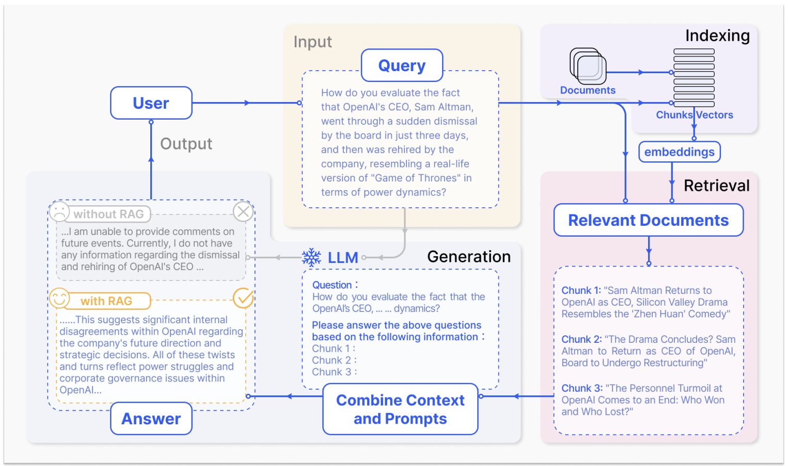
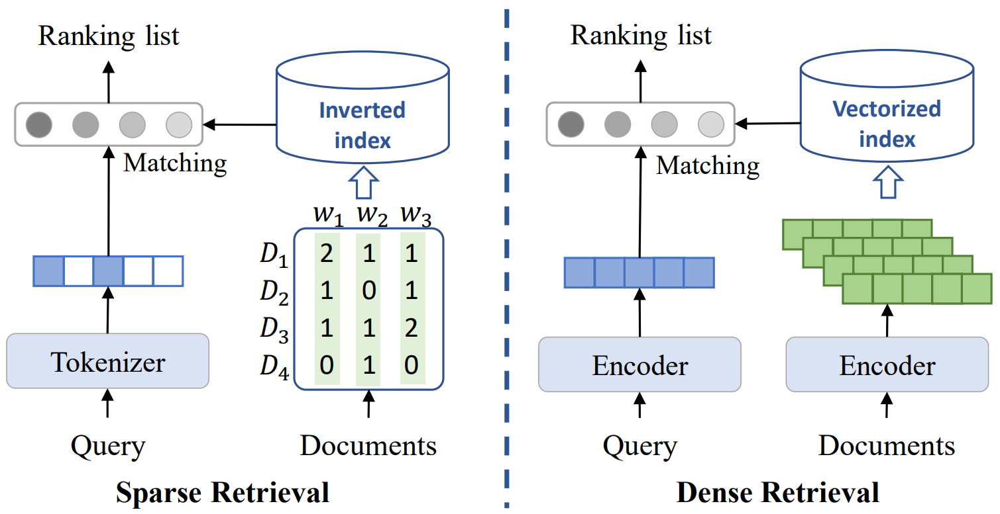
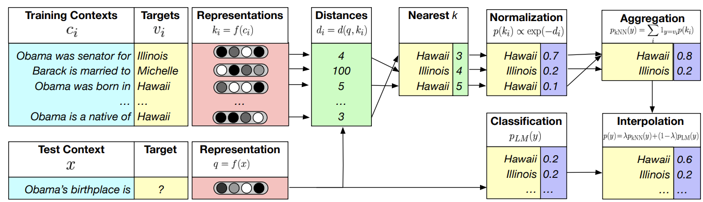

# 8. Retrieval Augmented Generation

Large Language Models (LLMs) have demonstrated impressive performance across various benchmark tasks in many domains. However, LLMs can also exhibit several problematic behaviors, such as [hallucinations](https://dl.acm.org/doi/full/10.1145/3571730?casa_token=0uwWXVL3Y4wAAAAA%3A6jp4nvXW59LfjKW0jHbHVOfNI6JRROYs-nb-9dMgq12Kn4TcIE4TesjC8ek0nHxdX_RaJNp9XRHo5g), which could possibly lead to dire consequences when applied in safety-critical areas like healthcare. To address these issues, Retrieval-Augmented Generation (RAG) has been introduced as a promising approach that integrates external knowledge into LLM outputs, offering a potential solution.


## Overview of RAG


Consider a scenario where a doctor wishes to utilize a Large Language Model (LLM) to answer medical questions for diagnostic purposes. Directly using a pre-trained LLM may not be optimal since it has not been fine-tuned/trained on medical data.

Assuming the doctor has access to medical textbooks and related resources, how can this knowledge base enhance the LLM's performance in answering medical questions? One option is to fine-tune the LLM with medical data; however, this requires the doctor to format their data appropriately for fine-tuning and possess some basic knowledge of deep learning, which may not be feasible.

A more practical approach is Retrieval-Augmented Generation (RAG), a paradigm that does **not** require training or tuning. 
The RAG process for question answering involves three main steps, as illustrated in the figure below: 
1. **Indexing**: Divide a knowledge base (KB), e.g., Wikipedia pages, into chunks, encode each chunk into a vector, and store these vectors in a vector database (DB).  
2. **Retrieval**: Retrieve the most relevant documents from the DB based on semantic similarity to the question.  
3. **Generation**: Combine the original question and the retrieved chunks, and feed them into the LLM to generate the final answer.  


**Figure: Overview of RAG** ([image source](https://arxiv.org/pdf/2312.10997))
<div style="text-align:center;">
    
</div>


## Indexing

We will discuss the indexing process in the context of RAG, which involves dividing a knowledge base (KB) into chunks, encoding each chunk into a vector, and storing these vectors in a vector database (DB). 

We will use the Wikipedia QA dataset as an example to demonstrate the indexing process. Let us first take a look at the dataset.

Ensure you have the required libraries installed. You can install them by running (remember to activate your virtual environment):

```bash
pip install datasets nltk numpy
```

```python
from datasets import load_dataset
import nltk
nltk.download('punkt')

# Load 1% of the Wiki-QA dataset for demonstration
dataset = load_dataset("wiki_qa", split='train[:1%]')

# Display some examples from the dataset
def display_examples(dataset):
    for i in range(min(10, len(dataset))):  # Show up to 10 examples
        example = dataset[i]
        print(f"Question: {example['question']}")
        print(f"Answer: {example['answer']}")
        print("-" * 40)  # Separator

# Call the function to display examples
display_examples(dataset)
```

```vbnet
Question: how are glacier caves formed?
Answer: A partly submerged glacier cave on Perito Moreno Glacier .
----------------------------------------
Question: how are glacier caves formed?
Answer: The ice facade is approximately 60 m high
----------------------------------------
Question: how are glacier caves formed?
Answer: Ice formations in the Titlis glacier cave
----------------------------------------
Question: how are glacier caves formed?
Answer: A glacier cave is a cave formed within the ice of a glacier .
----------------------------------------
Question: how are glacier caves formed?
Answer: Glacier caves are often called ice caves , but this term is properly used to describe bedrock caves that contain year-round ice.

```
We create a knowledge base (KB) by combining the answers from the dataset.


```python
# Function to aggregate answers only from the dataset
def aggregate_answers(dataset):
    knowledge_base = []
    for i in range(min(10, len(dataset))):  # Aggregate answers from up to 10 examples
        example = dataset[i]
        knowledge_base.append(example['answer'])
    # Join all answers into a single string
    return " ".join(knowledge_base)

# Aggregate the answers into a single string
knowledge_base = aggregate_answers(dataset)
```


### 1. Fixed-Length Chunking
Fixed-length chunking involves dividing a text document into segments of a predetermined size, typically defined by the number of characters, words, or sentences. This method is straightforward and easy to implement, making it a common choice in many text processing applications.

**Pros**:
- **Simplicity**: The method is easy to understand and implement.
- **Speed**: Quick to process since the boundaries of chunks are predefined.

**Cons**:
- **Loss of Context**: Important contextual information may be lost if chunk boundaries do not align with natural breaks in the text.
- **Inflexibility**: Fixed-length chunks may not accommodate varying content densities or the importance of specific information.


```python
# Function for fixed-length chunking
def fixed_length_chunking(text, chunk_size):
    return [text[i:i + chunk_size] for i in range(0, len(text), chunk_size)]

# Fixed-Length Chunking
print("Fixed-Length Chunking Results:")
fixed_chunks = fixed_length_chunking(knowledge_base, 20)  # Chunk size of 20 characters
for index, chunk in enumerate(fixed_chunks, start=1):
    print(f"Chunk {index}: {chunk}")
```


### 2. Semantic Chunking
Semantic chunking involves segmenting text based on the meaning and context of the content. This method typically employs natural language processing (NLP) techniques, such as sentence embeddings or topic modeling, to group related pieces of information together. It focuses on maintaining the semantic coherence of the chunks.

**Pros**:
- **Context Preservation**: By focusing on meaning, semantic chunking helps retain relevant context within each chunk.
- **Improved Retrieval**: This method enhances retrieval performance as chunks are more likely to align with user queries that rely on semantic understanding.

**Cons**:
- **Complexity**: Implementing semantic chunking can be more complex and resource-intensive due to the need for NLP techniques.
- **Data Dependency**: The effectiveness of this method may depend on the quality and diversity of the underlying data set used to train the models.

```python
def semantic_chunking(text):
    return nltk.sent_tokenize(text)

# Semantic Chunking
print("Semantic Chunking Results:")
semantic_chunks = semantic_chunking(knowledge_base)
for index, chunk in enumerate(semantic_chunks, start=1):
    print(f"Chunk {index}: {chunk}")
```


### 3. Sliding Window Technique
The sliding window technique creates overlapping chunks by defining a window size that moves through the text document. As the window slides, it generates chunks that share some content with adjacent chunks. This method is particularly useful for tasks where context and relationships between sentences are important.

**Pros**:
- **Context Maintenance**: Overlapping chunks help retain context across boundaries, making it easier to understand relationships between pieces of information.
- **Flexibility**: The window size can be adjusted based on the specific needs of the application, allowing for fine-tuning.

**Cons**:
- **Redundancy**: Overlapping content can lead to redundancy, increasing the size of the vector database and potentially complicating retrieval.
- **Complexity in Processing**: The processing of overlapping chunks may require additional computation and memory resources.


```python
# Sliding Window Chunking
def sliding_window_chunking(text, window_size, step_size):
    chunks = []
    for i in range(0, len(text) - window_size + 1, step_size):
        chunks.append(text[i:i + window_size])
    return chunks

# Sliding Window Chunking
print("Sliding Window Chunking Results:")
window_size = 50  # Length of each chunk
step_size = 25  # Overlap
sliding_chunks = sliding_window_chunking(knowledge_base, window_size, step_size)
for index, chunk in enumerate(sliding_chunks, start=1):
    print(f"Chunk {index}: {chunk}")
```


## Retrieval 

For the following section, we will use the semantic chunking method to divide the text into chunks. Next, we discuss the retrieval process in the context of RAG, which involves retrieving relevant documents from the KB based on semantic similarity to the question. Roughly, there are three types of retrieval methods: 
1. traditional information retrieval methods: including sparse retrieval (e.g., BM25) and dense retrieval (e.g., DPR, Contriever),
2. generative retrieval methods: such as Differentiable Search Index (DSI).

### I. Traditional Information Retrieval Methods


**Figure: A comparasion between Sparse Retrieval and Dense Retrieval** ([image source](https://arxiv.org/pdf/2208.09257))
<div style="text-align:center;">
    
</div>

#### 1. Sparse Retrieval

Sparse retrieval is a **keyword/lexical pattern** matching algorithm that focuses on the presence or absence of specific terms in documents by representing documents as sparse vectors. Here, sparse vectors are data structures that contain a large number of zero values, indicating the absence of terms, while only a small number of non-zero values represent the presence of relevant keywords.

BM25 (Best Matching 25) is a prominent algorithm in sparse retrieval. It ranks documents based on their relevance to a query by considering term frequency (the number of times a keyword appears in a document) and inverse document frequency (the rarity of a keyword across the entire document set). BM25 assigns higher scores to documents with more matching keywords while normalizing for document length, enhancing its effectiveness in retrieving the most relevant results for user queries.


The BM25 score for a document $D$ given a query $Q$ is calculated as follows:

$$
\text{BM25}(D, Q) = \sum_{i=1}^{n} IDF(t_i) \cdot \frac{TF(t_i, D) \cdot (k_1 + 1)}{TF(t_i, D) + k_1 \cdot \left(1 - b + b \cdot \frac{|D|}{avgdl}\right)}
$$

where:
- $t_i$ is a term in the query $Q$,
- $TF(t_i, D)$ is the term frequency of $t_i$ in document $D$,
- $IDF(t_i)$ is the inverse document frequency of $t_i$,
- $|D|$ is the length of document $D$,
- $avgdl$ is the average document length in the collection,
- $k_1$ and $b$ are parameters that control term saturation and document length normalization.


We can use the `rank_bm25` library in Python to implement BM25 for sparse retrieval. Install the required library using pip:

```bash
pip install rank_bm25
```


```python
from rank_bm25 import BM25Okapi
import numpy as np

def semantic_chunking(text):
    return nltk.sent_tokenize(text)

# Perform semantic chunking on the knowledge base
chunked_documents = semantic_chunking(knowledge_base)

# Tokenize chunked documents for BM25
tokenized_documents = [doc.split(" ") for doc in chunked_documents]

# Initialize BM25
bm25 = BM25Okapi(tokenized_documents)

# queries from Wiki-QA dataset
queries = [
    "How are glacier caves formed?",
    "How are the directions of the velocity and force vectors related in a circular motion?"
]

# Process each query
for query in queries:
    tokenized_query = query.lower().split(" ")
    
    # Get scores
    scores = bm25.get_scores(tokenized_query)

    # Display scores for the current query
    print(f"Scores for query: '{query}'")
    for doc, score in zip(chunked_documents, scores):
        print(f"Document: {doc}\nScore: {score}\n")
    print("-" * 40)  # Separator for clarity
```

Let us check the top 3 most relevant documents for each query:

```python
# Process each query
for query in queries:
    tokenized_query = query.lower().split(" ")
    
    # Get scores
    scores = bm25.get_scores(tokenized_query)

    # Get the indices of the top 3 documents
    top_indices = np.argsort(scores)[-3:][::-1]  # Get top 3 indices (sorted descending)

    # Display scores for the current query
    print(f"Top 3 Documents for query: '{query}'")
    for index in top_indices:
        print(f"Document: {chunked_documents[index]}\nScore: {scores[index]}\n")
    print("-" * 40)  # Separator for clarity
```


#### 2. Dense Retrieval

Unlike sparse retrieval methods that rely on keyword matching, dense retrieval models learn to represent both queries and documents as dense vectors in a continuous embedding space and match them based on semantic meaning. We will cover two popular dense retrieval methods: (1) Dense Passage Retrieval (DPR), and (2) Contriever.

#### DPR (Dense Passage Retrieval)


DPR uses a **two-tower** architecture to encode queries and passages into dense vectors.

- **Encoding**: Let $ Q $ represent a query and $ P $ represent a passage. The encoders are defined as:
  $
  q = f_Q(Q) \quad \text{and} \quad p = f_P(P)
  $
  where $ f_Q $ and $ f_P $ are the query and passage encoders, respectively, producing dense vectors $ q $ and $ p $.

- **Similarity Calculation**: The similarity between the query and passage vectors can be computed using:
  $
  \text{sim}(q, p) = q \cdot p^T
  $ or using cosine similarity: $
  \text{cosine\_similarity}(q, p) = \frac{q \cdot p}{\|q\| \|p\|} $

- **Retrieval**: The passages are ranked based on their similarity scores, and the top $ k $ passages are returned:
  $
  \text{Rank}(P) = \text{argsort}(\text{sim}(q, P))
  $

- **Training Loss**: To train the model, DPR employs a contrastive loss function that encourages the model to increase the similarity of the query and relevant passage pairs while decreasing the similarity with irrelevant passages. The training loss can be expressed as:
  $
  L = -\log \frac{e^{\text{sim}(q, p^+)}}{e^{\text{sim}(q, p^+)} + \sum_{p^-} e^{\text{sim}(q, p^-)}}
  $
  where $ p^+ $ is a positive passage related to the query $ Q $ and $ p^- $ are negative passages (not relevant to $ Q $).

**Advantages**: High accuracy due to contextual understanding and efficient retrieval with negative sampling. The training loss helps the model learn to better differentiate between relevant and irrelevant passages.

Let us check the top 3 most relevant documents for each query with DPR:

```python
import torch
from transformers import DPRContextEncoder, DPRContextEncoderTokenizer, DPRQuestionEncoder, DPRQuestionEncoderTokenizer


# Aggregate the answers into a single list
knowledge_base = aggregate_answers(dataset)

# chunking
knowledge_base = semantic_chunking(knowledge_base)

# Initialize the DPR tokenizer and models
question_tokenizer = DPRQuestionEncoderTokenizer.from_pretrained("facebook/dpr-question_encoder-single-nq-base")
context_tokenizer = DPRContextEncoderTokenizer.from_pretrained("facebook/dpr-ctx_encoder-single-nq-base")
question_model = DPRQuestionEncoder.from_pretrained("facebook/dpr-question_encoder-single-nq-base")
context_model = DPRContextEncoder.from_pretrained("facebook/dpr-ctx_encoder-single-nq-base")

# Encode the knowledge base documents
def encode_knowledge_base(knowledge_base):
    encoded_docs = []
    for doc in knowledge_base:
        inputs = context_tokenizer(doc, return_tensors="pt", padding=True, truncation=True)
        with torch.no_grad():
            embeddings = context_model(**inputs).pooler_output
        encoded_docs.append(embeddings)
    return torch.cat(encoded_docs)

# Encode the knowledge base
encoded_knowledge_base = encode_knowledge_base(knowledge_base)

# Sample queries
queries = [
    "how are glacier caves formed?",
    "How are the directions of the velocity and force vectors related in a circular motion?"
]

# Process each query
for query in queries:
    # Encode the query
    query_inputs = question_tokenizer(query, return_tensors="pt", padding=True, truncation=True)
    with torch.no_grad():
        query_embedding = question_model(**query_inputs).pooler_output

    # Compute cosine similarities between the query and knowledge base documents
    similarities = torch.nn.functional.cosine_similarity(query_embedding, encoded_knowledge_base)

    # Get the indices of the top 3 documents
    top_indices = similarities.argsort(descending=True)[:3]

    # Display top documents for the current query
    print(f"Top 3 Documents for query: '{query}'")
    for index in top_indices:
        print(f"Document: {knowledge_base[index]}\nSimilarity Score: {similarities[index].item()}\n")
    print("-" * 40)  # Separator for clarity
```


#### Contriever

Contriever is a **single-tower** dense retrieval model that leverages self-supervised learning to improve the quality of document embeddings for retrieval tasks.


1. **Encoding**: Similar to DPR, we start by encoding queries and documents by using the same encoder:
   $
   q = f(Q), \quad p = f(P)
   $
   where $f$ is the encoder for both queries and passages, producing dense vector representations $ q $ and $ p $.

2. **Self-Supervised Learning**: Contriever utilizes a self-supervised contrastive learning approach to optimize the embeddings. The contrastive loss function is defined as:
   $
   L = -\sum_{(q, p^+)} \log \frac{e^{\text{sim}(q, p^+)}}{e^{\text{sim}(q, p^+)} + \sum_{p^-} e^{\text{sim}(q, p^-)}}
   $
   Here, $ p^+ $ is a relevant passage for the query $ Q $, and $ p^- $ are negative passages (not relevant).

3. **Dynamic Sampling**: During training, Contriever dynamically samples both hard negatives and diverse positives, which can be mathematically represented by:
   $
   P = \{p | p \text{ is relevant to } q\}
   $
   $
   N = \{p | p \text{ is not relevant to } q\}
   $

4. **Retrieval Process**: The retrieval process in Contriever is similar to DPR, where the most relevant passages are identified based on their embeddings:
   $
   \text{Rank}(P) = \text{argsort}(\text{sim}(q, P))
   $

Let us check the top 3 most relevant documents for each query with Contriver:

```python
from transformers import AutoTokenizer, AutoModel

# Initialize the Contriever tokenizer and model
tokenizer = AutoTokenizer.from_pretrained("facebook/contriever")
model = AutoModel.from_pretrained("facebook/contriever")

# Encode the knowledge base documents
def encode_knowledge_base(knowledge_base):
    encoded_docs = []
    for doc in knowledge_base:
        inputs = tokenizer(doc, return_tensors="pt", padding=True, truncation=True)
        with torch.no_grad():
            embeddings = model(**inputs).last_hidden_state.mean(dim=1)  # Average pooling
        encoded_docs.append(embeddings)
    return torch.cat(encoded_docs)

# Encode the knowledge base
encoded_knowledge_base = encode_knowledge_base(knowledge_base)

# Sample queries
queries = [
    "how are glacier caves formed?",
    "How are the directions of the velocity and force vectors related in a circular motion?"
]

# Process each query
for query in queries:
    # Encode the query
    query_inputs = tokenizer(query, return_tensors="pt", padding=True, truncation=True)
    with torch.no_grad():
        query_embedding = model(**query_inputs).last_hidden_state.mean(dim=1)

    # Compute cosine similarities between the query and knowledge base documents
    similarities = torch.nn.functional.cosine_similarity(query_embedding, encoded_knowledge_base)

    # Get the indices of the top 5 documents
    top_indices = similarities.argsort(descending=True)[:5]

    # Display top documents for the current query
    print(f"Top 5 Documents for query: '{query}'")
    for index in top_indices:
        print(f"Document: {knowledge_base[index]}\nSimilarity Score: {similarities[index].item()}\n")
    print("-" * 40)  # Separator for clarity
```


#### Differences Between Contriever and Dense Passage Retrieval (DPR)

While both Contriever and DPR aim to enhance dense retrieval through effective document representations, they differ in their training approaches and the utilization of data:

1. **Training Approach**:
   - **DPR**: Utilizes a supervised contrastive loss that requires labeled positive and negative samples. The model learns to maximize the similarity of relevant pairs and minimize it for irrelevant ones.
   - **Contriever**: Employs a self-supervised learning framework that can leverage large amounts of unlabelled data. It focuses on learning from both hard negatives and diverse positives, making it more adaptable to varied datasets.

2. **Dynamic Sampling**:
   - **DPR**: Generally uses a static set of negatives based on the training set, which may not be as diverse.
   - **Contriever**: Implements dynamic sampling techniques during training to continually adjust the negatives and positives based on the current model state, allowing for a more robust learning process.

3. **Performance**:
   - **DPR**: Achieves high accuracy but may require more extensive fine-tuning and labeled data to reach optimal performance.
   - **Contriever**: Often demonstrates superior performance on various retrieval tasks due to its ability to utilize unlabelled data and adaptively sample training examples.


### II. Generative Retrieval

Two limitations of traditional information retrieval: 

- During training, the heterogeneous components in the traditional pipeline are difficult to jointly optimize in an end-to-end way towards a global objective. It also leads to errors accumulating and propagating among the sequential components.

- At the inference stage, it requires a large document index to search over the corpus, leading to significant memory consumption. This memory footprint further increases linearly with the corpus size.


Generative Retrieval is different from the “index-retrieve” paradigm. This model-based Information Retrieval system consolidates the indexing, retrieval, and ranking components into a single model, such as a large language model (LLM). The model directly generates relevant document identifiers based on a given query, bypassing the need for an explicit retrieval step. This approach has the potential to address the limitations of traditional retrieval methods by leveraging the generative capabilities of modern language models.

The Differentiable Search Index (DSI) is a popular generative retrieval framework that reflects its approach in the context of generative retrieval through a specific formulation of the objective function. In the DSI model, the focus is on directly generating relevant document identifiers based on a given query.

### Objective Function for Differentiable Search Index (DSI)

1. **Basic Formulation**:
   The goal of DSI can be expressed as maximizing the likelihood of generating the correct document identifiers $ ID $ given a query $ Q $:
   $
   L = -\sum_{(Q, ID) \in \mathcal{D}} \log P(ID | Q)
   $
   where:
   - $ L $ is the total loss.
   - $ \mathcal{D} $ is the training dataset consisting of pairs $ (Q, ID) $.
   - $ ID $ is the set of document identifiers relevant to the query $ Q $.

2. **Conditional Probability**:
   The model learns to predict the probability distribution of document identifiers conditioned on the input query:
   $
   P(ID | Q) = \text{softmax}(g(Q, D))
   $
   where:
   - $ g(Q, D) $ is a function (often implemented as a neural network) that computes a score for each document identifier based on the query $ Q $ and a set of document representations $ D $.

3. **Softmax Function**:
   To ensure that the output probabilities sum to one, the softmax function is applied:
   $
   P(ID_i | Q) = \frac{e^{g(Q, D_i)}}{\sum_{j=1}^{M} e^{g(Q, D_j)}}
   $
   where $ M $ is the total number of document identifiers.

4. **Training Loss**:
   The training loss can be expressed more explicitly as:
   $
   L = -\sum_{i=1}^{N} \log P(ID_i | Q_i)
   $
   where $ N $ is the number of samples in the training set.

In the example below, we simulate a simple DSI approach where the model generates relevant document IDs based on a query. Since we are focusing on the DSI concept, we do rely on an external model for this demonstration.

```python
# Aggregate the answers into a single list
knowledge_base = aggregate_answers(dataset)

# chunking
knowledge_base = semantic_chunking(knowledge_base)

# Function to simulate the DSI process
def generate_relevant_ids(query, knowledge_base):
    # This is a mock function to simulate DSI; normally, a model would generate IDs based on training
    # For simplicity, we'll randomly select IDs based on keyword matching
    relevant_ids = []
    for idx, answer in enumerate(knowledge_base):
        if query.lower() in answer.lower():  # Simple keyword match
            relevant_ids.append(idx)
    return relevant_ids if relevant_ids else random.sample(range(len(knowledge_base)), min(5, len(knowledge_base)))

# Sample queries
queries = [
    "how are glacier caves formed?",
    "How are the directions of the velocity and force vectors related in a circular motion?"
]

# Process each query
for query in queries:
    # Generate relevant document IDs using the mock DSI function
    relevant_ids = generate_relevant_ids(query, knowledge_base)

    # Display top documents for the current query
    print(f"Top Documents for query: '{query}'")
    for idx in relevant_ids:
        print(f"Document: {knowledge_base[idx]}\n")
    print("-" * 40)  # Separator for clarity

```


###  Efficient Retrieval

When the size of the knowledge base is large, e.g., millions or billions of entries, dense retrieval will suffer from 
- high memory consumption,
- high latency,
- high computational cost,
because it needs to iterate through all the documents to calculate similarity between high-dimensional vectors. 

Therefore, for practical purposes, efficient retrieval methods that enable quick identification of relevant documents with low computation and memory consumption are important. Methods achieving the above goals are referred to as **Approximate Nearest Neighbors (ANN)** Search. ANN search aims to quickly find the (approximate) nearest neighbors of a query point in high-dimensional spaces without exactly searching through all data points. Some common ANN algorithms include Locality-Sensitive Hashing (LSH), Hierarchical Navigable Small World (HNSW), and Quantization-based methods.


#### Quantization on Embeddings


Quantization is a technique used to reduce both the memory footprint of embeddings and the computitional cost while maintaining as much accuracy as possible. It involves mapping high-precision floating-point numbers (e.g., 32-bit) to lower-precision representations (e.g., 8-bit integers).
We will cover both **binary quantization** and **8-bit quantization**.

### 1. Binary Quantization

In binary quantization, each element of the embedding is mapped to either 0 or 1. Given an embedding vector $ \mathbf{e} $ with elements $ e_i $, the binary quantization is defined as:

$
\text{Binary}(e_i) = 
\begin{cases} 
1 & \text{if } e_i > 0 \\
0 & \text{if } e_i \leq 0 
\end{cases}
$

Thus, for an embedding vector $ \mathbf{e} = [e_1, e_2, \ldots, e_d] $, the binary quantized vector $ \mathbf{b} $ is:

$
\mathbf{b} = [\text{Binary}(e_1), \text{Binary}(e_2), \ldots, \text{Binary}(e_d]
$

### 2. 8-Bit Quantization

In 8-bit quantization, each element of the embedding is scaled to fit within the range of 0 to 255. The mathematical steps can be described as follows:

1. **Normalization**: First, normalize the embedding vector $ \mathbf{e} $ to the range $[0, 1]$:
   $
   \mathbf{e}_{\text{normalized}} = \frac{\mathbf{e} - \text{min}(\mathbf{e})}{\text{max}(\mathbf{e}) - \text{min}(\mathbf{e})}
   $

2. **Scaling**: Scale the normalized values to the range $[0, 255]$:
   $
   \mathbf{e}_{\text{scaled}} = \mathbf{e}_{\text{normalized}} \times 255
   $

3. **Quantization**: Convert the scaled values to 8-bit integers:
   $
   \mathbf{e}_{\text{quantized}} = \text{round}(\mathbf{e}_{\text{scaled}})
   $
   where the round operation converts each value to the nearest integer within the range of 0 to 255.

With optimized implementations, quantization can significantly reduce the memory footprint and computational cost of retrieval systems while maintaining retrieval accuracy. 

Table: Efficiency Comparison of Quantization Methods. [Source from HuggingFace](https://huggingface.co/blog/embedding-quantization#binary-quantization-in-sentence-transformers)
|                         | float32       | int8 | binary  |
|-------------------------|---------------|----------------|------------------|
| Memory & Index size savings | 1x            | exactly 4x     | exactly 32x      |
| Retrieval Speed         | 1x            | up to 4x       | up to 45x        |


```python
import random
# Aggregate the answers into a single list
knowledge_base = aggregate_answers(dataset)

# chunking
knowledge_base = semantic_chunking(knowledge_base)

# Initialize the model and tokenizer for Contriever
model_name = "facebook/contriever"  # Contriever model
tokenizer = AutoTokenizer.from_pretrained(model_name)
model = AutoModel.from_pretrained(model_name)

# Encode the knowledge base documents
def encode_knowledge_base(knowledge_base):
    encoded_docs = []
    for doc in knowledge_base:
        inputs = tokenizer(doc, return_tensors="pt", padding=True, truncation=True)
        with torch.no_grad():
            embeddings = model(**inputs).last_hidden_state.mean(dim=1)  # Average pooling
        encoded_docs.append(embeddings)
    return torch.cat(encoded_docs)

# Encode the knowledge base
encoded_knowledge_base = encode_knowledge_base(knowledge_base)

# Binary Quantization
def binary_quantization(embeddings):
    # Binarize the embeddings
    binary_embeddings = (embeddings > 0).float()  # Convert to binary (0 or 1) as float
    return binary_embeddings

# 8-Bit Quantization
def eight_bit_quantization(embeddings):
    # Scale the embeddings to the range [0, 255] and convert to uint8
    scaled_embeddings = (embeddings - embeddings.min()) / (embeddings.max() - embeddings.min())  # Normalize to [0, 1]
    quantized_embeddings = (scaled_embeddings * 255).byte()  # Scale to [0, 255] and convert to uint8
    return quantized_embeddings

# Apply quantization
binary_embeddings = binary_quantization(encoded_knowledge_base)
eight_bit_embeddings = eight_bit_quantization(encoded_knowledge_base)

# Function to calculate Hamming distance for binary embeddings
def hamming_distance(a, b):
    return torch.sum(a != b).item()

# Function to compute cosine similarity for 8-bit embeddings
def cosine_similarity(a, b):
    a_norm = a / a.norm(dim=1, keepdim=True)
    b_norm = b.float() / b.norm(dim=1, keepdim=True)  # Convert to float for normalization
    return (a_norm @ b_norm.T).numpy()

# Sample query for retrieval
query = 'How are the directions of the velocity and force vectors related in a circular motion?'

# Encode the query
query_inputs = tokenizer(query, return_tensors="pt", padding=True, truncation=True)
with torch.no_grad():
    query_embedding = model(**query_inputs).last_hidden_state.mean(dim=1)

# Quantize the query embedding for binary retrieval
quantized_query_binary = binary_quantization(query_embedding)

# Retrieve top 3 documents based on binary embeddings
print("Top 3 Documents using Binary Quantized Embeddings:")
binary_scores = []
for i in range(binary_embeddings.size(0)):
    score = hamming_distance(quantized_query_binary > 0, binary_embeddings[i])
    binary_scores.append((i, score))

# Sort by score
binary_scores.sort(key=lambda x: x[1])
for idx, score in binary_scores[:3]:
    print(f"Document: {knowledge_base[idx]}\nHamming Score: {score}\n")

# Quantize the query embedding for 8-bit retrieval
quantized_query_8bit = eight_bit_quantization(query_embedding)

# Retrieve top 3 documents based on 8-bit embeddings
print("Top 3 Documents using 8-Bit Quantized Embeddings:")
eight_bit_scores = cosine_similarity(quantized_query_8bit.float(), eight_bit_embeddings.float())  # Compare quantized query with document embeddings
top_indices = np.argsort(eight_bit_scores.flatten())[-3:][::-1]  # Get top 3 indices

for idx in top_indices:
    print(f"Document: {knowledge_base[idx]}\nCosine Similarity Score: {eight_bit_scores[0][idx]}\n")


```


## Generation


We introduce two approaches for generation in the context of RAG: (1) **Retrieval-and-Read** and (2) **KNN-LM**.


#### 1. Retrieval-and-Read

Retrieval-and-Read is a straightforward approach where the model retrieves relevant documents based on a query and then reads these documents to generate a response. This method emphasizes retrieving information before generating answers, allowing the model to provide more accurate and contextually relevant responses.

**Key Steps**:
- **Retrieve**: Use a retrieval model to fetch relevant documents based on the query.
- **Read**: Input the retrieved documents along with the query into a language model to produce the final output.

**Code Example**:
Here is an example demonstrating the Retrieval-and-Read approach:

```python
# Initialize the Contriever model and tokenizer for embeddings
model_name = "facebook/contriever"  # Contriever model for embedding
tokenizer = AutoTokenizer.from_pretrained(model_name)
model = AutoModel.from_pretrained(model_name)

# Encode the knowledge base documents
def encode_knowledge_base(knowledge_base):
    encoded_docs = []
    for doc in knowledge_base:
        inputs = tokenizer(doc, return_tensors="pt", padding=True, truncation=True)
        with torch.no_grad():
            embeddings = model(**inputs).last_hidden_state.mean(dim=1)  # Average pooling
        encoded_docs.append(embeddings)
    return torch.cat(encoded_docs)

# Encode the knowledge base
encoded_knowledge_base = encode_knowledge_base(knowledge_base)

# Function to calculate cosine similarity for retrieval
def cosine_similarity(a, b):
    a_norm = a / a.norm(dim=1, keepdim=True)
    b_norm = b / b.norm(dim=1, keepdim=True)  # Normalize for cosine similarity
    return (a_norm @ b_norm.T).numpy()

# Sample query for retrieval
query = "how are glacier caves formed?"

# Encode the query
query_inputs = tokenizer(query, return_tensors="pt", padding=True, truncation=True)
with torch.no_grad():
    query_embedding = model(**query_inputs).last_hidden_state.mean(dim=1)

# Retrieve top 3 documents based on cosine similarity
similarity_scores = cosine_similarity(query_embedding, encoded_knowledge_base)
top_indices = np.argsort(similarity_scores.flatten())[-3:][::-1]  # Get top 3 indices

# Retrieve the relevant documents
retrieved_documents = [knowledge_base[idx] for idx in top_indices]

# Print the retrieved documents
print("Retrieved Documents:")
for idx in top_indices:
    print(f"Document: {knowledge_base[idx]}")

# Initialize the language model for generating responses
language_model_name = "gpt2"  # You can choose another suitable model
language_tokenizer = AutoTokenizer.from_pretrained(language_model_name)
language_model = AutoModelForCausalLM.from_pretrained(language_model_name)

# Prepare input for the language model
read_input = f"Query: {query}\nDocuments: {' '.join(retrieved_documents)}\nResponse:"
input_ids = language_tokenizer(read_input, return_tensors="pt").input_ids

# Generate a response
with torch.no_grad():
    output = language_model.generate(input_ids, max_length=150, num_return_sequences=1)

response = language_tokenizer.decode(output[0], skip_special_tokens=True)

# Print the generated response
print("\nGenerated Response:")
print(response)

```

Let us see without the retrieval-and-read approach:

```python
# Prepare input for the language model using just the query
input_text = f"Query: {query}\nResponse:"
input_ids = language_tokenizer(input_text, return_tensors="pt").input_ids

# Generate a response without using retrieved content
with torch.no_grad():
    output = language_model.generate(input_ids, max_length=150, num_return_sequences=1)

response = language_tokenizer.decode(output[0], skip_special_tokens=True)

# Print the generated response
print("Generated Response Without Retrieved Content:")
print(response)
```


#### 2. KNN-LM

kNN-LM is an approach that extends a pre-trained LM by linearly interpolating its next word distribution with a $k$-nearest neighbors (kNN) model. The nearest neighbors are computed according to distance in the pre-trained embedding space and can be drawn from any text collection, including the original LM training data. This approach allows rare patterns to be memorized explicitly, rather than implicitly in model parameters. It also improves performance when the same training data is used for learning the prefix representations and the kNN model.


**Figure: Overview of KNN-LM** ([image source](https://arxiv.org/pdf/1911.00172))
<div style="text-align:center;">
    
</div>

#### Database
Let $ f(\cdot) $ be the function that maps a context $ c $ to a fixed-length vector representation computed by the pre-trained LM. For instance, in a Transformer LM, $ f(c) $ could map $ c $ to an intermediate representation that is output by an arbitrary self-attention layer. Then, given the $ i $-th training example $ (c_i, w_i) \in \mathcal{D} $, we define the key-value pair $ (k_i, v_i) $, where the key $ k_i $ is the vector representation of the context $ f(c_i) $ and the value $ v_i $ is the target word $ w_i $. The datastore $ (K, V) $ is thus the set of all key-value pairs constructed from all the training examples in $ \mathcal{D} $:

$$
(K, V) = \{(f(c_i), w_i) | (c_i, w_i) \in \mathcal{D}\}
$$

#### Inference
At test time, given the input context $ x $, the model generates the output distribution over next words $ p_{LM}(y|x) $ and the context representation $ f(x) $. The model queries the datastore with $ f(x) $ to retrieve its $ k $-nearest neighbors $ \mathcal{N} $ according to a distance function $ d(\cdot, \cdot) $ (squared $ L^2 $ distance in our experiments, making the similarity function an RBF kernel). Then, it computes a distribution over neighbors based on a softmax of their negative distances, while aggregating probability mass for each vocabulary item across all its occurrences in the retrieved targets (items that do not appear in the retrieved targets have zero probability):

$$
p_{kNN}(y|x) \propto \sum_{(k_i,v_i) \in \mathcal{N}} 1_{y=v_i} \exp(-d(k_i, f(x)))
$$

Finally, we follow Grave et al. (2017a) and interpolate the nearest neighbor distribution $ p_{kNN} $ with the model distribution $ p_{LM} $ using a tuned parameter $ \lambda $ to produce the final $ kNN-LM $ distribution:

$$
p(y|x) = \lambda p_{kNN}(y|x) + (1 - \lambda) p_{LM}(y|x)
$$


### References


- Knowledge Discovery in Databases: An Overview. [paper](https://ojs.aaai.org/aimagazine/index.php/aimagazine/article/view/1011/929)

- [Semantic chunking:] Liu, J., & Liu, J. (2019). "A Novel Semantic Text Chunking Method Based on a Self-Attention Mechanism." *Information Sciences*, 482, 130-142. DOI: 10.1016/j.ins.2019.02.054.

- Sliding-window: Chen, S., & Wang, S. (2019). "Sliding Window Approach for Text Chunking in Natural Language Processing." *Journal of Computer and Communications*, 7(7), 25-32. DOI: 10.4236/jcc.2019.77004.

- Generalization through Memorization: Nearest Neighbor Language Models. [Paper](https://arxiv.org/pdf/1911.00172)


