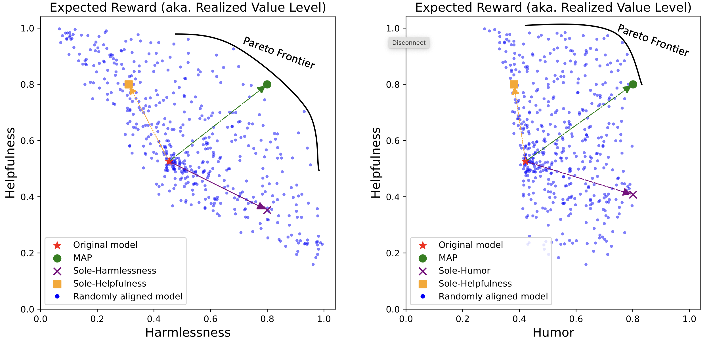
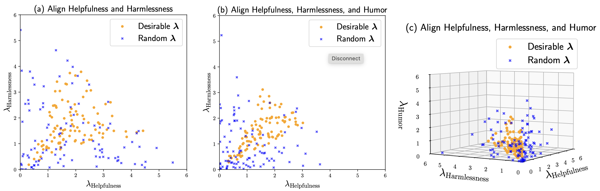
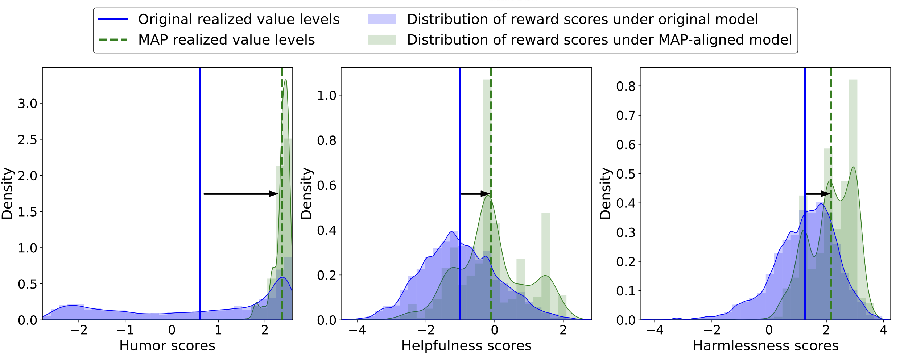
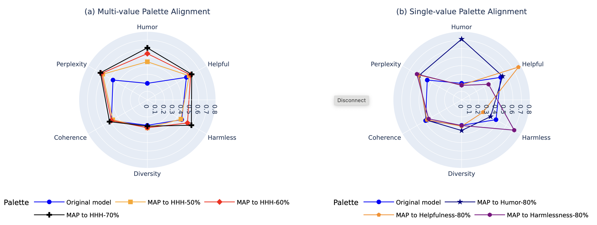
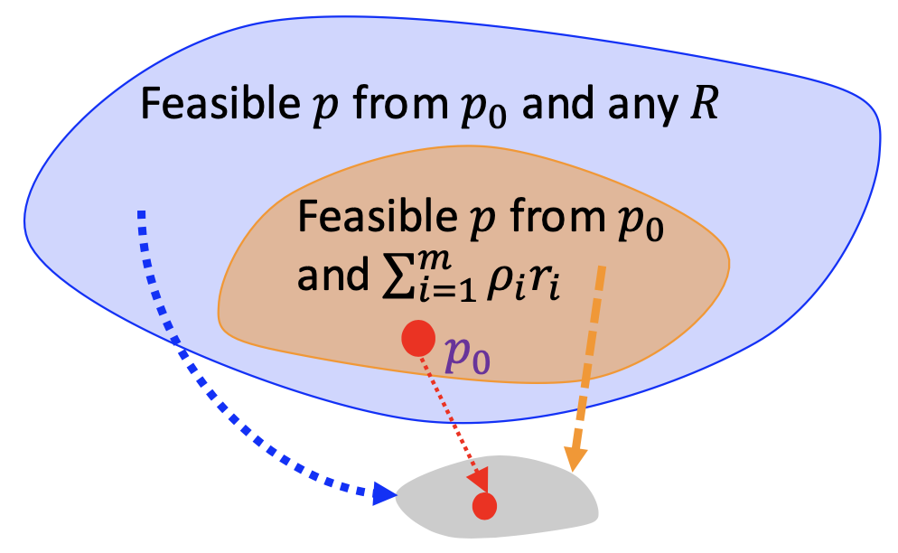

# 5. Human Value Alignment
<!-- and Human Value Alignment -->


## (Recall) Overview of Using LLM in Practice

```{mermaid}
graph LR
    UseCase[Define Science Domain] --> DataCuration[Data Curation]
    DataCuration --> Architecture[Set Architecture]
    Architecture --> Training[Training]
    Training --> Base[Base Model]
```
```{mermaid}
graph LR
    BaseModel[Base Model] --> FineTuning[Supervised Finetuning]
	UseCase[Define Application Case] --> FineTuning[Supervised Finetuning]
    FineTuning --> RLHF[Human Value Alignment]
```

We will go through human value alignment problems in this chapter.


## Human Value Alignment Formulation  

Recent advancements in AI have highlighted the critical need for aligning AI systems with human values, a concept known as human value alignment. The alignment can serve the purpose of generating outcomes that are better suited for human ethics, personalized needs, or reduced harmful content. 

This alignment has traditionally been pursued by adjusting AI behavior to adhere to specific attributes via preference datasets or reward functions. While procedures can differ in using the data or prior knowledge, the alignment process involves adjusting the generative model according to the optimization problem:


```{math}
:label: eq_RLHF
\max_{p \in \mathbb{P}} \mathbb{E}_{x \sim \mathcal{D}, y \sim p(\cdot \mid x)}\biggl\{ R(x, y) -\beta \cdot \text{KL}(p(\cdot \mid x) \| p_{0}(\cdot \mid x)) \biggr\}.
```

- $\mathbb{P}$: the class of all distributions
- $p_{0}$: is the distribution that represents the generative model to align
- $p$: distribution that represents the aligned model
- $R$: reward function that quantifies the preference level of any given pair of prompt $x$ and generation $y$
- $\text{KL}$: KL-divergence
- $\beta > 0$: regularization hyperparameter

After applying the calculus of variations, we obtain the solution to the above optimization to be in the form of 

$$
p_{\lambda}(y \mid x) = \frac{1}{Z(x,\lambda)} p_{0}(y \mid x) e^{\beta^{-1} R(x,y)}
$$

where $Z(\lambda) \overset{\Delta}{=} \mathbb{E}_{x \sim \mathcal{D}, y \sim p_{0}(\cdot \mid x)} e^{\beta^{-1} R(x,y)}$. Here, a larger $\beta$ can reduce unnecessary deviations from the original model but could also diminish the to-be-aligned human values. 

The Problem {eq}`eq_RLHF`  has deep conceptual roots in the Bayesian framework. Specifically, if we consider $x$ as observed data and $y$ as a parameter $\theta$, the problem can be expressed as 


```{math}
:label: eq_Bayes
\mathbb{E}_{\theta \sim p(\cdot)} \bigl\{ \log p(x \mid \theta) - \text{KL}[p(\cdot) \| p_{0}(\cdot)] \bigr\}
```

This formulation yields the solution 

$$
p_x(\theta) \propto p_{0}(\theta) p(x \mid \theta)
$$ 

which is precisely Bayes' Rule.

:::{admonition} Exercise
:class: tip
Verify the solutions to the above two problems {eq}`eq_RLHF` and {eq}`eq_Bayes`.
:::


## Reward Models

This reward model effectively serves as a stand-in for human preferences, allowing the model to approximate the desirability of its outputs without continuous human intervention.
We discuss common methods for obtaining reward functions $r_i$:

**From pairwise comparison datasets**

The reward function is typically learned explicitly through pairwise or ranking comparisons. One common method is using the Bradley-Terry model, which is particularly well-known for modeling preferences based on pairwise comparisons. In this model, the probability of preferring item $i$ over item $j$ is described by a logistic function:

$$
    \sigma(s_i - s_j)
$$

where $\sigma$ is the sigmoid function, and $s_i$ represents the latent score or quality of item $i$, and $s_j$ that of item $j$. The observations consist of indicators that denote whether $i$ is preferred over $j$ for a set of $(i, j)$ pairs.

The Bradley-Terry model has been widely applied in ranking contexts, such as chess, where the results of games between players are used to update their latent skill levels. Each player's rank is modeled based on their relative success over time.

In the context of human value alignment, this model helps to quantify preferences between different outputs, such as generated text, and serves as a foundation for training models to align with human judgments. To apply this concept in reward modeling, we represent the data as triplets $(x, y_{\text{win}}, y_{\text{lose}})$, where $x$ is the input prompt, $y_{\text{win}}$ is the preferred outcome, and $y_{\text{lose}}$ is the less preferred outcome.

The Bradley-Terry loss function can be defined using the reward model output $s(x, y)$ given input $x$ and output $y$, with the goal of maximizing the probability of the preferred outcome:

$$
    \mathcal{L}_{\text{BT}}(x, y_{\text{win}}, y_{\text{lose}}) = - \log \sigma(s(x, y_{\text{win}}) - s(x, y_{\text{lose}}))
$$

This loss encourages the model to assign a higher score to the preferred outcome $y_{\text{win}}$ compared to the less preferred one $y_{\text{lose}}$. In the context of human value alignment, the Bradley-Terry model serves as a mechanism for learning reward functions from human comparisons, guiding the model towards generating outputs more aligned with human values.


**From pretrained classifiers**

Each reward function associated with a preference class $v_i$ is defined as:

$$
    r_i(x,y) \overset{\Delta}{=} \log p(v_i \mid x,y) \in (-\infty, 0]
$$ 

Here, $p(v_i \mid x,y)$ denotes the probability that a sentence $(x,y)$ belongs to the preference class $v_i$. For example, if $v_i$ represents "harmlessness," $p(v_i \mid x,y)$ could be sourced from a classifier trained to detect if text is harmless. Assuming conditional independence of $v_i$ given $(x,y)$ and $\lambda_i = 1$ for all $i$, the solution for $q$ in an optimization framework can be expressed as:

$$
    q(y \mid x) \propto p_{0}(y \mid x) \prod_{i=1}^m p(v_i \mid x,y) \propto p(y \mid x, v_1,\ldots,v_m).
$$

In this configuration, the generative model $q$ acts as a "controlled generator," producing text conditioned on specific human values. For more refined applications, the model may employ $p(v_i \mid x,y)^{\lambda_i}$, allowing for the adjustment of preferences through the tempering of likelihoods. The weights $\lambda_i$ could reflect uncertainties regarding model specifications or hyperparameter choices.

**From language processing metrics** 

Metrics such as coherence, diversity, and perplexity are used to construct rewards that reflect various aspects of language quality and effectiveness. These metrics help in refining the model to produce more desirable text characteristics. 


:::{admonition} Exercise
:class: tip
Discuss the potential limitations/risks of using an ``arbitrarily obtained'' reward function. 
:::


## Implementation of Model Alignment


### Finetuning-Based Approach: Using Reinforcement Learning for Optimization

In this approach, the objective is to align model outputs with human values by optimizing a reward function derived from human feedback. The core concept involves developing a reward model that predicts the value of a model's outputs based on human judgments, as previously described. This process of using reinforcement learning to fine-tune models according to a reward function reflective of human values is traditionally known as Reinforcement Learning from Human Feedback (RLHF).

To fine-tune the model in accordance with the reward function, we typically use advanced reinforcement learning algorithms such as Proximal Policy Optimization (PPO), which we have briefly reviewed [here](https://genai-course.jding.org/en/latest/quickreview/index.html#proximal-policy-optimization-ppo). PPO helps in making more stable and effective updates by optimizing a special clipped objective, which ensures that the updates are significant enough to improve the model without deviating too much from the previous policy. This makes it particularly effective for applications where continuous adaptation to complex or subjective human preferences is crucial.

**Figure: Overview of the RLHF based on PPO**
<div style="text-align:center;">
    
</div>

### Sample Code

```python
import torch
from tqdm import tqdm
import fire
from transformers import AutoTokenizer
from trl import AutoModelForCausalLMWithValueHead, PPOConfig, PPOTrainer
from datasets import Dataset
from torch.nn.utils.rnn import pad_sequence
import os
from utils import get_prompts_from_imdb, get_model_and_tokenizer, get_reward

def collator(data):
    return dict((key, [d[key] for d in data]) for key in data[0])

def build_dataset(config, tokenizer, data_name):

    if data_name=="Imdb":
        prompts = get_prompts_from_imdb()
    else:
        raise ValueError(f"Data name {data_name} is not supported.")

    ds = Dataset.from_dict({'text': prompts})
    def tokenize(sample):
        input_ids = tokenizer.encode(sample['text'], add_special_tokens=True)
        input_ids = tokenizer.encode(sample['text'])
        query = tokenizer.decode(input_ids)
        return {'input_ids': input_ids, "query": query}

    ds = ds.map(tokenize, batched=False)
    ds.set_format(type='torch')

    return ds

def main(lam_list, value_list, model_name, data_name, save_path, learning_rate=1e-6, batch_size=20, mini_batch_size=2, nepoch=1):

    if batch_size % mini_batch_size != 0:
        raise ValueError('mini_batch_size * gradient_accumulation_steps should equal to batch size')
    
    config = PPOConfig(
        model_name=model_name,
        learning_rate=learning_rate,
        batch_size=batch_size,
        mini_batch_size=mini_batch_size,
        gradient_accumulation_steps=int(batch_size // mini_batch_size)
    )

    tokenizer = AutoTokenizer.from_pretrained(config.model_name)
    if tokenizer.pad_token_id is None:
        tokenizer.pad_token_id = tokenizer.eos_token_id
    if 'gpt' in model_name or 'opt' in model_name or 'llama' in model_name:
        tokenizer.padding_side = 'left'

    dataset = build_dataset(config, tokenizer, data_name)
    model = AutoModelForCausalLMWithValueHead.from_pretrained(config.model_name)
    ref_model = AutoModelForCausalLMWithValueHead.from_pretrained(config.model_name)
    ppo_trainer = PPOTrainer(config, model, ref_model, tokenizer, dataset=dataset, data_collator=collator)
    lam = torch.tensor(lam_list, dtype=torch.float32)
    values = value_list.split(',')

    model_rewards, tokenizer_rewards = {}, {}
    for value in values:
        model_rewards[value], tokenizer_rewards[value] = get_model_and_tokenizer(value)

    generation_config = {"max_new_tokens": 50, "temperature": 1, "top_k": 50, "do_sample": True, "pad_token_id": tokenizer.eos_token_id}
    for epoch in tqdm(range(nepoch), "epoch: "):
        for batch in tqdm(ppo_trainer.dataloader):    
            query_tensors = batch["input_ids"]
            remove_padding = tokenizer.bos_token_id != tokenizer.eos_token_id
            response_tensors = ppo_trainer.generate(query_tensors, remove_padding=remove_padding, **generation_config)
            if not remove_padding:
                for i in range(len(response_tensors)):
                    pad_mask = response_tensors[i] == tokenizer.eos_token_id
                    pad_start = torch.nonzero(pad_mask, as_tuple=False)
                    if pad_start.shape[0] != 1:
                        pad_start = pad_start[1, 0].item()
                        response_tensors[i] = response_tensors[i][: pad_start + 1]

            batch["response"] = [tokenizer.decode(r.squeeze()) for r in response_tensors]
            decoded_outputs = [q + r for q, r in zip(batch["query"], batch["response"])]
            reward_vectors = []
            for value in values:
                rewards = get_reward(decoded_outputs, value, model=model_rewards.get(value), tokenizer=tokenizer_rewards.get(value), prompts=batch['query'])
                reward_vectors.append(rewards)

            reward_matrix = torch.tensor(reward_vectors, dtype=torch.float32)
            reward_final = torch.matmul(lam, reward_matrix)
            reward_final_list = [reward_final.unsqueeze(1)[i] for i in range(reward_final.shape[0])]
    
            stats = ppo_trainer.step(query_tensors, response_tensors, reward_final_list)
            ppo_trainer.log_stats(stats, batch, rewards)
            print("Training Stats:", stats)

        os.makedirs(save_path, exist_ok=True)
        ppo_trainer.save_pretrained(save_path)
        print("Training complete!")

if __name__ == "__main__":
    fire.Fire(main)
```

Example use:

Prepare a utils.py file that contains your customized functions `get_prompts_from_imdb`, `get_model_and_tokenizer`, `get_reward` to import into the above sample code. Then run:

```bash
python trainPPO.py --model_name="opt-1.3b" --data_name="Imdb" ...
```

### Decoding-Based Approach: Utilizing Monte Carlo Sampling for Content Generation

Recall that the probability distribution for generating a response $y$ given an input $x$ can be expressed as:

$$
p_{\lambda}(y \mid x) \propto p_{0}(y \mid x) e^{\beta^{-1} R(x,y)}
$$

This formula suggests that we can implement a Monte Carlo sampling method to generate multiple candidate responses. We then use a multinomial distribution with weights proportional to $e^{\beta^{-1} R(x,y)}$ to select the most appropriate response. This approach is purely inferential, meaning it operates during the decoding phase without necessitating additional training. However, it typically results in higher latency during decoding due to the computational cost of generating and evaluating multiple candidates.


:::{admonition} Exercise
:class: tip
- Implement the decoding-based approach
:::


## Direct Preference Optimization (DPO): Using Implicit Reward Function

DPO is a recent approach to human value alignment that optimizes models based on explicit preferences derived from pairwise comparisons or rankings. Unlike RLHF, which involves fitting a reward model and employing reinforcement learning techniques to solve optimization problems, DPO simplifies the process by directly optimizing an empirical risk. This risk is calculated using the Bradley-Terry loss, where the reward score is defined as:

$$
    r(x,y) \overset{\Delta}{=} \log \frac{p(y \mid x)}{p_{0}(y \mid x)}.
$$

This definition leads to the DPO objective:

$$
    \mathcal{L}_{\mathrm{DPO}}(p_w ; p_0)=-\mathbb{E}_{(x, y_w, y_l) \sim \mathcal{D}}\biggl[\log \sigma\biggl(\beta \left(\log \frac{p_w(y_w \mid x)}{p_0(y_w \mid x)} - \log \frac{p_w(y_l \mid x)}{p_0(y_l \mid x)}\right)\biggr)\biggr]
$$

Here, $p_w$ represents the generative model being aligned (parameterized by weights $w$), and $p_0$ is the original model. This empirical risk formulation offers a streamlined method for model updates by directly minimizing the discrepancy between preferred and less preferred outcomes as assessed in the training data.


:::{admonition} Exercise
:class: tip
- Derive the DPO empirical risk formula provided above.
- Discuss the limitations of DPO--when the "free lunch" of simplified modeling could lead to compromised outcomes.
:::


### Sample Code

```python
import fire
from transformers import AutoTokenizer, AutoModelForCausalLM
from trl import DPOTrainer, DPOConfig
import torch

def train_dpo(beta, train_dataset, model_name, save_path):

    tokenizer = AutoTokenizer.from_pretrained(model_name)
    model = AutoModelForCausalLM.from_pretrained(model_name)
    model = model.to('cuda')
    
    training_args = DPOConfig(
        beta=beta,
        output_dir=save_path,
        num_train_epochs=1,
        per_device_train_batch_size=2,
        per_device_eval_batch_size=2,
        gradient_accumulation_steps=10,
        save_only_model=True,
    )

    dpo_trainer = DPOTrainer(
        model=model,
        args=training_args,
        train_dataset=train_dataset,
        tokenizer=tokenizer,
    )

    dpo_trainer.train()
    dpo_trainer.save_model()

if __name__ == "__main__":
    fire.Fire(train_dpo)
```
Example usage: 
```bash
python trainDPO.py --beta=0.5 ...
```


## Multi-Dimensional Human Value Alignment

While the earlier formulation provides an elegant interpretation of how AI models can be adjusted to reflect new information or preferences, it may not fully capture the complexity required when aligning AI systems to multiple, potentially conflicting human values. 


Ensuring that generative AI systems align with human values is essential but challenging, especially when considering multiple human values and their potential trade-offs. Since human values can be personalized and dynamically change over time, the desirable levels of value alignment vary across different ethnic groups, industry sectors, and user cohorts. Within existing frameworks, it is hard to define human values and align AI systems accordingly across different directions simultaneously, such as harmlessness, helpfulness, and positiveness. 

**Figure: Expected reward (realized value level) of generated content having Harmlessness (left) and Humor (right) versus Helpfulness for various models aligned from the Llama2-7B-chat model**



### Linear Scalarization

Linear scalarization is a widely utilized technique in multi-objective optimization, where different weight combinations are applied to various objectives to approximate optimal trade-offs. It solves

$$
\max_{w} \sum_{i=1}^m \rho_i f_i(w)
$$

where $f_i(w)$ represents different objective functions and $\rho_i$ are the weights that specify the importance of each objective, constrained by $\sum_{i=1}^m \rho_i = 1$ and $\rho_i \geq 0$.

### Fast Training of Aligned Models under Linear Scalarization

Building on the scalarization formulation, recent advancements have led to the "Rewarded Soup" approach, which aims to efficiently combine multiple separately fine-tuned networks into a single model. 

To detail the process, consider the aligned model represented by $q_w$, where $w$ denotes the neural network weights. Assume we have a set of reward functions $r_i$, for $i=1, \ldots, m$. Let each $q_{w_i}$ be the solution to the single-value alignment problem with $r = r_i$. The Rewarded Soup method then constructs the composite model using the formula:

$$
\biggl\{ w \overset{\Delta}{=} \sum_{i=1}^m \rho_i w_i :  \, \bm \rho \in \mathbb{S}_m \biggr\},
$$

where $\mathbb{S}_m \overset{\Delta}{=} \{\bm \rho:  \sum_{i=1}^m \rho_i =1, \rho_i \geq 0 \}$ is the $m$-dimensional simplex. This method allows us to approximate the set of fine-tuned models that would result from optimizing a single composite reward function formed by various linear combinations of the individual rewards, specifically $r \overset{\Delta}{=} \sum_{i=1}^m r_i$.

This approach significantly reduces the computational overhead typically required for training models under multiple, complex reward scenarios by eliminating the need to repeatedly train from scratch for each possible combination of reward functions. Instead, it leverages the linear properties of neural network weights to explore different behavioral trade-offs effectively and efficiently.

:::{admonition} Exercise
:class: tip
Use Taylor expansion to argue that the Rewarded Soup approach is reasonable under suitable conditions
:::

### Multi-Human-Value Alignment Palette (MAP)

The challenge of effectively choosing the parameter $\lambda$ can lead to inefficiencies, as illustrated in the following figure.

**Figure: Randomly sampled $\bm \lambda$ that represent all the possible $\bm \lambda$ whose $\ell_1$-norm is less than 6 and its subset of all the desirable $\bm \lambda$ in aligning the OPT-1.3B model towards (a) two values: Helpfulness and Harmlessness, (b) three values: adding Humor, and (c) the same three values visualized in 3D. A desirable $\bm \lambda$ means it produces Pareto improvement over all the values.**


Does there exist a first-principle approach that allows users to directly specify the improvements they want and ensures those improvements are achieved? This question motivates the development of the Multi-Human-Value Alignment Palette (MAP), a framework designed to directly optimize multiple human value preferences.

The initial human value alignment problem can be interpreted as maximizing the expected reward while imposing a regularization to minimize unnecessary deviations from the reference model $p_0$. For aligning $m \geq 1$ value preferences, MAP considers the following problem formulation:


```{math}
:label: eq_MAP
\textbf{MAP: }
\min_{p \in \mathcal{P}} \mathbb{E}_{x \sim \mathcal{D}, y \sim p(\cdot \mid x)} \text{KL}[p(\cdot \mid x) \| p_0(\cdot \mid x)]\\
\, \text{s.t.} \, \mathbb{E}_{x \sim \mathcal{D}, y \sim p(\cdot \mid x)} R_i(x,y) \geq c_i, \, \forall i =1,\ldots, m. 
```

In the specific single-value case, the constraint in {eq}`eq_MAP`  reduces to through a statistical functional constraint:

$$
\mathbb{E}_{x \sim \mathcal{D}, y \sim p(\cdot \mid x)} R(x,y) \geq c,
$$

which is interpreted as ''the expected rewards, or realized levels, under a value preference must be at least $c$''. The $\bm c \overset{\Delta}{=} [c_1,\ldots,c_m]^T$ is called a **value palette**. With a solution $p$, its realized value levels are defined by $\mathbb{E}_{x \sim \mathcal{D}, y \sim p(\cdot \mid x)} (\bm R(x,y) \overset{\Delta}{=} [R_1(x,y), \ldots, R_m(x,y)]^T)$.

It can be proved that the solution to the MAP problem {eq}`eq_MAP` is

$$
p_{\bm \lambda}(y \mid x)=\frac{1}{Z(x,\lambda)} p_0(y \mid x) e^{\bm \lambda^T \bm R(x,y)},
$$

where $\bm \lambda^T \bm R(x,y) = \sum_{i=1}^m \lambda_i  R_i(x,y)$, for some $\bm \lambda \geq \bm 0$. 

Moreover, assuming that $\bm R(x,y)$ is not trivially constant on the support set of $x, y$, the above $\bm \lambda$ is the unique solution to the problem:

$$
\max_{\bm \lambda \geq \bm 0} g(\bm \lambda) \overset{\Delta}{=} - \log Z(\bm \lambda) + \bm \lambda^T \bm c,
$$

where $Z(\bm \lambda) \overset{\Delta}{=} \mathbb{E}_{x \sim \mathcal{D}, y \sim p_0(\cdot \mid x)} e^{\bm \lambda^T \bm R(x,y)}$, and $g$ is strictly concave. As a result, we can treat $\bm \lambda$ as an implicit function of $\bm c$ and denote it as

$$
\bm \lambda = \bm \lambda(\bm c) \overset{\Delta}{=} \textrm{argmax}_{\bm \lambda \geq \bm 0} g(\bm \lambda).
$$

The above establishes a one-to-one correspondence between the quantities $\bm c$ and $\bm \lambda$.

How to interpret the $\bm \lambda$? From a decision-theoretic view, the decision of $\lambda$ is based on trading off the utility term $\bm \lambda^T \bm c$ and the "risk" term $-\log Z(\bm \lambda)$. The latter term can be seen as a form of risk aversion, because maximizing it would penalize decisions that place a disproportionate weight on less likely, albeit highly desirable, outcomes.

Practically, the expectation $\mathbb{E}_{x \sim \mathcal{D, y \sim p_0(\cdot \mid x)}}$ can be easily approximated using a sample average from a dataset generated under $p_0$, allowing the dual problem to be numerically solved. This provides easy computational benefits.

**Figure: Distribution of reward scores before and after aligning the Llama2-7B-chat model towards three values: Humor (left plot), Helpfulness (middle plot), and Harmlessness (right plot), using the proposed MAP. This alignment involves a user-specified palette designed to shift the expected rewards, also referred to as realized value levels, toward the 80\% quantile of the pre-alignment distributions.**


**Figure: Radar plots showing the alignment of OPT-1.3B with (a) multi-value palettes determined by 50\%, 60\%, and 70\% quantiles of the original model's reward distributions (numerically computed using generated data), and (b) single-value palettes at the 80\% quantile.**



<!-- ### Connection between the hyperparameter $\beta$ and $\bm \lambda$ -->
 
 ### The Pareto Frontier in Aligning Multiple Values

The Multi-Human-Value Alignment Palette (MAP) and the original alignment problem share identical solutions in terms of realizable value levels but may differ in their specific parameterizations. This realization prompts the examination of whether MAP limits the breadth of realizable value levels compared to those achievable under Reinforcement Learning from Human Feedback (RLHF) with arbitrarily chosen rewards. Both methods aim to optimize:

$$
R(x, y) \overset{\Delta}{=} \beta \cdot \lambda(\bm c)^T \bm R(x,y).
$$

Given the reference distribution $p_0$ and any specific reward functions $R$, the solution $p$, if feasible, depends solely on $R$. To illustrate this dependency, we denote $p$ as $p_{R}$. Let $\mathfrak{F}_{\textrm{RLHF}}(p_0)$ represent the range of $R$ that admits feasible solutions to the RLHF problem, essentially those with valid probability densities. The realizable value levels under the RLHF problem are defined as:

$$
    \mathcal{V}_{\textrm{RLHF}}(p_0) \overset{\Delta}{=} \biggl\{ \mathbb{E}_{x \sim \mathcal{D} , y \sim p_{R}(\cdot \mid x)} \bm R(x,y) : \,  R \in \mathfrak{F}_{\textrm{RLHF}}(p_0) \biggr\}.
$$

For multiple reward functions $R_1, \ldots, R_m$, we consider a specific class of $R$ comprising various non-negative linear combinations, and define their realizable value levels similarly:

$$
    \mathcal{V}_{\textrm{RLHF}}(R_1, \ldots, R_m; p_0) \overset{\Delta}{=} \biggl\{ \mathbb{E}_{x \sim \mathcal{D} , y \sim p_{R}(\cdot \mid x)} \bm R(x,y) : \, \\
    R \overset{\Delta}{=} \sum_{i=1}^m \rho_i R_i \in \mathfrak{F}_{\textrm{RLHF}}(p_0) , \, \rho_i \geq 0 \biggr\}.
$$

In the MAP problem, given $p_0$ and $\bm R$, the solution $p$, if feasible, depends only on the user-specified value palette $\bm c$. To emphasize this relationship, we denote $p$ as $p_{\bm c}$. Let $\mathcal{C}_{\textrm{MAP}}(R_1, \ldots, R_m; p_0)$ denote the range of $\bm c$ that admits feasible solutions to the MAP problem. We further consider the realized value levels of all feasible solutions under various $\bm c$, defined as:

$$
    \mathcal{V}_{\textrm{MAP}}(R_1, \ldots, R_m; p_0) \overset{\Delta}{=} \biggl\{ \mathbb{E}_{x \sim \mathcal{D} , y \sim p_{\bm c}(\cdot \mid x)} \bm R(x,y) : \, \bm c \in \mathcal{C}_{\textrm{MAP}}(R_1, \ldots, R_m; p_0) \biggr\}.
$$

It has been demonstrated in the MAP framework that for any original generative model $p_0$, we have:

$$
        \mathcal{V}_{\textrm{MAP}}(R_1, \ldots, R_m; p_0)
        = \mathcal{V}_{\textrm{RLHF}}(p_0)
        = \mathcal{V}_{\textrm{RLHF}}(R_1, \ldots, R_m; p_0).
$$

This equivalence confirms that the realizable value levels by MAP equate to those in the original alignment problem using a specific reward function — a linear combination of individual rewards. This proves that **linear combinations of individual reward functions can sufficiently capture the entire Pareto Frontier**. It is crucial to note that while the sets of solutions, namely $p$, are not identical for both problems, the key insight is that the set of realizable value levels, which resides within a finite $m$-dimensional space, is mapped from the infinitely dimensional set of solutions $p$ through a many-to-one mapping, as depicted in the following figure.


**Figure: Illustration of the same set of realizable value levels under general reward and linearly combined reward.**
<div style="text-align:center;">
    
</div>


## Reference


- A general framework for updating
belief distributions. [paper](https://www.jstor.org/stable/44682909)

- Rank Analysis of Incomplete Block Designs: A Method of Paired Comparisons Employing Unequal Repetitions on Pairs. [paper](https://www.jstor.org/stable/2527550)

- Assigning a value to a power likelihood in a general Bayesian model. [paper](https://www.jstor.org/stable/26363738)

- TRL: Transformer reinforcement learning. [code](https://github.com/huggingface/trl)

- Policy shaping: Integrating human feedback with reinforcement learning. [paper](https://proceedings.neurips.cc/paper_files/paper/2013/file/e034fb6b66aacc1d48f445ddfb08da98-Paper.pdf)

- Training a helpful and harmless assistant with reinforcement learning from human feedback. [paper](https://arxiv.org/pdf/2204.05862)

- Direct Preference Optimization: Your Language Model is Secretly a Reward Model. [paper](https://openreview.net/pdf?id=HPuSIXJaa9)

- Rewarded soups: towards pareto-optimal alignment by interpolating weights fine-tuned on diverse rewards. [paper](https://openreview.net/pdf?id=lSbbC2VyCu)

- MAP: Multi-Human-Value Alignment Palette. [paper]()

- Human preference data about helpfulness and harmlessness. Human-generated and annotated red teaming dialogues. [data](https://huggingface.co/datasets/Anthropic/hh-rlhf)

- Perspective API. [data](https://developers.perspectiveapi.com/s/about-the-api?language=en_US)

- Toxic Comment Classification. [code](https://huggingface.co/unitary/toxic-bert), [data](https://www.kaggle.com/c/jigsaw-toxic-comment-classification-challenge)