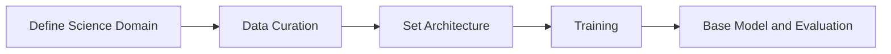
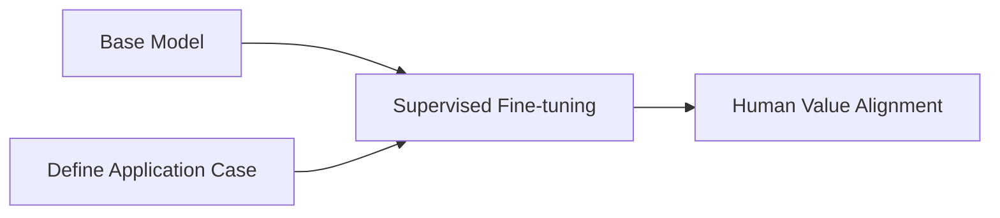

# 4. Finetuning and Human Value Alignment


## Big Picture of Using LLM in Practice




-   **Base Model**: Typically involves training a transformer-based model on a diverse dataset to learn a broad representation of language (which is not necessarily human language). 
	> This can be likened to a well-educated individual who has a broad understanding of various topics but has not specialized in any. They have potential because they are well-rounded and knowledgeable, but lack specific skills or experiences.
    
-   **Supervised Fine-tuning**: After the base training, the model is fine-tuned on more specific datasets. This step helps the model adapt to particular tasks or domains by learning from labeled data that provide direct examples of desired outputs.
	> This process can be compared to job-specific training where the individual applies their broad knowledge to a particular domain. They become more adept at handling specific tasks relevant to that domain, thus gaining depth in addition to their breadth.
    
-   **Human Value Alignment**: This step often the techniques of Reinforcement Learning from Human Feedback (RLHF) to further finetune the model to refine its responses based on human feedback. It is used to align the model's outputs more closely with human values and preferences, enhancing its applicability in practical scenarios.
	> This step could be likened to personalized coaching or mentoring, where the individual refines their skills further, focusing on particular nuances and preferences that are highly valued in specific contexts or by particular users.

We will go through base model training in this chapter and defer the finetuning and alignment in a later chapter. 


## Fine-Tuning LLMs

Fine-tuning is the process of taking a pre-trained model and adapting it to a specific task or domain. This approach leverages the general language understanding that the model has already acquired during its initial training on large-scale text corpora. By fine-tuning, we can specialize the model for tasks such as text classification, question-answering, or even more complex instructions.

Fine-tuning methods broadly fall into two categories: full fine-tuning and transfer learning: 

- **Full Fine-Tuning**: Updates all base model parameters.  This is the most comprehensive way to train an LLM for a specific task or domain – but requires more time and resources.

- **Transfer Learning**: Freezes most layers and tunes specific ones. The remaining layers – or, often, newly added – unfrozen layers are fine-tuned with the smaller fine-tuning dataset – requiring less time and computational resources than full fine-tuning.

## Alpaca Instruction Fine-Tuning Example
Let's explore an example of instruction fine-tuning using Alpaca. Alpaca is a smaller language model based on LLaMA, designed to follow instructions more closely by fine-tuning on a dataset of instruction-following examples.

A typical Fine-tuning involves the following steps:

- Data Preparation: Gather and preprocess a dataset that is representative of the task you want the model to perform. For instruction fine-tuning, this data typically includes input-output pairs where the model is given specific prompts and expected responses.

- Model Adaptation: Modify the architecture or specific components of the pre-trained model if necessary, to better suit the fine-tuning task.

- Training: Train the model on the task-specific dataset using a smaller learning rate to prevent catastrophic forgetting of the pre-trained knowledge.

Here’s a simplified version of the code used for fine-tuning Alpaca:
```python

```

- Evaluation and Testing: Evaluate the fine-tuned model on a separate validation set to assess its performance on the task.

## Catastrophic Forgetting

- **Naive Fine-tuning Leads to Catastrophic Forgetting**
    - Naive fine-tuning involves taking a pre-trained model and training it further on new data without using special mechanisms to preserve previously learned knowledge. This often leads to catastrophic forgetting, where the model loses performance on older tasks while adapting to new ones.
    - This is a critical issue in lifelong learning, where the goal is to continuously learn and retain knowledge over time without requiring retraining on all past data. Without addressing catastrophic forgetting, models cannot effectively learn from sequential data, making lifelong learning impossible. This concept emphasizes the need for methods that allow models to learn new tasks while preserving existing knowledge, a fundamental requirement for developing adaptable and intelligent systems.

- **Catastrophic Forgetting and Lifelong Learning**
    - Lifelong learning is the ability of a model to continuously learn from new experiences without forgetting previously acquired skills.
    - This concept is inspired by human learning, where new information is integrated into existing knowledge structures rather than replacing them. Lifelong learning is important because, in many real-world applications, data arrives sequentially, and the model must adapt without losing its effectiveness on past tasks.
    - In settings such as robotics, personalized AI, and evolving data environments, the capacity to learn continuously and remember past information is crucial. However, catastrophic forgetting presents a major challenge, as traditional training methods tend to overwrite previously learned information, hindering the model’s ability to function effectively in dynamic environments.


- **Methods in Literature**: 
    - Several strategies have been developed in the literature to address catastrophic forgetting, each with unique approaches and strengths:
        - **Regularization Techniques**: These methods, such as Elastic Weight Consolidation (EWC), Synaptic Intelligence (SI), and Memory Aware Synapses (MAS), work by identifying important weights from previously learned tasks and penalizing their changes during training on new data. This helps the model retain critical knowledge by constraining updates to crucial weights.
        - **Replay Methods**: Experience replay and generative replay are techniques where past data or synthetic samples generated by the model are replayed during training on new tasks. This approach effectively interleaves old and new information, helping maintain performance across tasks.
        - **Architectural Solutions**: Methods like Progressive Neural Networks and Dynamically Expandable Networks allocate separate modules or resources for different tasks. By isolating task-specific learning, these architectures prevent interference between tasks and preserve learned information.
        - **Distillation-Based Methods**: Knowledge distillation techniques transfer knowledge from an old model (teacher) to a new model (student), allowing the student to retain learned behavior while adapting to new tasks. 

- **Example with Catastrophic Forgetting**: 
    - We will demonstrate the catastrophic forgetting issue using GPT-2 in a class-incremental setting.
    - In this class-incremental learning scenario, the model is first trained on Task A, learning to classify two sentiment-related classes. Then, without revisiting the data from Task A, the model is fine-tuned on Task B, where it learns to classify new topic-related classes (Technology and Sports).

- Task A: Sentiment Analysis (IMDb Dataset)
    - This task involves classifying text into two sentiment categories: positive and negative. We use the IMDb dataset, which contains movie reviews labeled as either positive (class 1) or negative (class 0). This task helps the model learn to distinguish sentiment-related content.

- Task B: Topic Classification (AG News Dataset) 
    - In this task, the model classifies text into two topic categories: Technology and Sports. The AG News dataset is used, where we filter the dataset to include only technology (class 2) and sports (class 3) categories. This task introduces new, non-overlapping classes that require the model to learn different types of information.

    
```python
from transformers import GPT2Tokenizer, GPT2ForSequenceClassification, Trainer, TrainingArguments, DataCollatorWithPadding
from datasets import load_dataset
import torch

# Load tokenizer
tokenizer = GPT2Tokenizer.from_pretrained("gpt2")
tokenizer.pad_token = tokenizer.eos_token  # Set padding token

# Load and preprocess Task A dataset (IMDb for Sentiment Analysis)
# Remap sentiment labels to class indices: 0 for negative, 1 for positive
train_task_a = load_dataset("imdb", split="train[:2000]")  # Train set subset
test_task_a = load_dataset("imdb", split="test[:500]")  # Test set subset
train_task_a = train_task_a.map(lambda x: {'label': 0 if x['label'] == 0 else 1})  # Remap labels
test_task_a = test_task_a.map(lambda x: {'label': 0 if x['label'] == 0 else 1})
train_task_a = train_task_a.map(lambda x: tokenizer(x['text'], truncation=True, padding='max_length', max_length=128), batched=True)
test_task_a = test_task_a.map(lambda x: tokenizer(x['text'], truncation=True, padding='max_length', max_length=128), batched=True)
train_task_a.set_format(type='torch', columns=['input_ids', 'attention_mask', 'label'])
test_task_a.set_format(type='torch', columns=['input_ids', 'attention_mask', 'label'])

# Load and preprocess Task B dataset (AG News for Topic Classification)
# Remap topic labels to class indices: 2 for Tech, 3 for Sports
train_task_b = load_dataset("ag_news", split="train[:2000]")  # Train set subset
test_task_b = load_dataset("ag_news", split="test[:500]")  # Test set subset
train_task_b = train_task_b.filter(lambda x: x['label'] in [0, 1])  # Filtering for Tech (0) and Sports (1)
test_task_b = test_task_b.filter(lambda x: x['label'] in [0, 1])
train_task_b = train_task_b.map(lambda x: {'label': x['label'] + 2})  # Remap labels to 2 and 3
test_task_b = test_task_b.map(lambda x: {'label': x['label'] + 2})
train_task_b = train_task_b.map(lambda x: tokenizer(x['text'], truncation=True, padding='max_length', max_length=128), batched=True)
test_task_b = test_task_b.map(lambda x: tokenizer(x['text'], truncation=True, padding='max_length', max_length=128), batched=True)
train_task_b.set_format(type='torch', columns=['input_ids', 'attention_mask', 'label'])
test_task_b.set_format(type='torch', columns=['input_ids', 'attention_mask', 'label'])

# Define data collator
data_collator = DataCollatorWithPadding(tokenizer=tokenizer)

# Define a simple compute metrics function for accuracy
compute_metrics = lambda eval_pred: {
    'accuracy': (torch.tensor(eval_pred.predictions).argmax(dim=1) == torch.tensor(eval_pred.label_ids)).float().mean().item()
}

# Load pre-trained model and tokenizer with a classification head
model = GPT2ForSequenceClassification.from_pretrained("gpt2", num_labels=4)
model.config.pad_token_id = model.config.eos_token_id


# Fine-tuning on Task A (Sentiment Analysis)
training_args_a = TrainingArguments(
    output_dir="./results_task_a",
    num_train_epochs=1,
    per_device_train_batch_size=8,
    eval_strategy="epoch"
)

trainer_a = Trainer(
    model=model,
    args=training_args_a,
    train_dataset=train_task_a,
    eval_dataset=test_task_a,
    data_collator=data_collator,
    compute_metrics=compute_metrics
)
print("Training on Task A (Sentiment Analysis)...")
trainer_a.train()

# Evaluate performance on Task A after Task A fine-tuning
results_task_a_after_a = trainer_a.evaluate(test_task_a)
results_task_b_after_a = trainer_a.evaluate(test_task_b)
print("Accuracy on Task A after Task A fine-tuning:", results_task_a_after_a["eval_accuracy"])
print("Accuracy on Task B after Task A fine-tuning:", results_task_b_after_a["eval_accuracy"])

# Fine-tuning on Task B (Topic Classification)
training_args_b = TrainingArguments(
    output_dir="./results_task_b",
    num_train_epochs=1,
    per_device_train_batch_size=8,
    evaluation_strategy="epoch"
)

trainer_b = Trainer(
    model=model,
    args=training_args_b,
    train_dataset=train_task_b,
    eval_dataset=test_task_b,
    data_collator=data_collator,
    compute_metrics=compute_metrics
)
print("Training on Task B (Topic Classification)...")
trainer_b.train()

# Evaluate performance on Task A and Task B after Task B fine-tuning
results_task_a_after_b = trainer_b.evaluate(test_task_a)
results_task_b_after_b = trainer_b.evaluate(test_task_b)
print("Accuracy on Task A after Task B fine-tuning:", results_task_a_after_b["eval_accuracy"])
print("Accuracy on Task B after Task B fine-tuning:", results_task_b_after_b["eval_accuracy"])
```
# Fine-tuning LLM for Tabular Data

## 1. Motivation
The application of LLMs for tabular data prediction opens up new possibilities for data analysis, allowing models to leverage contextual information within the data, which traditional models might overlook. 

## 2. Traditional Problems in Tabular Data Prediction and Baseline

Consider a traditional classification problem with the dataset California. It contains 8 attributes of 20,640 districts in California and the goal was to predict
the median house value in each district. Here we created a
balanced classification task by predicting whether the house value is below or above the median (10,317 positive).

``` python
import pandas as pd
import numpy as np
from sklearn.datasets import fetch_california_housing

# Load the dataset
housing = fetch_california_housing(as_frame=True)
df = housing.frame

# Display the first few rows
df.head()

median_value = df['MedHouseVal'].median()

# Create the binary target variable
df['Above_Median'] = (df['MedHouseVal'] > median_value).astype(int)
df = df.drop('MedHouseVal', axis=1)
df['Above_Median'].value_counts()
```

We do a simple train-test spliting to first fit and evaluate two traditional models: logistic regression and XGBoost.

```python
from sklearn.model_selection import train_test_split
from sklearn.preprocessing import StandardScaler

# Split the data
X = df.drop('Above_Median', axis=1)
y = df['Above_Median']

X_train, X_test, y_train, y_test = train_test_split(X, y, test_size=0.2, random_state=42)

# Standardize the features
scaler = StandardScaler()
X_train_scaled = scaler.fit_transform(X_train)
X_test_scaled = scaler.transform(X_test)
```

```python
from sklearn.linear_model import LogisticRegression
from sklearn.metrics import accuracy_score

# Train the model
log_reg = LogisticRegression(max_iter=1000)
log_reg.fit(X_train_scaled, y_train)

# Make predictions
y_pred_lr = log_reg.predict(X_test_scaled)

# Evaluate the model
accuracy_lr = accuracy_score(y_test, y_pred_lr)
print(f'Logistic Regression Accuracy: {accuracy_lr:.4f}')

```
```python
from xgboost import XGBClassifier

# Train the model
xgb_clf = XGBClassifier(use_label_encoder=False, eval_metric='logloss')
xgb_clf.fit(X_train, y_train)

# Make predictions
y_pred_xgb = xgb_clf.predict(X_test)

# Evaluate the model
accuracy_xgb = accuracy_score(y_test, y_pred_xgb)
print(f'XGBoost Accuracy: {accuracy_xgb:.4f}')
```

## 3. Classification of Tabular Data with Large Language Model

To let an LLM make prediction on tabular data, we need to transform the rows of tabular data and describe our task into text prompts. This involves two steps: 

- Serialize feature names and values into  natural-language string. 

- Add task-specific prompt.

For example, the dataset California contains 8 features named `MedInc`,	`HouseAge`,	`AveRooms`,	`AveBedrms`, `Population`, `AveOccup`,	`Latitude`,	`Longitude`. One way to serialize them is to simply write 
```
- MedInc: 3.2377
- HouseAge: 32
- AveRooms: 6,597
- AveBedrms: 1,579
- Population: 3,689
- AveOccup: 1,459
- Latitude: 34.15
- Longitude: -118.01
```
, and add our question for LLM to anwser：

```
Is this house block valuable? Yes or No?
Answer:
```
The code for above template would look like this


```python
# Define a template for the prompt as per your new format
def create_prompt(row):
    # Serialization of row data
    serialization = '\n'.join([f'- {col}: {val}' for col, val in row.items()])
    # Combine serialization with the question and answer template
    prompt = f"{serialization}\nIs this house block valuable? Yes or No?\nAnswer:\n|||\n"
    return prompt

# Apply to training and test sets
X_train_prompts = X_train.apply(create_prompt, axis=1)
X_test_prompts = X_test.apply(create_prompt, axis=1)
```

Now we can load the LLM and see how it predict on an example prompt. The logic here is that we let the LLM pick the next word with higher probability between 'Yes' and 'No', and set it as its prediction on this data. 

```python
from transformers import AutoTokenizer, AutoModelForCausalLM
import torch
# Load the tokenizer and model for GPT-2
tokenizer = AutoTokenizer.from_pretrained('gpt2')
model = AutoModelForCausalLM.from_pretrained('gpt2')
tokenizer.pad_token = tokenizer.eos_token

# Function to make zero-shot predictions based on evaluating the logits
def zero_shot_predict(prompt):
    # Tokenize the input prompt
    inputs = tokenizer(prompt, return_tensors='pt')
    
    # Get the logits from the model
    with torch.no_grad():
        outputs = model(**inputs)
    
    # Get the logits for the last token in the sequence
    logits = outputs.logits[:, -1, :]
    
    # Tokens for 'Yes' and 'No'
    yes_token = tokenizer.convert_tokens_to_ids('Yes')
    no_token = tokenizer.convert_tokens_to_ids('No')
    
    # Compare the logits for 'Yes' and 'No'
    yes_logit = logits[:, yes_token].item()
    no_logit = logits[:, no_token].item()
    
    # Choose the token with the higher logit
    if yes_logit > no_logit:
        return 'Yes'
    else:
        return 'No'

# Example prediction
example_prompt = X_test_prompts.iloc[0]
print(zero_shot_predict(example_prompt))
```
:::{admonition} Exercises
:class: tip
- Design code to assess performance metrics (e.g. accuracy, F1) based on a predefined dataset size.
- Try to obtain the output directly given the prompt.
- Try different formats for the prompt and see if performance changes.
:::

Typically, you may verify that the predictions from a relatively small model like GPT-2 would approximate random guessing in binary classification tasks. This is precisely where fine-tuning would prove its value. Here we use the model with a classification head, and the labels correspond to Yes and No. We fine-tune this model on our labeled examples.

```python
import numpy as np
import evaluate
from datasets import Dataset
from transformers import Trainer, TrainingArguments, AutoTokenizer, GPT2ForSequenceClassification, DataCollatorWithPadding

# Load the tokenizer and model for GPT-2 adapted for sequence classification
tokenizer = AutoTokenizer.from_pretrained('gpt2')
model = GPT2ForSequenceClassification.from_pretrained('gpt2', num_labels=2)

# Set pad token if not already defined (GPT-2 does not have a default pad token)
tokenizer.pad_token = tokenizer.eos_token  
model.config.pad_token_id = model.config.eos_token_id

train_size = 2000
# Update the dataset dictionary
train_data = {'text': X_train_prompts[:train_size], 'labels': y_train[:train_size]}
test_data = {'text': X_test_prompts.tolist(), 'labels': y_test}

train_dataset = Dataset.from_dict(train_data)
test_dataset = Dataset.from_dict(test_data)

# Tokenization function that maps texts to model inputs
def tokenize_function(examples):
    return tokenizer(examples["text"], truncation=True, padding='max_length', max_length=512)

tokenized_train = train_dataset.map(tokenize_function, batched=True)
tokenized_test = test_dataset.map(tokenize_function, batched=True)

# Set format for PyTorch
tokenized_train.set_format(type='torch', columns=['input_ids', 'attention_mask', 'labels'])
tokenized_test.set_format(type='torch', columns=['input_ids', 'attention_mask', 'labels'])

# Load the accuracy metric
accuracy_metric = evaluate.load('accuracy')

def compute_metrics(eval_pred):
    logits, labels = eval_pred
    predictions = np.argmax(logits, axis=-1)
    return accuracy_metric.compute(predictions=predictions, references=labels)
```

```python
epochs = 5
train_batch_size=8
test_batch_size=16
lr=1e-5

# Define training arguments
training_args = TrainingArguments(
    output_dir='./results',
    num_train_epochs=epochs,
    per_device_train_batch_size=train_batch_size,
    per_device_eval_batch_size=test_batch_size,
    evaluation_strategy='epoch',
    save_strategy="epoch",
    logging_dir='./logs',
    learning_rate=lr,
    load_best_model_at_end=True,
    metric_for_best_model='accuracy',
)

# Define a data collator
from transformers import DataCollatorWithPadding
data_collator = DataCollatorWithPadding(tokenizer=tokenizer)

# Initialize Trainer with compute_metrics
trainer = Trainer(
    model=model,
    args=training_args,
    train_dataset=tokenized_train,
    eval_dataset=tokenized_test,
    tokenizer=tokenizer,
    data_collator=data_collator,
    compute_metrics=compute_metrics,
)
# Start fine-tuning
trainer.train()
```

:::{admonition} Exercises
:class: tip

- Evaluate the performance of the fine-tuned LLM.
- Think about reasonable setup, such as the size of the training dataset, for comparing with traditional methods like logistic regression.
- Experiment with various LLMs to determine if there are notable differences in performance.
:::    


# Reference

- TabLLM  [paper](https://arxiv.org/pdf/2210.10723)
