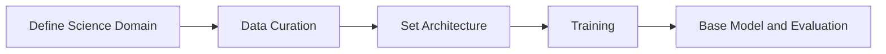
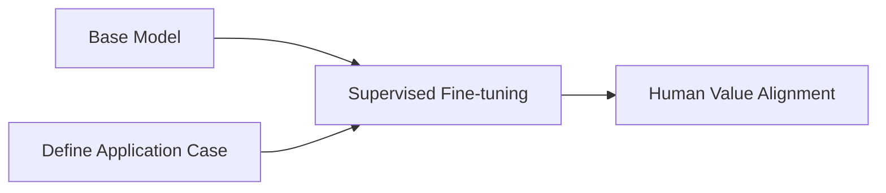

# 4. Finetuning and Human Value Alignment


## Big Picture of Using LLM in Practice




-   **Base Model**: Typically involves training a transformer-based model on a diverse dataset to learn a broad representation of language (which is not necessarily human language). 
	> This can be likened to a well-educated individual who has a broad understanding of various topics but has not specialized in any. They have potential because they are well-rounded and knowledgeable, but lack specific skills or experiences.
    
-   **Supervised Fine-tuning**: After the base training, the model is fine-tuned on more specific datasets. This step helps the model adapt to particular tasks or domains by learning from labeled data that provide direct examples of desired outputs.
	> This process can be compared to job-specific training where the individual applies their broad knowledge to a particular domain. They become more adept at handling specific tasks relevant to that domain, thus gaining depth in addition to their breadth.
    
-   **Human Value Alignment**: This step often the techniques of Reinforcement Learning from Human Feedback (RLHF) to further finetune the model to refine its responses based on human feedback. It is used to align the model's outputs more closely with human values and preferences, enhancing its applicability in practical scenarios.
	> This step could be likened to personalized coaching or mentoring, where the individual refines their skills further, focusing on particular nuances and preferences that are highly valued in specific contexts or by particular users.

We will go through base model training in this chapter and defer the finetuning and alignment in a later chapter. 


## Fine-Tuning LLMs

Fine-tuning is the process of taking a pre-trained model and adapting it to a specific task or domain. This approach leverages the general language understanding that the model has already acquired during its initial training on large-scale text corpora. By fine-tuning, we can specialize the model for tasks such as text classification, question-answering, or even more complex instructions.

Fine-tuning methods broadly fall into two categories: full fine-tuning and transfer learning: 

- **Full Fine-Tuning**: Updates all base model parameters.  This is the most comprehensive way to train an LLM for a specific task or domain – but requires more time and resources.

- **Transfer Learning**: Freezes most layers and tunes specific ones. The remaining layers – or, often, newly added – unfrozen layers are fine-tuned with the smaller fine-tuning dataset – requiring less time and computational resources than full fine-tuning.

## Alpaca Instruction Fine-Tuning Example
Let's explore an example of instruction fine-tuning using Alpaca. Alpaca is a smaller language model based on LLaMA, designed to follow instructions more closely by fine-tuning on a dataset of instruction-following examples.

A typical Fine-tuning involves the following steps:

- Data Preparation: Gather and preprocess a dataset that is representative of the task you want the model to perform. For instruction fine-tuning, this data typically includes input-output pairs where the model is given specific prompts and expected responses.

- Model Adaptation: Modify the architecture or specific components of the pre-trained model if necessary, to better suit the fine-tuning task.

- Training: Train the model on the task-specific dataset using a smaller learning rate to prevent catastrophic forgetting of the pre-trained knowledge.

Here’s a simplified version of the code used for fine-tuning Alpaca:
```python

```

- Evaluation and Testing: Evaluate the fine-tuned model on a separate validation set to assess its performance on the task.

