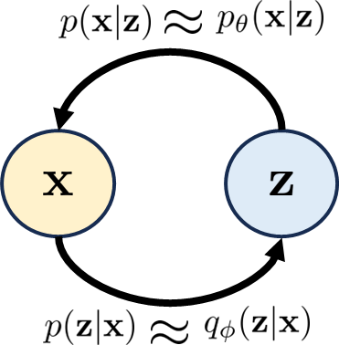
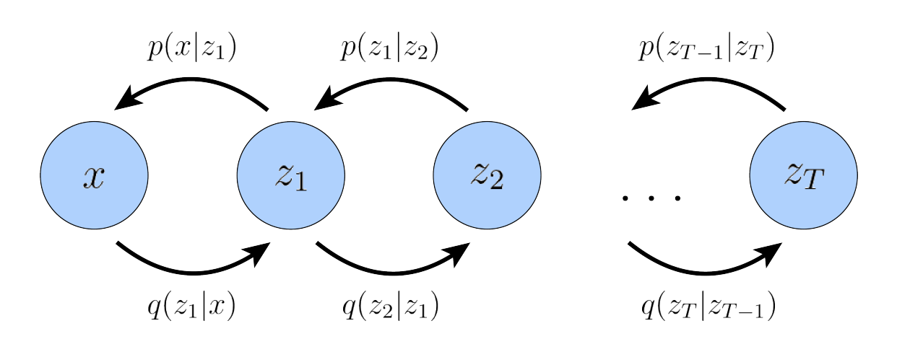
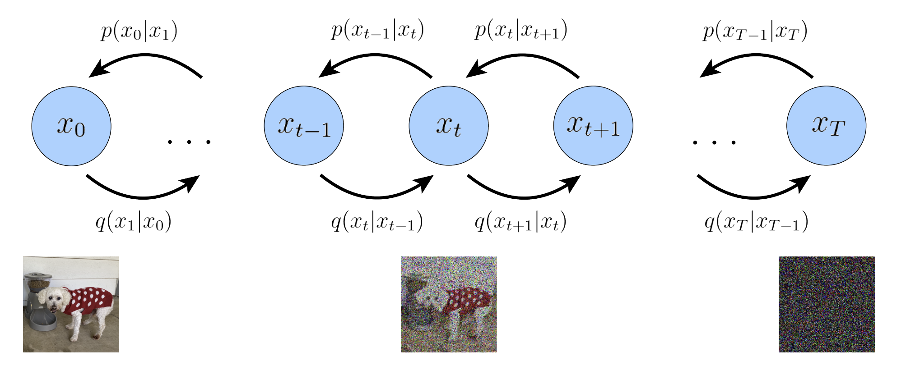

# 5. Diffusion Models

This tutorial discusses the essential ideas underlying diffusion models, which are the foundation of many modern generative tools. These models are particularly powerful in applications like text-to-image and text-to-video generation. The content is mostly based on two excellent tutorials from [Stanley](https://arxiv.org/abs/2403.18103) and [Calvin](https://arxiv.org/abs/2208.11970).

## Contents

1. [The Basics: Variational Auto-Encoder (VAE)](#vae)
    - [VAE Setting](#vae-setting)
    - [Evidence Lower Bound](#evidence-lower-bound)
    - [Training VAE](#training-vae)
    - [Inference with VAE](#inference-with-vae)
    - [Hierarchical VAE](#hierarchical-vae)
2. [Denoising Diffusion Probabilistic Model (DDPM)](#ddpm)
    - [Variational Diffusion Models](#variational-diffusion-models)
    - [ELBO of DDPM](#elbo-of-ddpm)
    - [Key conditional distributions for ELBO](#key-conditional-distributions-for-elbo)
    - [Three equivalent way of derivation for training and inference](#three-equivalent-way-of-derivation-for-training-and-inference)
3. [Score-Matching Langevin Dynamics (SMLD)](#smld)
    - [Langevin Dynamics](#ld)
    - [Score Matching Techniques](#sm-techniques)
4. [Stochastic Differential Equation (SDE)](#sde)
    - [Forward and Backward Iterations in SDE](#f-n-b-sde)
    - [SDE for DDPM](#sde-ddpm)
    - [SDE for SMLD](#sde-smld)
5. [Conclusion](#conclusion)

## 1. The Basics: Variational Autoencoders (VAEs) 

### 1.1 VAE Setting 

Variational Autoencoder is a foundational concept in generative modeling. It aims to encode data into a latent space and then decode it to reconstruct the input.

#### Probabilistic Framework

In a VAE, both $\boldsymbol{x}$ and $\boldsymbol{z}$ are described using probability distributions, enhancing flexibility over deterministic transformations:
- $p(\boldsymbol{x})$: The distribution of $\boldsymbol{x}$, typically unknown and complex.
- $p(\boldsymbol{z})$: The distribution of $\boldsymbol{z}$, often assumed to be a standard Gaussian $\mathcal{N}(0, I)$. The dimension of the latent $\boldsymbol{z}$ is usually smaller than $p(\boldsymbol{x})$.
- $p(\boldsymbol{z}|\boldsymbol{x})$: The conditional distribution associated with the encoder, which ideally aligns with how $\boldsymbol{z}$ relates to $\boldsymbol{x}$.
- $p(\boldsymbol{x}|\boldsymbol{z})$: The conditional distribution associated with the decoder, defining the likelihood of $\boldsymbol{x}$ given $\boldsymbol{z}$.

However, we have no access to either $p(\boldsymbol{z}|\boldsymbol{x})$ or $p(\boldsymbol{x}|\boldsymbol{z})$. Hence, we need to train our encoder and decoder to approach them:

- $q_{\boldsymbol{\phi}}(\boldsymbol{z} | \boldsymbol{x})$ : The encoder, proxy for $p(\boldsymbol{z} | \boldsymbol{x})$. Usually $q_{\boldsymbol{\phi}}(\boldsymbol{z} | \boldsymbol{x})=\mathcal{N}\left(\boldsymbol{z} ; \boldsymbol{\mu}_{\boldsymbol{\phi}}(\boldsymbol{x}), \boldsymbol{\sigma}_{\boldsymbol{\phi}}^2(\boldsymbol{x}) \mathbf{I}\right).$
- $p_{\boldsymbol{\theta}}(\boldsymbol{x} | \boldsymbol{z})$ : The decoder, proxy for $p(\boldsymbol{x} | \boldsymbol{z})$. $p_{\boldsymbol{\theta}}(\boldsymbol{x} | \boldsymbol{z})=\mathcal{N}\left(\boldsymbol{x} ; \boldsymbol{\mu}_{\boldsymbol{\theta}}(\boldsymbol{x}), \boldsymbol{\sigma}_{\text{dec}}^2 \mathbf{I}\right).$ 

*Figure 1: In a variational autoencoder, the variables $\boldsymbol{x}$ and $\boldsymbol{z}$ are connected by the conditional distributions $p(\boldsymbol{x} | \boldsymbol{z})$ and $p(\boldsymbol{z} | \boldsymbol{x})$. To make things work, we introduce two proxy distributions $p_{\boldsymbol{\theta}}(\boldsymbol{x} | \boldsymbol{z})$ and $q_{\boldsymbol{\phi}}(\boldsymbol{z} | \boldsymbol{x})$, respectively.*

### 1.2 Evidence Lower Bound (ELBO) 

The Evidence Lower Bound (ELBO) is a fundamental concept in generative modeling, particularly relevant to VAEs. It provides a lower bound to the log likelihood of observed data, effectively quantifying the evidence of the model's fit.

#### Concept Overview

In generative modeling, the primary goal is to maximize the likelihood of the observed data, denoted $p(\boldsymbol{x})$. However, directly computing $p(\boldsymbol{x})$ can be infeasible because it involves either integrating out all latent variables $\boldsymbol{z}$ :
$$
\int p(\boldsymbol{x},\boldsymbol{z}) \mathbb{d} \boldsymbol{z},
$$
 
or accessing the exact latent encoder $p(\boldsymbol{z}|\boldsymbol{x})$:
$$\begin{equation} p(\boldsymbol{x})  =\frac{p(\boldsymbol{x},\boldsymbol{z}) }{p(\boldsymbol{z}|\boldsymbol{x}) }. \end{equation}$$

#### ELBO Derivation

We have 

$$\begin{align}\log p(\boldsymbol{x}) &= \mathbb{E}_{q_{\boldsymbol{\phi}}(\boldsymbol{z} | \boldsymbol{x})}\left[\log \frac{p(\boldsymbol{x}, \boldsymbol{z})}{q_{\boldsymbol{\phi}}(\boldsymbol{z} | \boldsymbol{x})}\right]+D_{\mathrm{KL}}\left(q_{\boldsymbol{\phi}}(\boldsymbol{z} | \boldsymbol{x}) \| p(\boldsymbol{z} | \boldsymbol{x})\right)\\&\geq \mathbb{E}_{q_{\boldsymbol{\phi}}(\boldsymbol{z} | \boldsymbol{x})}\left[\log \frac{p(\boldsymbol{x}, \boldsymbol{z})}{q_{\boldsymbol{\phi}}(\boldsymbol{z} | \boldsymbol{x})}\right],\end{align}$$
where $q_{\boldsymbol{\phi}}(\boldsymbol{z}|\boldsymbol{x})$ represents an approximate variational distribution with parameters $\phi$, which we optimize to closely approximate the true posterior distribution $p(\boldsymbol{z}|\boldsymbol{x})$.

The ELBO of $p(\boldsymbol{x})$ is then defined as the lower bound of $\log p(\boldsymbol{x})$ in (4):

$$\begin{equation}\text{ELBO} = \mathbb{E}_{q_{\boldsymbol{\phi}}(\boldsymbol{z}|\boldsymbol{x})}\left[\log \frac{p(\boldsymbol{x}, \boldsymbol{z})}{q_{\boldsymbol{\phi}}(\boldsymbol{z}|\boldsymbol{x})}\right].\end{equation}$$

#### Importance of ELBO

Optimizing the ELBO is advantageous for model training, acting as a proxy for maximizing the actual likelihood. By maximizing the ELBO, which involves minimizing $D_{\mathrm{KL}}\left(q_{\boldsymbol{\phi}}(\boldsymbol{z} | \boldsymbol{x}) \| p(\boldsymbol{z} | \boldsymbol{x})\right)$, the model learns the latent structure underlying the observed data. This process not only enhances the accuracy of the model but also ensures that its inference closely mirrors the true distribution of the data.

### 1.3 Training VAE 

#### ELBO of VAE
The objective function for VAEs is the maximization of the ELBO (5), which can be rewritten as

$$\begin{equation}\text{ELBO} = \mathbb{E}_{q_{\boldsymbol{\phi}}(\boldsymbol{z}|\boldsymbol{x})}[\log p_\theta(\boldsymbol{x}|\boldsymbol{z})] - D_{KL}(q_{\boldsymbol{\phi}}(\boldsymbol{z}|\boldsymbol{x}) \| p(\boldsymbol{z}))\end{equation}$$

#### Loss Function

 We approximate the first term in (6) by Monte-Carlo simulation:
$$\begin{equation} \mathbb{E}_{q_{\boldsymbol{\phi}}(\boldsymbol{z} | \boldsymbol{x})}\left[\log p_{\boldsymbol{\theta}}(\boldsymbol{x} | \boldsymbol{z})\right] \approx \frac{1}{L} \sum_{\ell=1}^L \log p_{\boldsymbol{\theta}}\left(\boldsymbol{x}^{\ell} | \boldsymbol{z}^{(\ell)}\right), \quad \boldsymbol{z}^{(\ell)} \sim q_{\boldsymbol{\phi}}\left(\boldsymbol{z} | \boldsymbol{x}^{(\ell)}\right), \end{equation}$$

where $\boldsymbol{x}^{(\ell)}$ is the $\ell$-th sample in the training set, and $\boldsymbol{z}^{(\ell)}$ is sampled from $\boldsymbol{z}^{(\ell)} \sim q_{\boldsymbol{\phi}}\left(\boldsymbol{z} | \boldsymbol{x}^{(\ell)}\right)$. The distribution $q_{\boldsymbol{\phi}}\left(\boldsymbol{z} | \boldsymbol{x}^{(\ell)}\right)$ is parameterized by $\mathcal{N}\left(\boldsymbol{z} | \boldsymbol{\mu}_{\boldsymbol{\phi}}\left(\boldsymbol{x}^{(\ell)}\right), \boldsymbol{\sigma}_{\boldsymbol{\phi}}^2\left(\boldsymbol{x}^{(\ell)}\right) \mathbf{I}\right)$.

Then the training loss of VAE is given by
$$\begin{equation} \underset{\boldsymbol{\phi}, \boldsymbol{\theta}}{\mathrm{argmax}}\left\{\frac{1}{L} \sum_{\ell=1}^L \log p_{\boldsymbol{\theta}}\left(\boldsymbol{x}^{(\ell)} | \boldsymbol{z}^{(\ell)}\right)-\mathbb{D}_{\mathrm{KL}}\left(q_{\boldsymbol{\phi}}\left(\boldsymbol{z} | \boldsymbol{x}^{(\ell)}\right) \| p(\boldsymbol{z})\right)\right\}. \end{equation}$$

You may verify that the KL divergence has an analytic expression
$$\begin{equation} {D}_{\mathrm{KL}}\left(q_{\boldsymbol{\phi}}\left(\boldsymbol{z} | \boldsymbol{x}^{(\ell)}\right) \| p(\boldsymbol{z})\right)=\frac{1}{2}\left(\left(\sigma_{\boldsymbol{\phi}}^2\left(\boldsymbol{x}^{(\ell)}\right)\right)^d+\boldsymbol{\mu}_{\boldsymbol{\phi}}\left(\boldsymbol{x}^{(\ell)}\right)^T \boldsymbol{\mu}_{\boldsymbol{\phi}}\left(\boldsymbol{x}^{(\ell)}\right)-d \log \left(\sigma_{\boldsymbol{\phi}}^2\left(\boldsymbol{x}^{(\ell)}\right)\right)\right), \end{equation}$$

where $d$ is the dimension of the vector $\boldsymbol{z}$. 

#### Reparameterization Trick

Each $\boldsymbol{z}^{(\ell)}$ in our loss is generated by a stochastic sampling procedure, which is generally non-differentiable.

We can address this via the reparameterization trick, enabling gradient descent by making the sampling process differentiable:
$$\begin{equation} \boldsymbol{z} = \boldsymbol{\mu}_{\boldsymbol{\phi}}(\boldsymbol{x})+ \boldsymbol{\sigma}_{\boldsymbol{\phi}}(\boldsymbol{x}) \cdot \boldsymbol{\epsilon}, \quad \boldsymbol{\epsilon} \sim \mathcal{N}(0, \mathbf{I}) . \end{equation}$$

Now the overall loss function (8) is differentiable. So, we can train the encoder and the decoder end-to-end by backpropagating the gradients.

### 1.4 Inference with VAE 

After training a VAE, generating new data can be performed by sampling directly from the latent space $p(\boldsymbol{z})$
and then running it through the decoder.

### 1.5 Hierarchical Variational Autoencoders (HVAEs) 

A Hierarchical Variational Autoencoder (HVAE) extends the concept of VAEs by introducing multiple layers of latent variables.

General HVAE has $T$ hierarchical levels and each latent is allowed to condition on all previous
latents. We instead focus on a special case called Markovian HVAE (MHVAE). In a MHVAE,
the generative process is a Markov chain, i.e., decoding each $\boldsymbol{z}_t$ only conditions on $\boldsymbol{z}_{t+1}$. See below for a MHVAE.

*Figure 2: A Markovian Hierarchical Variational Autoencoder with $T$ hierarchical latents. The generative process is modeled as a Markov chain, where each latent $\boldsymbol{z}_t$ is generated only from the previous latent $\boldsymbol{z}_{t+1}$.*

The joint distribution and the posterior of a MHVAE is given by

$$\begin{equation} p\left(\boldsymbol{x}, \boldsymbol{z}_{1: T}\right)  =p\left(\boldsymbol{z}_T\right) p_{\boldsymbol{\theta}}\left(\boldsymbol{x} | \boldsymbol{z}_1\right) \prod_{t=2}^T p_{\boldsymbol{\theta}}\left(\boldsymbol{z}_{t-1} | \boldsymbol{z}_t\right) \end{equation}$$

and

$$\begin{equation} q_{\boldsymbol{\phi}}\left(\boldsymbol{z}_{1: T} | \boldsymbol{x}\right)  =q_{\boldsymbol{\phi}}\left(\boldsymbol{z}_1 | \boldsymbol{x}\right) \prod_{t=2}^T q_{\boldsymbol{\phi}}\left(\boldsymbol{z}_t | \boldsymbol{z}_{t-1}\right) .\end{equation}$$

The ELBO of such model can be written as

$$\begin{align}\text{ELBO}&=\mathbb{E}_{q_{\boldsymbol{\phi}}\left(\boldsymbol{z}_{1: T} | \boldsymbol{x}\right)}\left[\log \frac{p\left(\boldsymbol{x}, \boldsymbol{z}_{1: T}\right)}{q_{\boldsymbol{\phi}}\left(\boldsymbol{z}_{1: T} | \boldsymbol{x}\right)}\right]\\&=\mathbb{E}_{q_{\boldsymbol{\phi}}\left(\boldsymbol{z}_{1: T} | \boldsymbol{x}\right)}\left[\log \frac{p\left(\boldsymbol{z}_T\right) p_{\boldsymbol{\theta}}\left(\boldsymbol{x} | \boldsymbol{z}_1\right) \prod_{t=2}^T p_{\boldsymbol{\theta}}\left(\boldsymbol{z}_{t-1} | \boldsymbol{z}_t\right)}{q_{\boldsymbol{\phi}}\left(\boldsymbol{z}_1 | \boldsymbol{x}\right) \prod_{t=2}^T q_{\boldsymbol{\phi}}\left(\boldsymbol{z}_t | \boldsymbol{z}_{t-1}\right)}\right].\end{align}$$

## 2. Denoising Diffusion Probabilisitc Model (DDPM) 

### 2.1 Variational Diffusion Models (VDM) 

A Variational Diffusion Model (VDM) is a MHVAE with below three restrictions:

#### Restriction I: The latent dimention is equal to the data dimention

Basically a VDM has a sequence of states $\{\boldsymbol{x}_t\}^T_{t=0}$, where $\boldsymbol{x}_0$ is the original image, $\boldsymbol{x}_1,\ldots, \boldsymbol{x}_T$ are the latent variables with the same dimension as $\boldsymbol{x}_0$.

The VDM posterior can now be rewritten as

$$\begin{equation} q\left(\boldsymbol{x}_{1: T} | \boldsymbol{x}_0\right)=\prod_{t=1}^T q\left(\boldsymbol{x}_t | \boldsymbol{x}_{t-1}\right) \end{equation}$$

#### Restriction II: The latent encoder at each timestep is pre-defined as a linear Gaussian model 

Here we parameterize the encoder as 

$$\begin{equation} q\left(\boldsymbol{x}_t | \boldsymbol{x}_{t-1}\right)=\mathcal{N}\left(\boldsymbol{x}_t ; \sqrt{\alpha_t} \boldsymbol{x}_{t-1},\left(1-\alpha_t\right) \mathbf{I}\right), \end{equation}$$

or

$$\begin{equation} \boldsymbol{x}_t=\sqrt{\alpha_t} \boldsymbol{x}_{t-1}+\sqrt{1-\alpha_t} \boldsymbol{\epsilon} \quad \text { with } \boldsymbol{\epsilon} \sim \mathcal{N}(\boldsymbol{\epsilon} ; \boldsymbol{0}, \mathbf{I}), \end{equation}$$

where $\alpha_t$ is a (potentially learnable) coefficient that can vary per time $t$. This form of coefficients are chosen for being variance-preserving.
Denoising Diffusion Probabilistic Model (DDPM) is a VDM that parameterized with some pre-defined $\alpha_t$ as in (16) and (17).

#### Restriction III: The parameters of the Gaussian latent encoders are set to vary over time such that the distribution of the latent at the final timestep $T$ is a standard Gaussian

$\alpha_t$ is set to evolve according to a schedule structured such that $\boldsymbol{x}_T \sim \mathcal{N}\left(\boldsymbol{0}, \mathbf{I}\right)$.

Now the joint distribution for a VDM can be rewritten as 
$$\begin{equation} p\left(\boldsymbol{x}_{0: T}\right)=p\left(\boldsymbol{x}_T\right) \prod_{t=1}^T p_{\boldsymbol{\theta}}\left(\boldsymbol{x}_{t-1} | \boldsymbol{x}_t\right), \end{equation}$$

where $p\left(\boldsymbol{x}_T\right)=\mathcal{N}\left(\boldsymbol{x}_T ; \boldsymbol{0}, \mathbf{I}\right).$

Note our encoders are no longer parameterized by $\boldsymbol{\phi}$, while our decoders (denoising transitions) $p_{\boldsymbol{\theta}}\left(\boldsymbol{x}_{t-1} | \boldsymbol{x}_t\right)$ are learnable to approach the transition distributions $p(\boldsymbol{x}_{t-1} | \boldsymbol{x}_t)$.

The full process of the encoders $q(\boldsymbol{x}_t|\boldsymbol{x}_{t-1})$ (adding noises) and decoders $p(\boldsymbol{x}_t|\boldsymbol{x}_{t+1})$ (denoising) is shown below.

*Figure 3: A visual representation of a Variational Diffusion Model; $\boldsymbol{x}_0$ represents true data observations such as natural images, $\boldsymbol{x}_T$ represents pure Gaussian noise, and $\boldsymbol{x}_t$ is an intermediate noisy version of $\boldsymbol{x}_0$. Each $q\left(\boldsymbol{x}_t | \boldsymbol{x}_{t-1}\right)$ is modeled as a Gaussian distribution that uses the output of the previous state as its mean.*

From now on we use DDPM to term the VDM.

### 2.2 ELBO of DDPM 

There are two ways to understand the ELBO of DDPM.

The first way is to write

$$\begin{equation} \text{ELBO}=\underbrace{\mathbb{E}_{q\left(\boldsymbol{x}_1 | \boldsymbol{x}_0\right)}\left[\log p_\theta\left(\boldsymbol{x}_0 | \boldsymbol{x}_1\right)\right]}_{\text {reconstruction term }}  -\underbrace{\mathbb{E}_{q\left(\boldsymbol{x}_{T-1} | \boldsymbol{x}_0\right)}\left[D_{\mathrm{KL}}\left(q\left(\boldsymbol{x}_T | \boldsymbol{x}_{T-1}\right) \| p\left(\boldsymbol{x}_T\right)\right)\right]}_{\text {prior matching term }} -\sum_{t=1}^{T-1} \underbrace{\mathbb{E}_{q\left(\boldsymbol{x}_{t-1}, \boldsymbol{x}_{t+1} | \boldsymbol{x}_0\right)}\left[D_{\mathrm{KL}}\left(q\left(\boldsymbol{x}_t | \boldsymbol{x}_{t-1}\right) \| p_\theta\left(\boldsymbol{x}_t | \boldsymbol{x}_{t+1}\right)\right)\right]}_{\text {consistency term }}. \end{equation}$$

#### Reconstruction Term $\mathbb{E}_{q\left(\boldsymbol{x}_1 | \boldsymbol{x}_0\right)}\left[\log p_\theta\left(\boldsymbol{x}_0 | \boldsymbol{x}_1\right)\right]$
The reconstruction term is derived from the expectation over the conditional distribution $q_{\boldsymbol{\phi}}(\boldsymbol{x}_1|\boldsymbol{x}_0)$.
This term predicts the log probability of the original data sample $\boldsymbol{x}_0$ given the first-step latent $\boldsymbol{x}_1$. This is similar to the decoder phase in a standard VAE, where the model learns to regenerate the original input from its latent representation, enhancing the model's ability to capture and reconstruct the input data accurately.

- **Role in Training:** Encourages the model to effectively regenerate the original data from its latent representation, ensuring that important features of the input data are captured.
- **Implementation:** Trained by maximizing the likelihood of $\boldsymbol{x}_0$ given $\boldsymbol{x}_1$, similar to training a decoder in a standard autoencoder.

#### Prior Matching Term $\mathbb{E}_{q\left(\boldsymbol{x}_{T-1} | \boldsymbol{x}_0\right)}\left[D_{\mathrm{KL}}\left(q\left(\boldsymbol{x}_T | \boldsymbol{x}_{T-1}\right) \| p\left(\boldsymbol{x}_T\right)\right)\right]$

The prior matching term involves the KL divergence between the final latent distribution and the Gaussian prior.
This term is minimized when the distribution of the final latent variable $\boldsymbol{x}_T$ closely matches the Gaussian prior $\mathcal{N}(0, I)$. 

- **Role in Training:** Ensures that the latent space distribution adheres to a predetermined prior, facilitating the generation process and improving sample diversity.
- **Implementation:** No direct optimization is required as it involves no trainable parameters; becomes negligible when the assumption of Gaussian distribution at $T$ is satisfied.

#### Consistency Term $\mathbb{E}_{q\left(\boldsymbol{x}_{t-1}, \boldsymbol{x}_{t+1} | \boldsymbol{x}_0\right)}\left[D_{\mathrm{KL}}\left(q\left(\boldsymbol{x}_t | \boldsymbol{x}_{t-1}\right) \| p_\theta\left(\boldsymbol{x}_t | \boldsymbol{x}_{t+1}\right)\right)\right]$

The consistency term checks for the consistency of the latent space transformation across all intermediate steps.
It ensures that the forward transformation to a noisier image matches the reverse transformation from a cleaner image, making the distribution at $\boldsymbol{x}_t$ consistent.

- **Role in Training:** Ensures that the latent space transitions are smooth and consistent, enhancing the model's stability and predictive performance.
- **Implementation:** Minimized by training the model to align the forward-generated and the reverse-modeled distributions.

Under this derivation, all terms of the ELBO are computed as expectations, and can therefore be approximated using Monte Carlo estimates. However, actually optimizing the ELBO using the terms we just derived might be suboptimal; because the consistency term is computed as an expectation over two random variables $\left\{\boldsymbol{x}_{t-1}, \boldsymbol{x}_{t+1}\right\}$ for every timestep, the variance of its Monte Carlo estimate could potentially be higher than a term that is estimated using only one random variable per timestep. As it is computed by summing up $T-1$ consistency terms, the final estimated value of the ELBO may have high variance for large $T$ values.

The second way tries to compute expectation over only
one random variable at a time:

$$\begin{equation} \text{ELBO}=\underbrace{\mathbb{E}_{q\left(\boldsymbol{x}_1 | \boldsymbol{x}_0\right)}\left[\log p_{\boldsymbol{\theta}}\left(\boldsymbol{x}_0 | \boldsymbol{x}_1\right)\right]}_{\text {reconstruction term }}-\underbrace{D_{\mathrm{KL}}\left(q\left(\boldsymbol{x}_T | \boldsymbol{x}_0\right) \| p\left(\boldsymbol{x}_T\right)\right)}_{\text {prior matching term }}-\sum_{t=2}^T \underbrace{\mathbb{E}_{q\left(\boldsymbol{x}_t | \boldsymbol{x}_0\right)}\left[D_{\mathrm{KL}}\left(q\left(\boldsymbol{x}_{t-1} | \boldsymbol{x}_t, \boldsymbol{x}_0\right) \| p_{\boldsymbol{\theta}}\left(\boldsymbol{x}_{t-1} | \boldsymbol{x}_t\right)\right)\right]}_{\text {denoising matching term }}. \end{equation}$$

#### Reconstruction Term $\mathbb{E}_{q\left(\boldsymbol{x}_1 | \boldsymbol{x}_0\right)}\left[\log p_{\boldsymbol{\theta}}\left(\boldsymbol{x}_0 | \boldsymbol{x}_1\right)\right]$

The reconstruction term in the ELBO remains similar to its standard use in vanilla VAEs
It represents the log-likelihood of reconstructing the original data sample $x_0$ from the latent variable $x_1$. The use of a Monte Carlo estimate allows for an efficient approximation and optimization of this term, reflecting the model's ability to accurately reconstruct input data from its compressed latent form.

- **Role in Training:** Maximizes data reconstruction fidelity, crucial for learning representative latent features.
- **Implementation:** Optimized by sampling from $q_{\boldsymbol{\phi}}(x_1|x_0)$ and evaluating the log-likelihood under the model's current parameters.

#### Prior Matching Term $D_{\mathrm{KL}}\left(q\left(\boldsymbol{x}_T | \boldsymbol{x}_0\right) \| p\left(\boldsymbol{x}_T\right)\right)$

This term involves the KL divergence between the final latent distribution and a Gaussian prior
Under assumptions that the final latent distribution approximates a Gaussian, this term often evaluates to zero. This simplification reflects the model's adherence to the prior distribution without requiring trainable parameters.

- **Role in Training:** Aligns the final latent state with a Gaussian prior, standardizing the latent space to improve generative consistency.
- **Implementation:** Requires no optimization, simplifies to zero when the Gaussian assumption holds.

#### Denoising Matching (Consistency) Term $\mathbb{E}_{q\left(\boldsymbol{x}_t | \boldsymbol{x}_0\right)}\left[D_{\mathrm{KL}}\left(q\left(\boldsymbol{x}_{t-1} | \boldsymbol{x}_t, \boldsymbol{x}_0\right) \| p_{\boldsymbol{\theta}}\left(\boldsymbol{x}_{t-1} | \boldsymbol{x}_t\right)\right)\right]$

The consistency term measures the fidelity of the denoising transitions
It ensures that the model's denoising capability, from a noisier to a cleaner state, matches the theoretical ground-truth denoising transition defined by $q(x_{t-1}|x_t, x_0)$. This term is minimized when the model's predicted denoising steps closely align with these ground-truth transitions.

- **Role in Training:** Enhances the model's denoising accuracy and stability across different stages of the latent transformation.
- **Implementation:** Optimized by training the model to mimic ground-truth denoising transitions, improving the fidelity of generated samples.

The second interpretation of the ELBO offers a framework for understanding and implementing each component with reduced computational complexity and increased intuitive clarity. By focusing on one random variable at a time, we achieve lower variance in estimates, leading to more stable and reliable model training outcomes in variational inference frameworks like VAEs.

### 2.3 Key conditional distributions for ELBO 

For ELBO derived in the (20), we need the explicit form of  $q\left(\boldsymbol{x}_t | \boldsymbol{x}_0\right)$ and $\left(\boldsymbol{x}_{t-1} | \boldsymbol{x}_t, \boldsymbol{x}_0\right)$ for sampling. 

We present the result here:
$$\begin{equation} q\left(\boldsymbol{x}_t | \boldsymbol{x}_0\right)=\mathcal{N}\left(\boldsymbol{x}_t ; \sqrt{\bar{\alpha}_t}\boldsymbol{x}_0, (1-\bar{\alpha}_t)\mathbf{I}\right), \end{equation}$$

or equivalently
$$\begin{equation} \boldsymbol{x}_t= \sqrt{\bar{\alpha}_t}\boldsymbol{x}_0+\sqrt{1-\bar{\alpha}_t}\boldsymbol{\epsilon}_0, \end{equation}$$

where $\bar{\alpha}_t=\prod^t_{i=1}\alpha_i$ and $\boldsymbol{\epsilon}_0\sim \mathcal{N}\left(0, \mathbf{I}\right)$.

$$\begin{equation} q\left(\boldsymbol{x}_{t-1} | \boldsymbol{x}_t, \boldsymbol{x}_0\right)=\mathcal{N}\left(\boldsymbol{x}_{t-1} | \boldsymbol{\mu}_q\left(\boldsymbol{x}_t, \boldsymbol{x}_0\right), \boldsymbol{\Sigma}_q(t)\right), \end{equation}$$

where
$$\begin{align}\boldsymbol{\mu}_q\left(\boldsymbol{x}_t, \boldsymbol{x}_0\right) & =\frac{\left(1-\bar{\alpha}_{t-1}\right) \sqrt{\alpha_t}}{1-\bar{\alpha}_t} \boldsymbol{x}_t+\frac{\left(1-\alpha_t\right) \sqrt{\bar{\alpha}_{t-1}}}{1-\bar{\alpha}_t} \boldsymbol{x}_0 ,\\ \boldsymbol{\Sigma}_q(t) & =\frac{\left(1-\alpha_t\right)\left(1-\bar{\alpha}_{t-1}\right)}{1-\bar{\alpha}_t} \mathbf{I} \stackrel{\text { def }}{=} \sigma_q^2(t) \mathbf{I} .\end{align}$$

### 2.4 Three equivalent way of derivation for training and inference 

From the ELBO (20) we know that we have to compute the KL divergence term. $p_\theta$ is what we can set for training, and from 2.3 we know $q\left(\boldsymbol{x}_{t-1} | \boldsymbol{x}_t, \boldsymbol{x}_0\right)$ is Gaussian, so for convenience we also assume that $p_\theta$ is a Gaussian, with the same variance as $q\left(\boldsymbol{x}_{t-1} | \boldsymbol{x}_t, \boldsymbol{x}_0\right)$ and a learnable mean:

$$\begin{equation} p_{\boldsymbol{\theta}}\left(\boldsymbol{x}_{t-1} | \boldsymbol{x}_t\right)=\mathcal{N}\left(\boldsymbol{x}_{t-1} |\boldsymbol{\mu}_{\boldsymbol{\theta}}\left(\boldsymbol{x}_t,t\right), \sigma_q^2(t) \mathbf{I}\right), \end{equation}$$

where $\boldsymbol{\mu}_{\boldsymbol{\theta}}\left(\boldsymbol{x}_t,t\right)$ is a neural network parametrized by $\boldsymbol{\theta}$.

Now we have

$$\begin{equation} D_{\mathrm{KL}}\left(q\left(\boldsymbol{x}_{t-1} | \boldsymbol{x}_t, \boldsymbol{x}_0\right) \| p_{\boldsymbol{\theta}}\left(\boldsymbol{x}_{t-1} | \boldsymbol{x}_t\right)\right)=\frac{1}{2 \sigma_q^2(t)}\left\|\boldsymbol{\mu}_q\left(\boldsymbol{x}_t, \boldsymbol{x}_0\right)-\boldsymbol{\mu}_{\boldsymbol{\theta}}\left(\boldsymbol{x}_t,t\right)\right\|^2. \end{equation}$$

To match the form of mean in (24)

$$\begin{equation} \boldsymbol{\mu}_q\left(\boldsymbol{x}_t, \boldsymbol{x}_0\right) =\frac{\left(1-\bar{\alpha}_{t-1}\right) \sqrt{\alpha_t}}{1-\bar{\alpha}_t} \boldsymbol{x}_t+\frac{\left(1-\alpha_t\right) \sqrt{\bar{\alpha}_{t-1}}}{1-\bar{\alpha}_t} \boldsymbol{x}_0 \end{equation}$$

we set 
$$\begin{equation} \boldsymbol{\mu}_{\boldsymbol{\theta}}\left(\boldsymbol{x}_t\right)=\frac{\left(1-\bar{\alpha}_{t-1}\right) \sqrt{\alpha_t}}{1-\bar{\alpha}_t} \boldsymbol{x}_t+\frac{\left(1-\alpha_t\right) \sqrt{\bar{\alpha}_{t-1}}}{1-\bar{\alpha}_t}\hat{\boldsymbol{x}}_{\boldsymbol{\theta}}(\boldsymbol{x}_t,t), \end{equation}$$

where $\hat{\boldsymbol{x}}_{\boldsymbol{\theta}}(\boldsymbol{x}_t,t)$ is another neural network (still parameterized by $\boldsymbol{\theta}$) that predicts the clean image $\boldsymbol{x}_0 $ from the noisy image $\boldsymbol{x}_t$ and time $t$.
 
Now the KL divergence (27) can be further simplifies to 

$$\begin{equation}D_{\mathrm{KL}}\left(q\left(\boldsymbol{x}_{t-1} | \boldsymbol{x}_t, \boldsymbol{x}_0\right) \| p_{\boldsymbol{\theta}}\left(\boldsymbol{x}_{t-1} | \boldsymbol{x}_t\right)\right)=\frac{1}{2 \sigma_q^2(t)} \frac{\bar{\alpha}_{t-1}\left(1-\alpha_t\right)^2}{\left(1-\bar{\alpha}_t\right)^2}\left[\left\|\hat{\boldsymbol{x}}_{\boldsymbol{\theta}}\left(\boldsymbol{x}_t, t\right)-\boldsymbol{x}_0\right\|^2\right].\end{equation}$$

Note that for our reconstruction term in (20) we can derive that

$$\begin{equation} \log p_{\boldsymbol{\theta}}\left(\boldsymbol{x}_0 | \boldsymbol{x}_1\right) =-\frac{1}{2 \sigma_q^2(1)}\left\|\widehat{\boldsymbol{x}}_{\boldsymbol{\theta}}\left(\boldsymbol{x}_1,1\right)-\boldsymbol{x}_0\right\|^2. \end{equation}$$

Therefore, the training of the neural network based on the ELBO we derived boils down to the simple loss function below:

$$\begin{equation} \boldsymbol{\theta}^*=\underset{\boldsymbol{\theta}}{\mathrm{argmin}} \sum_{t=1}^T \frac{1}{2 \sigma_q^2(t)} \frac{\left(1-\alpha_t\right)^2 \bar{\alpha}_{t-1}}{\left(1-\bar{\alpha}_t\right)^2} \mathbb{E}_{q\left(\boldsymbol{x}_t | \boldsymbol{x}_0\right)}\left[\left\|\widehat{\boldsymbol{x}}_{\boldsymbol{\theta}}\left(\boldsymbol{x}_t,t\right)-\boldsymbol{x}_0\right\|^2\right] . \end{equation}$$

#### Training a Denoising Diffusion Probabilistic Model. (Version: predict image) 

For every image $\boldsymbol{x}_0$ in your training dataset:
- Repeat the following steps until convergence.
- Pick a random time stamp $t \sim \mathrm{Uniform}[1, T]$.
- Draw a sample $\boldsymbol{x}_t \sim \mathcal{N}\left(\boldsymbol{x}_t | \sqrt{\bar{\alpha}_t} \boldsymbol{x}_0,\left(1-\bar{\alpha}_t\right) \mathbf{I}\right)$ by
$$\begin{equation} \boldsymbol{x}_t=\sqrt{\bar{\alpha}_t} \boldsymbol{x}_0+\sqrt{\left(1-\bar{\alpha}_t\right)} \boldsymbol{z}, \quad \boldsymbol{z} \sim \mathcal{N}(0, \mathbf{I}) . \end{equation}$$

- Take gradient descent step on
$$\begin{equation} \nabla_{\boldsymbol{\theta}}\left\|\widehat{\boldsymbol{x}}_{\boldsymbol{\theta}}\left(\boldsymbol{x}_t,t\right)-\boldsymbol{x}_0\right\|^2 \end{equation}$$

#### Inference on a Denoising Diffusion Probabilistic Model. (Version: predict image)
- You give us a white noise vector $\boldsymbol{x}_T \sim \mathcal{N}(0, \mathbf{I})$.
- Repeat the following for $t=T, T-1, \ldots, 1$.
- We calculate $\widehat{\boldsymbol{x}}_{\boldsymbol{\theta}}\left(\boldsymbol{x}_t,t\right)$ using our trained denoiser.
- Update according to
$$\begin{equation} \boldsymbol{x}_{t-1}=\frac{\left(1-\bar{\alpha}_{t-1}\right) \sqrt{\alpha_t}}{1-\bar{\alpha}_t} \boldsymbol{x}_t+\frac{\left(1-\alpha_t\right) \sqrt{\bar{\alpha}_{t-1}}}{1-\bar{\alpha}_t} \widehat{\boldsymbol{x}}_{\boldsymbol{\theta}}\left(\boldsymbol{x}_t,t\right)+\sigma_q(t) \boldsymbol{z}, \quad \boldsymbol{z} \sim \mathcal{N}(0, \mathbf{I}) . \end{equation}$$

Note that we set our neural network ($\widehat{\boldsymbol{x}}_{\boldsymbol{\theta}}\left(\boldsymbol{x}_t,t\right)$) for predicting the image . We can actually learn to predict the noise. To see that, from $\boldsymbol{x}_t=\sqrt{\bar{\alpha}_t} \boldsymbol{x}_0+\sqrt{\left(1-\bar{\alpha}_t\right)} \boldsymbol{\epsilon}_0$ we can obtain $\boldsymbol{x}_0=\frac{\boldsymbol{x}_t-\sqrt{\left(1-\bar{\alpha}_t\right)} \boldsymbol{\epsilon}_0}{\sqrt{\bar{\alpha}_t}}$ and put it in $\boldsymbol{\mu}_q\left(\boldsymbol{x}_t, \boldsymbol{x}_0\right)$, and then get 

$$\begin{equation} \boldsymbol{\mu}_q\left(\boldsymbol{x}_t, \boldsymbol{x}_0\right)=\frac{1}{{\sqrt{{\alpha}_t}}}\boldsymbol{x}_t-\frac{1-{\alpha}_t}{\sqrt{1-\bar{\alpha}_t}\sqrt{{\alpha}_t}} \boldsymbol{\epsilon}_0. \end{equation}$$

So similarly we can design our mean estimator $\boldsymbol{\mu}_{\boldsymbol{\theta}}$ as 

$$\begin{equation} \boldsymbol{\mu}_{\boldsymbol{\theta}}\left(\boldsymbol{x}_t, t\right)=\frac{1}{{\sqrt{{\alpha}_t}}}\boldsymbol{x}_t-\frac{1-{\alpha}_t}{\sqrt{1-\bar{\alpha}_t}\sqrt{{\alpha}_t}} \widehat{\boldsymbol{\epsilon}}_{\boldsymbol{\theta}}\left(\boldsymbol{x}_t, t\right). \end{equation}$$

And the new loss function would be given by

$$\begin{equation} \boldsymbol{\theta}^*=\underset{\boldsymbol{\theta}}{\mathrm{argmin}} \sum_{t=1}^T \frac{1}{2 \sigma_q^2(t)} \frac{\left(1-\alpha_t\right)^2 \bar{\alpha}_{t-1}}{\left(1-\bar{\alpha}_t\right)^2} \mathbb{E}_{q\left(\boldsymbol{x}_t | \boldsymbol{x}_0\right)}\left[\left\|\widehat{\boldsymbol{\epsilon}}_{\boldsymbol{\theta}}\left(\boldsymbol{x}_t, t\right)-\boldsymbol{\epsilon}_0\right\|^2\right] . \end{equation}$$

The training and inference process below is what you would see in the [DDPM paper](https://arxiv.org/abs/2006.11239).

#### Training a Denoising Diffusion Probabilistic Model. (Version: Predict noise) 

For every image $\boldsymbol{x}_0$ in your training dataset:
- Repeat the following steps until convergence.
- Pick a random time stamp $t \sim \mathrm{Uniform}[1, T]$.
- Draw a sample $\boldsymbol{x}_t \sim \mathcal{N}\left(\boldsymbol{x}_t | \sqrt{\bar{\alpha}_t} \boldsymbol{x}_0,\left(1-\bar{\alpha}_t\right) \mathbf{I}\right)$ by
$$\begin{equation} \boldsymbol{x}_t=\sqrt{\bar{\alpha}_t} \boldsymbol{x}_0+\sqrt{\left(1-\bar{\alpha}_t\right)} \boldsymbol{z}, \quad \boldsymbol{z} \sim \mathcal{N}(0, \mathbf{I}) . \end{equation}$$

- Take gradient descent step on
$$\begin{equation} \nabla_{\boldsymbol{\theta}}\left\|\widehat{\boldsymbol{\epsilon}}_{\boldsymbol{\theta}}\left(\boldsymbol{x}_t,t\right)-\boldsymbol{\epsilon}_0\right\|^2 \end{equation}$$

#### Inference on a Denoising Diffusion Probabilistic Model. (Version: Predict noise)
- You give us a white noise vector $\boldsymbol{x}_T \sim \mathcal{N}(0, \mathbf{I})$.
- Repeat the following for $t=T, T-1, \ldots, 1$.
- We calculate $\widehat{\boldsymbol{\epsilon}}_{\boldsymbol{\theta}}\left(\boldsymbol{x}_t,t\right)$ using our trained denoiser.
- Update according to
$$\begin{equation} \boldsymbol{x}_{t-1}=\frac{1}{{\sqrt{{\alpha}_t}}}\boldsymbol{x}_t-\frac{1-{\alpha}_t}{\sqrt{1-\bar{\alpha}_t}\sqrt{{\alpha}_t}}\widehat{\boldsymbol{\epsilon}}_{\boldsymbol{\theta}}\left(\boldsymbol{x}_t, t\right)+\sigma_q(t) \boldsymbol{z}, \quad \boldsymbol{z} \sim \mathcal{N}(0, \mathbf{I}) . \end{equation}$$

Our third way of training and inference is based on gradient of $\boldsymbol{x}_t$ in data space, $\nabla_{\boldsymbol{x}_t}\log p(\boldsymbol{x}_t)$, which is also called (Stein's) score function.

For Gaussian-distributed $q\left(\boldsymbol{x}_t | \boldsymbol{x}_0\right)=\mathcal{N}\left(\boldsymbol{x}_t ; \sqrt{\bar{\alpha}_t}\boldsymbol{x}_0, (1-\bar{\alpha}_t)\mathbf{I}\right)$, by [Tweedie's Formula](https://efron.ckirby.su.domains/papers/2011TweediesFormula.pdf), we have 
$$\begin{equation} \mathbb{E}\left[\sqrt{\bar{\alpha}_t}\boldsymbol{x}_0 | \boldsymbol{x}_t\right]=\boldsymbol{x}_t+\left(1-\bar{\alpha}_t\right) \nabla_{\boldsymbol{x}_t} \log p\left(\boldsymbol{x}_t\right), \end{equation}$$

and thus 

$$\begin{equation} \boldsymbol{x}_0=\frac{\boldsymbol{x}_t+\left(1-\bar{\alpha}_t\right) \nabla_{\boldsymbol{x}_t} \log p\left(\boldsymbol{x}_t\right)}{\sqrt{\bar{\alpha}_t}}. \end{equation}$$

Again we can plug (43) into $\boldsymbol{\mu}_q\left(\boldsymbol{x}_t, \boldsymbol{x}_0\right)$ and get

$$\begin{equation} \boldsymbol{\mu}_q\left(\boldsymbol{x}_t, \boldsymbol{x}_0\right) =\frac{1}{\sqrt{\alpha_t}} \boldsymbol{x}_t+\frac{\left(1-\alpha_t\right) }{\sqrt{\alpha_t}}  \nabla_{\boldsymbol{x}_t} \log p\left(\boldsymbol{x}_t\right). \end{equation}$$

Therefore, we can set another new nerual network

$$\begin{equation} \boldsymbol{\mu}_{\boldsymbol{\theta}}\left(\boldsymbol{x}_t, t\right)=\frac{1}{{\sqrt{{\alpha}_t}}}\boldsymbol{x}_t+\frac{1-{\alpha}_t}{\sqrt{{\alpha}_t}}{\boldsymbol{s}}_{\boldsymbol{\theta}}\left(\boldsymbol{x}_t, t\right), \end{equation}$$

and the corresponding loss function would be 

$$\begin{equation} \boldsymbol{\theta}^*=\underset{\boldsymbol{\theta}}{\arg \min } \frac{1}{2 \sigma_{\boldsymbol{q}}^2(t)} \frac{\left(1-\alpha_t\right)^2}{\alpha_t}\left[\left\|\boldsymbol{s}_{\boldsymbol{\theta}}\left(\boldsymbol{x}_t, t\right)-\nabla_{\boldsymbol{x}_t} \log p\left(\boldsymbol{x}_t\right)\right\|^2\right], \end{equation}$$

where $\boldsymbol{s}_{\boldsymbol{\theta}}\left(\boldsymbol{x}_t, t\right)$ is a neural network that learns to predict the score function $\nabla_{\boldsymbol{x}_t} \log p\left(\boldsymbol{x}_t\right)$.

We save the third way of training and inference for our next section.  

## 3. Score-Matching Langevin Dynamics (SMLD) 

We have demonstrated that DDPM can be learned by optimizing a neural network $\boldsymbol{s}_{\boldsymbol{\theta}}\left(\boldsymbol{x}_t, t\right)$ to predict the score function $\nabla_{\boldsymbol{x}_t} \log p\left(\boldsymbol{x}_t\right)$, but no intuition is given on why score function is worth modeling. Luckily, Score-based Generative Models, another way to generate data from a desired distribution, can explain, and in this section we will talk about how it is related to diffusion models.

### 3.1 Langevin Dynamics 

The Langevin dynamics for sampling from a known distribution $p(\boldsymbol{x})$ is an iterative procedure for $t=1, \ldots, T$ :

$$\begin{equation} \boldsymbol{x}_{t+1}=\boldsymbol{x}_t+\tau \nabla_{\boldsymbol{x}} \log p\left(\boldsymbol{x}_t\right)+\sqrt{2 \tau} \boldsymbol{z}, \quad \boldsymbol{z} \sim \mathcal{N}(0, \mathbf{I}), \end{equation}$$

where $\tau$ is the step size that users can control, and $\boldsymbol{x}_0$ is white noise.

Without the noise term, Langevin dynamics is gradient descent:

$$\begin{equation} \boldsymbol{x}_{t+1}=\boldsymbol{x}_t+\tau \nabla_{\boldsymbol{x}} \log p\left(\boldsymbol{x}_t\right), \end{equation}$$

which would solve the optimization

$$\begin{equation} \boldsymbol{x}^*=\argmax_{\boldsymbol{x}} \log p(\boldsymbol{x}). \end{equation}$$

 Langevin dynamics itself is stochastic gradient descent: 
 - Adding the noise ensures that the generated samples do not always collapse onto a mode, but hover around it
for diversity. 

- Furthermore, because the learned score function is deterministic, sampling with a noise term
involved adds stochasticity to the generative process, allowing us to avoid deterministic trajectories. 

See below for an example of three sampling trajectories generated with Langevin dynamics, all starting
from the same initialization point, for a Mixture of Gaussians.

*Figure 4: Visualization of three random sampling trajectories generated with Langevin dynamics, all starting from the same initialization point, for a Mixture of Gaussians. The left figure plots these sampling trajectories on a three-dimensional contour, while the right figure plots the sampling trajectories against the groundtruth score function. From the same initialization point, we are able to generate samples from different modes due to the stochastic noise term in the Langevin dynamics sampling procedure; without it, sampling from a fixed point would always deterministically follow the score to the same mode every trial.*

### 3.2 Score Matching Techniques 

Since we have no access to $p(\boldsymbol{x})$, we need approximation of $\nabla_{\boldsymbol{x}} \log p\left(\boldsymbol{x}_t\right)$. In this section we introduce two of such approximation. 

We define $\boldsymbol{s}_{\boldsymbol{\theta}}(\boldsymbol{x})$ as the neural network parameterized by $\boldsymbol{\theta}$ that predicts the score function.

#### Explicit Score-Matching

Given dataset $\mathcal{X}=\{\boldsymbol{x}_t,\ldots, \boldsymbol{x}_M\}$, consider the classical kernel density estimation (KDE) with

$$\begin{equation} q(\boldsymbol{x})=\frac{1}{M} \sum_{m=1}^M \frac{1}{h} K\left(\frac{\boldsymbol{x}-\boldsymbol{x}_m}{h}\right), \end{equation}$$

where $h$ is the bandwidth for the kernel function $K(\cdot)$. $q(\boldsymbol{x})$ is then an approximation to the unknown true data distribution $p(\boldsymbol{x})$.

The explicit score matching loss is then given by 

$$\begin{equation} J_{\mathrm{ESM}}(\boldsymbol{\theta}) \stackrel{\text { def }}{=} \mathbb{E}_{q(\boldsymbol{x})}\left\|\boldsymbol{s}_{\boldsymbol{\theta}}(\boldsymbol{x})-\nabla_{\boldsymbol{x}} \log q(\boldsymbol{x})\right\|^2. \end{equation}$$

Once we train the network $\boldsymbol{s}_{\boldsymbol{\theta}}$, we can do sampling with 

$$\begin{equation} \boldsymbol{x}_{t+1}=\boldsymbol{x}_t+\tau \boldsymbol{s}_{\boldsymbol{\theta}}(\boldsymbol{x}_t)+\sqrt{2 \tau} \boldsymbol{z}. \end{equation}$$

The problem with explicit score matching is that KDE is poor estimation of the true distribution, especially when the number of samples is limited or the samples are high-dimensional.

#### Denoising Score Matching

A more popular score matching called Denoising Score Matching (DSM) is defined as follows:

$$\begin{equation} J_{\mathrm{DSM}}(\boldsymbol{\theta}) \stackrel{\text { def }}{=} \mathbb{E}_{q\left(\boldsymbol{x}, \boldsymbol{x}^{\prime}\right)}\left[\frac{1}{2}\left\|\boldsymbol{s}_{\boldsymbol{\theta}}(\boldsymbol{x})-\nabla_{\boldsymbol{x}} q\left(\boldsymbol{x} | \boldsymbol{x}^{\prime}\right)\right\|^2\right], \end{equation}$$

where $q\left(\boldsymbol{x} | \boldsymbol{x}^{\prime}\right)$ is usually set as $\mathcal{N}(\boldsymbol{x} | \boldsymbol{x}^{\prime},\sigma^2 \mathbf{I})$, or $\boldsymbol{x} = \boldsymbol{x}^{\prime}+\sigma \boldsymbol{z}$.

(
DSM makes sense because we have the following theorem that connects ESM and DSM:

$$\begin{equation} J_{\mathrm{DSM}}(\boldsymbol{\theta}) = J_{\mathrm{ESM}}(\boldsymbol{\theta}) + C \end{equation}$$

for up to a constant $C$ that is independent of the variable $\boldsymbol{\theta}$.)

Then the loss of DSM becomes

$$\begin{equation} J_{\mathrm{DSM}}(\boldsymbol{\theta}) =\mathbb{E}_{q\left(\boldsymbol{x}^{\prime}\right)}\left[\frac{1}{2}\left\|\boldsymbol{s}_{\boldsymbol{\theta}}\left(\boldsymbol{x}^{\prime}+\sigma \boldsymbol{z}\right)+\frac{\boldsymbol{z}}{\sigma^2}\right\|^2\right]. \end{equation}$$

Now we replace $\boldsymbol{x}^{\prime}$ with $\boldsymbol{x}$, and sampling from $q$ can be replaced by sampling from $p$ when given training dataset. Then

$$\begin{equation} J_{\mathrm{DSM}}(\boldsymbol{\theta}) =\mathbb{E}_{p\left(\boldsymbol{x}\right)}\left[\frac{1}{2}\left\|\boldsymbol{s}_{\boldsymbol{\theta}}\left(\boldsymbol{x}+\sigma \boldsymbol{z}\right)+\frac{\boldsymbol{z}}{\sigma^2}\right\|^2\right]. \end{equation}$$

Note the expectation taking over $p$ is approximated by sampling directly from the training set. 

Now the loss function (56) is highly interpretable: the score function $\boldsymbol{s}_{\boldsymbol{\theta}}$ is trained to take the noisy image $\boldsymbol{x}+\sigma \boldsymbol{z}$ and predict the noise $\boldsymbol{z}/\sigma^2$.

The training step is as follows: You give us a training dataset $\{\boldsymbol{x}^{(\ell)}\}_{\ell=1}^L$, we train a network $\boldsymbol{\theta}$ with the goal to

$$\begin{equation} \boldsymbol{\theta}^*=\underset{\boldsymbol{\theta}}{\mathrm{argmin}} \frac{1}{L} \sum_{\ell=1}^L \frac{1}{2}\left\|\boldsymbol{s}_{\boldsymbol{\theta}}\left(\boldsymbol{x}^{(\ell)}+\sigma \boldsymbol{z}^{(\ell)}\right)+\frac{\boldsymbol{z}^{(\ell)}}{\sigma^2}\right\|^2, \quad \text { where } \quad \boldsymbol{z}^{(\ell)} \sim \mathcal{N}(0, \mathbf{I}) . \end{equation}$$

For inference,  to generate an image, we perform the following procedure for $t=1, \ldots, T$ with the trained score estimator $\boldsymbol{s}_{\boldsymbol{\theta}}$:

$$\begin{equation} \boldsymbol{x}_{t+1}=\boldsymbol{x}_t+\tau \boldsymbol{s}_{\boldsymbol{\theta}}\left(\boldsymbol{x}_t\right)+\sqrt{2 \tau} \boldsymbol{z}_t, \quad \text { where } \quad \boldsymbol{z}_t \sim \mathcal{N}(0, \mathbf{I}). \end{equation}$$

We can go further by adding multiple levels of Gaussian noise to the data. This would 

- Expands the support of data samples across the entire space, ensuring they are not confined to a low-dimensional manifold.
- Increases the coverage of each mode within the data distribution by introducing large Gaussian noise, which provides a stronger training signal even in low-density regions.
- Creates intermediate distributions that align with the ground truth mixing coefficients via utilizing Gaussian noise with progressively increasing variance.

To be more specific, we can choose a positive sequence of noise levels $\{\sigma_t\}_{t=1}^T$ and define a sequence of progressively perturbed data distributions:

$$\begin{equation} p_{\sigma_t}\left(\boldsymbol{x}_t\right)=\int p(\boldsymbol{x}) \mathcal{N}\left(\boldsymbol{x}_t ; \boldsymbol{x}, \sigma_t^2 \mathbf{I}\right) \mathrm{d} \boldsymbol{x}. \end{equation}$$

Then, a neural network $\boldsymbol{s}_{\boldsymbol{\theta}}(\boldsymbol{x}, t)$ is trained using score matching to learn the score function for all noise levels simultaneously:

$$\begin{equation} \underset{\boldsymbol{\theta}}{\arg \min } \sum_{t=1}^T \lambda(t) \mathbb{E}_{p_{\sigma_t}\left(\boldsymbol{x}_t\right)}\left[\left\|\boldsymbol{s}_{\boldsymbol{\theta}}(\boldsymbol{x}, t)-\nabla \log p_{\sigma_t}\left(\boldsymbol{x}_t\right)\right\|_2^2\right], \end{equation}$$

where $\lambda(t)$ is a positive weighting function that conditions on noise level $t$. Note that this objective almost exactly matches the objective derived in (46), our third explanation on DDPM. 

The annealed Langevin dynamics sampling is applied as a generative procedure: samples are produced by running Langevin dynamics for each $t=T, T-1, \ldots, 2,1$ in sequence:

For each noise level $\sigma_t$, $M$ steps of Langevin MCMC are run sequentially for each $p_{\sigma_t}(\boldsymbol{x})$:
    $$\begin{equation} \boldsymbol{x}_{m}^{(t)} = \boldsymbol{x}_{m-1}^{(t)} + \epsilon_t \boldsymbol{s}_{\theta^*}(\boldsymbol{x}_{m-1}^{(t)}, \sigma_t) + \sqrt{2 \epsilon_t} \boldsymbol{z}_m^{(t)}, \end{equation}$$

where $\epsilon_t > 0$ is the step size, and $\boldsymbol{z}_m^{(t)} $ is standard normal. 

The sampling start with $\boldsymbol{x}_0^{(T)} \sim \mathcal{N}(\boldsymbol{0}, \sigma_{\text{max}}^2 \mathbf{I})$ and set $\boldsymbol{x}_0^{(t)} = \boldsymbol{x}_M^{(t+1)}$ for $t < T.$

As $M \to \infty$ and $\epsilon_t \to 0$, $\boldsymbol{x}_M^{(1)}$ converges to a sample from $p(\boldsymbol{x}).$
    
This is directly analogous to the sampling procedure performed in the Markovian HVAE interpretation of a Variational Diffusion Model, where a randomly initialized data vector is iteratively refined over decreasing noise levels.

Therefore, we have established an explicit connection between DDPM and Score-based Generative Models, both in their training objectives and sampling procedures.

## 4. Stochastic Differential Equations (SDE) 

One question is how to naturally generalize diffusion models to an infinite number of timesteps. Under the Markovian HVAE view, this can be interpreted as extending the number of hierarchies to infinity $T \rightarrow \infty$. It is clearer to represent this from the equivalent score-based generative model perspective: under an infinite number of noise scales, the perturbation of an image over continuous time can be represented as a stochastic process, and therefore described by a stochastic differential equation (SDE). 

<!-- Sampling is then performed by reversing the SDE, which naturally requires [estimating the score function at each continuous-valued noise level](https://arxiv.org/abs/2011.13456). Different parameterizations of the SDE essentially describe different perturbation schemes over time, enabling flexible modeling of the noising procedure. -->

### 4.1 Forward and Backward Iterations in SDE 

We start from discretizing a continuous interval. Suppose $\boldsymbol{x}(t)$ is a continous function for $t \in [0,1]$, and there are $N$ steps in $[0,1]$ such that it can be devided into a sequence $\{i/N\}^{N-1}_{i=0}.$ The interval step is $\Delta t =1/N$ and now $t \in \{0,1/N,\ldots,(N-1)/N \}.$ Set $\boldsymbol{x}_i=\boldsymbol{x}(i/N)$.

Suppose now the sampling goes like this:

$$\begin{equation} \boldsymbol{x}_{i}= \boldsymbol{x}_{i-1}-\tau \nabla f\left(\boldsymbol{x}_{i-1},i-1\right)+ \boldsymbol{z}_{i-1}, \quad \boldsymbol{z}_{i-1} \sim \mathcal{N}(0, \mathbf{I}). \end{equation}$$

Use our discretization we have

$$\begin{equation} \boldsymbol{x}(t+\Delta t)= \boldsymbol{x}(t)-\tau \nabla f\left(\boldsymbol{x}(t),t\right)+ \boldsymbol{z}(t). \end{equation}$$

Now we define a random process $\boldsymbol{w}(t)$ (called Wiener process, or Brownian motion) such that $$\begin{equation} \boldsymbol{z}(t) = \boldsymbol{w}(t+\Delta t)-\boldsymbol{w}(t) \approx \frac{\mathrm{d}\boldsymbol{w}(t) }{\mathrm{d} t}\Delta t \end{equation}$$

for a very small $\Delta t$.

With $\boldsymbol{w}(t)$ we have

$$\begin{align}\boldsymbol{x}(t+\Delta t)-\boldsymbol{x}(t) &=-\tau \nabla f(\boldsymbol{x}(t),t)+\boldsymbol{w}(t+\Delta t)-\boldsymbol{w}(t) \\\Longrightarrow  \mathrm{d} \boldsymbol{x} &=-\tau \nabla f(\boldsymbol{x},t) \mathrm{d} t+\mathrm{d} \boldsymbol{w},\end{align}$$

which reveals a generic form of SDE, called Forward Diffusion:

$$\begin{equation} \mathrm{d} \boldsymbol{x} = \underbrace{\boldsymbol{f}(\boldsymbol{x},t)}_{\text{drift}} \mathrm{d} t+\underbrace{g(t)}_{\text{diffusion}}\mathrm{d} \boldsymbol{w}. \end{equation}$$

The reverse direction of the diffusion equation (67) is to move backward in time. The reverse-time SDE is given as follows: 

$$\begin{equation} \mathrm{d} \boldsymbol{x}=[\underbrace{\boldsymbol{f}(\boldsymbol{x}, t)}_{\text {drift }}-g(t)^2 \underbrace{\nabla_{\boldsymbol{x}} \log p_t(\boldsymbol{x})}_{\text {score function }}] \mathrm{d} t+\underbrace{g(t) \mathrm{d} \overline{\boldsymbol{w}}}_{\text {reverse-time diffusion }} , \end{equation}$$

where $p_t(\boldsymbol{x})$ is the probability density function of $\boldsymbol{x}$ at time $t$, and $\overline{\boldsymbol{w}}$ is the Wiener process when time flows backwards. 

### 4.2 SDE for DDPM 

The discrete-time DDPM iteration is given by

$$\begin{equation} \boldsymbol{x}_i = \sqrt{1 - \beta_i} \boldsymbol{x}_{i-1} + \sqrt{\beta_i} \boldsymbol{z}_{i-1}, \quad \boldsymbol{z}_{i-1} \sim \mathcal{N}(0, \mathbf{I}), \end{equation}$$

for $i=1,2,\ldots,N.$ This forward sampling equation can be written as an SDE via

$$\begin{equation} \mathrm{d} \boldsymbol{x} = -\frac{\beta(t)}{2} \boldsymbol{x}\mathrm{d} t+\sqrt{\beta(t)}\mathrm{d} \boldsymbol{w}, \end{equation}$$

which is called a variance-preserving (VP) SDE.

We can say the DDPM iteration (69) solves the SDE (70), but it may not be the best solver.

The corresponding reverse diffusion is then given by

$$\begin{equation} \mathrm{d} \boldsymbol{x}=-\beta(t)\left[\frac{\boldsymbol{x}}{2}+ \nabla_{\boldsymbol{x}} \log p_t(\boldsymbol{x})\right] \mathrm{d} t+\sqrt{\beta(t)} \mathrm{d} \overline{\boldsymbol{w}}. \end{equation}$$

<!-- We can recover the DDPM iteration by discretization: consider $\mathrm{d} \boldsymbol{x} = \boldsymbol{x}(t-\Delta t) - \boldsymbol{x}(t)$, $\mathrm{d} \overline{\boldsymbol{w}} = \boldsymbol{w}(t-\Delta t)-\boldsymbol{w}(t)= \sqrt{\Delta t}\boldsymbol{z}$, and $\mathrm{d} t = -\Delta t$, we have

$$
\boldsymbol{x}(t-\Delta t) = \boldsymbol{x}(t) +\beta(t)\Delta t\left[\frac{\boldsymbol{x}(t)}{2}+ \nabla_{\boldsymbol{x}} \log p_t(\boldsymbol{x}(t))\right]+\sqrt{\beta(t)\Delta t} \boldsymbol{z}
$$ -->

### 4.3 SDE for SMLD 

The score-matching Langevin Dynamics model can also be described by an SDE. To start with, we notice that in the SMLD setting, there isn't really a "forward diffusion step". However, we can roughly argue that if we divide the noise scale in the SMLD training into $N$ levels, then the recursion should follow a Markov chain

$$\begin{equation} \boldsymbol{x}_i=\boldsymbol{x}_{i-1}+\sqrt{\sigma_i^2-\sigma_{i-1}^2} \boldsymbol{z}_{i-1}, \quad i=1,2, \ldots, N. \end{equation}$$

The (rough) argument is as follows: in SMLD we have $q_{\sigma_t}(\boldsymbol{x}|\boldsymbol{x}_0)= \mathcal{N}\left(\boldsymbol{x} ; \boldsymbol{x}_0, \sigma_t^2 \mathbf{I}\right)$, and thus $\boldsymbol{x}_i=\boldsymbol{x}_0+\sigma_i \boldsymbol{z} =\boldsymbol{x}_{i-1}-\sigma_{i-1} \boldsymbol{z}^{\prime}+\sigma_i \boldsymbol{z} = \sqrt{\sigma_i^2-\sigma_{i-1}^2} \boldsymbol{z}_{i-1}$.   

The forward sampling equation of SMLD can be written as an SDE via

$$\begin{equation} d \boldsymbol{x}=\sqrt{\frac{d\left[\sigma(t)^2\right]}{d t}} d \boldsymbol{w}, \end{equation}$$

which is also called a variance-exploding (VE) SDE.

The reverse sampling equation of SMLD can be written as an SDE via

$$\begin{equation} d \boldsymbol{x}=-\left(\frac{d\left[\sigma(t)^2\right]}{d t} \nabla_{\boldsymbol{x}} \log p_t(\boldsymbol{x}(t))\right) d t+\sqrt{\frac{d\left[\sigma(t)^2\right]}{d t}} d \overline{\boldsymbol{w}}. \end{equation}$$

Similar to DDPM case we have the following discretization:

$$\begin{equation} \boldsymbol{x}_{i-1}=\boldsymbol{x}_i+\left(\sigma_i^2-\sigma_{i-1}^2\right) \nabla_{\boldsymbol{x}} \log p_i\left(\boldsymbol{x}_i\right)+\sqrt{\left(\sigma_i^2-\sigma_{i-1}^2\right)} \boldsymbol{z}_i, \end{equation}$$

which matches (58) the SMLD at inference.

## 5. Conclusion 

Diffusion models, including VAEs, DDPMs, SMLD, and SDEs, provide powerful frameworks for generative tasks. Understanding these models involves grasping the principles of variational inference, score matching, and stochastic processes.

---

This tutorial provides a foundation for understanding and applying diffusion models in various generative applications. For further reading and practical implementation, refer to the original research papers and online tutorials.

---

### References

- [Tutorial on Diffusion Models for Imaging and Vision](https://arxiv.org/abs/2403.18103)
- [Understanding Diffusion Models: A Unified Perspective](https://arxiv.org/abs/2208.11970)
- [Auto-Encoding Variational Bayes](https://arxiv.org/abs/1312.6114)
- [Denoising Diffusion Probabilistic Models](https://arxiv.org/abs/2006.11239)
- [Variational Diffusion Models](https://arxiv.org/abs/2107.00630)
- [Score-Based Generative Modeling through Stochastic Differential Equations](https://arxiv.org/abs/2011.13456)
- [Tweedie's Formula and Selection Bias](https://efron.ckirby.su.domains/papers/2011TweediesFormula.pdf)

