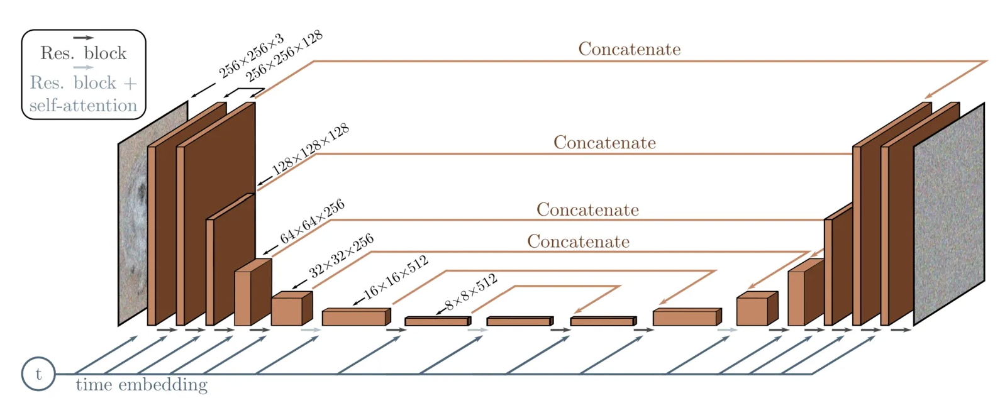
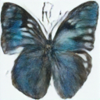
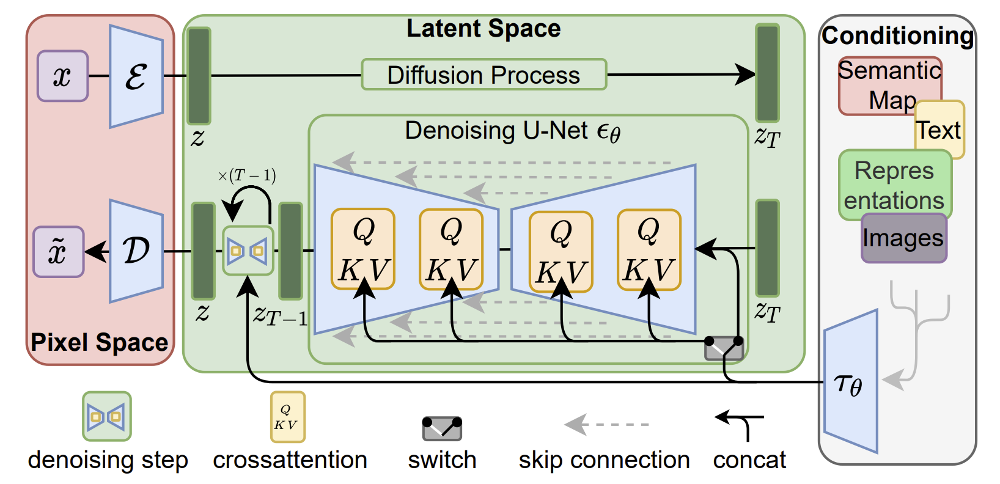

# 7. Diffusion Models

This chapter discusses main ideas of diffusion models behind many modern generative tools. These models are particularly powerful in applications like text-to-image and text-to-video generation. 

<!-- ## Contents

1. [The Basics: Variational Auto-Encoder (VAE)](#vae)
    - [VAE Setting](#vae-setting)
    - [Evidence Lower Bound](#evidence-lower-bound)
    - [Training VAE](#training-vae)
    - [Inference with VAE](#inference-with-vae)
    - [Hierarchical VAE](#hierarchical-vae)
2. [Denoising Diffusion Probabilistic Model (DDPM)](#ddpm)
    - [Variational Diffusion Models](#variational-diffusion-models)
    - [ELBO of DDPM](#elbo-of-ddpm)
    - [Key conditional distributions for ELBO](#key-conditional-distributions-for-elbo)
    - [Three equivalent way of derivation for training and inference](#three-equivalent-way-of-derivation-for-training-and-inference)
3. [Score-Matching Langevin Dynamics (SMLD)](#smld)
    - [Langevin Dynamics](#ld)
    - [Score Matching Techniques](#sm-techniques)
4. [Stochastic Differential Equation (SDE)](#sde)
    - [Forward and Backward Iterations in SDE](#f-n-b-sde)
    - [SDE for DDPM](#sde-ddpm)
    - [SDE for SMLD](#sde-smld)
5. [Conclusion](#conclusion) -->


## 1. Variational Autoencoders (VAEs) <a name="vae"></a>

### 1.1 The Basics

Recall the following concept from our [Chapter 1](https://genai-course.jding.org/en/latest/quickreview/index.html#from-elbo-to-vae-loss):
 
- $p(\boldsymbol{x})$: The distribution of $\boldsymbol{x}$, typically unknown and complex.
- $p(\boldsymbol{z})$: The distribution of $\boldsymbol{z}$, often assumed to have standard Gaussian prior $\mathcal{N}(0, I)$ whose dimension is smaller than $\bm x$.
- $q_{\boldsymbol{\phi}}(\boldsymbol{z} | \boldsymbol{x})$ : The encoder, proxy for $p(\boldsymbol{z} | \boldsymbol{x})$. 
- $p_{\boldsymbol{\theta}}(\boldsymbol{x} | \boldsymbol{z})$ : The decoder, proxy for $p(\boldsymbol{x} | \boldsymbol{z})$. 

- The objective function for VAEs is the maximization of the Evidence Lower Bound (ELBO)

$$
\text{ELBO} = \mathbb{E}_{q_{\boldsymbol{\phi}}(\boldsymbol{z}|\boldsymbol{x})}[\log p_\theta(\boldsymbol{x}|\boldsymbol{z})] - D_{KL}(q_{\boldsymbol{\phi}}(\boldsymbol{z}|\boldsymbol{x}) \| p(\boldsymbol{z})).
$$

- Loss Function: We approximate the first term by Monte-Carlo simulation:

$$
\mathbb{E}_{q_{\boldsymbol{\phi}}(\boldsymbol{z} | \boldsymbol{x})}\left[\log p_{\boldsymbol{\theta}}(\boldsymbol{x} | \boldsymbol{z})\right] \approx \frac{1}{L} \sum_{\ell=1}^L \log p_{\boldsymbol{\theta}}\left(\boldsymbol{x}^{\ell} | \boldsymbol{z}^{(\ell)}\right), \quad \boldsymbol{z}^{(\ell)} \sim q_{\boldsymbol{\phi}}\left(\boldsymbol{z} | \boldsymbol{x}^{(\ell)}\right),
$$

where $\boldsymbol{x}^{(\ell)}$ is the $\ell$-th sample in the training set, and $\boldsymbol{z}^{(\ell)}$ is sampled from $\boldsymbol{z}^{(\ell)} \sim q_{\boldsymbol{\phi}}\left(\boldsymbol{z} | \boldsymbol{x}^{(\ell)}\right)$. The distribution $q_{\boldsymbol{\phi}}\left(\boldsymbol{z} | \boldsymbol{x}^{(\ell)}\right)$ is parameterized by $\mathcal{N}\left(\boldsymbol{z} | \boldsymbol{\mu}_{\boldsymbol{\phi}}\left(\boldsymbol{x}^{(\ell)}\right), \boldsymbol{\sigma}_{\boldsymbol{\phi}}^2\left(\boldsymbol{x}^{(\ell)}\right) \mathbf{I}\right)$.

Then the training loss of VAE is given by

$$
\underset{\boldsymbol{\phi}, \boldsymbol{\theta}}{\mathrm{argmax}}\left\{\frac{1}{L} \sum_{\ell=1}^L \log p_{\boldsymbol{\theta}}\left(\boldsymbol{x}^{(\ell)} | \boldsymbol{z}^{(\ell)}\right)-\mathbb{D}_{\mathrm{KL}}\left(q_{\boldsymbol{\phi}}\left(\boldsymbol{z} | \boldsymbol{x}^{(\ell)}\right) \| p(\boldsymbol{z})\right)\right\}.
$$ (vaeloss)

You may verify that the KL divergence has an analytic expression.

<!-- #### Reparameterization Trick

Each $\boldsymbol{z}^{(\ell)}$ in our loss is generated by a stochastic sampling procedure, which is generally non-differentiable.

We can address this via the reparameterization trick, enabling gradient descent by making the sampling process differentiable:

$$
\boldsymbol{z} = \boldsymbol{\mu}_{\boldsymbol{\phi}}(\boldsymbol{x})+ \boldsymbol{\sigma}_{\boldsymbol{\phi}}(\boldsymbol{x}) \cdot \boldsymbol{\epsilon}, \quad \boldsymbol{\epsilon} \sim \mathcal{N}(0, \mathbf{I}) .
$$

Now the overall loss function {eq}`vaeloss` is differentiable. So, we can train the encoder and the decoder end-to-end by backpropagating the gradients. -->

<!-- ### 1.1 Inference with VAE <a name="inference-with-vae"></a> -->

After training a VAE, generating new data can be performed by sampling directly from the latent space $p(\boldsymbol{z})$
and then running it through the decoder.

### 1.2 Hierarchical Variational Autoencoders (HVAEs) <a name="hierarchical-vae"></a>

A Hierarchical Variational Autoencoder (HVAE) extends the concept of VAEs by introducing multiple layers of latent variables.

General HVAE has $T$ hierarchical levels and each latent is allowed to condition on all previous
latents. We instead focus on a special case called Markovian HVAE (MHVAE). In a MHVAE,
the generative process is a Markov chain, i.e., decoding each $\boldsymbol{z}_t$ only conditions on $\boldsymbol{z}_{t+1}$. See below for a MHVAE.

**Figure: A Markovian HVAE** ([image source](https://arxiv.org/abs/2208.11970))
<div style="text-align:center;">
    
</div>

The joint distribution and the posterior of a MHVAE is given by

$$
p\left(\boldsymbol{x}, \boldsymbol{z}_{1: T}\right)  =p\left(\boldsymbol{z}_T\right) p_{\boldsymbol{\theta}}\left(\boldsymbol{x} | \boldsymbol{z}_1\right) \prod_{t=2}^T p_{\boldsymbol{\theta}}\left(\boldsymbol{z}_{t-1} | \boldsymbol{z}_t\right)
$$

and

$$
q_{\boldsymbol{\phi}}\left(\boldsymbol{z}_{1: T} | \boldsymbol{x}\right)  =q_{\boldsymbol{\phi}}\left(\boldsymbol{z}_1 | \boldsymbol{x}\right) \prod_{t=2}^T q_{\boldsymbol{\phi}}\left(\boldsymbol{z}_t | \boldsymbol{z}_{t-1}\right) .
$$


The ELBO of such model can be written as


$$
\text{ELBO}&=\mathbb{E}_{q_{\boldsymbol{\phi}}\left(\boldsymbol{z}_{1: T} | \boldsymbol{x}\right)}\left[\log \frac{p\left(\boldsymbol{x}, \boldsymbol{z}_{1: T}\right)}{q_{\boldsymbol{\phi}}\left(\boldsymbol{z}_{1: T} | \boldsymbol{x}\right)}\right]\\&=\mathbb{E}_{q_{\boldsymbol{\phi}}\left(\boldsymbol{z}_{1: T} | \boldsymbol{x}\right)}\left[\log \frac{p\left(\boldsymbol{z}_T\right) p_{\boldsymbol{\theta}}\left(\boldsymbol{x} | \boldsymbol{z}_1\right) \prod_{t=2}^T p_{\boldsymbol{\theta}}\left(\boldsymbol{z}_{t-1} | \boldsymbol{z}_t\right)}{q_{\boldsymbol{\phi}}\left(\boldsymbol{z}_1 | \boldsymbol{x}\right) \prod_{t=2}^T q_{\boldsymbol{\phi}}\left(\boldsymbol{z}_t | \boldsymbol{z}_{t-1}\right)}\right].
$$

## 2. Denoising Diffusion Probabilisitc Model (DDPM) <a name="ddpm"></a>

<!-- ### 2.1 Variational Diffusion Models (VDM) <a name="variational-diffusion-models"></a> -->

A Denoising Diffusion Probabilisitc Model (DDPM) is a MHVAE with below three restrictions:

- **Restriction 1: The latent dimention is equal to the data dimention**

Basically a DDPM has a sequence of states $\{\boldsymbol{x}_t\}^T_{t=0}$, where $\boldsymbol{x}_0$ is the original image, $\boldsymbol{x}_1,\ldots, \boldsymbol{x}_T$ are the latent variables with the same dimension as $\boldsymbol{x}_0$.

The DDPM posterior can now be rewritten as

$$
q\left(\boldsymbol{x}_{1: T} | \boldsymbol{x}_0\right)=\prod_{t=1}^T q\left(\boldsymbol{x}_t | \boldsymbol{x}_{t-1}\right).
$$


- **Restriction 2: The latent encoder at each timestep is pre-defined as a linear Gaussian model** 

Here we parameterize the encoder as 

$$
q\left(\boldsymbol{x}_t | \boldsymbol{x}_{t-1}\right)=\mathcal{N}\left(\boldsymbol{x}_t ; \sqrt{\alpha_t} \boldsymbol{x}_{t-1},\left(1-\alpha_t\right) \mathbf{I}\right),
$$


or

$$
\boldsymbol{x}_t=\sqrt{\alpha_t} \boldsymbol{x}_{t-1}+\sqrt{1-\alpha_t} \boldsymbol{\epsilon} \quad \text { with } \boldsymbol{\epsilon} \sim \mathcal{N}(\boldsymbol{\epsilon} ; \boldsymbol{0}, \mathbf{I}), 
$$


where $\alpha_t$ is a (potentially learnable) coefficient that can vary per time $t$. This form of coefficients are chosen for being variance-preserving.


- **Restriction 3: The parameters of the Gaussian latent encoders are set to vary over time such that the distribution of the latent at the final timestep $T$ is a standard Gaussian**

$\alpha_t$ is set to evolve such that $\boldsymbol{x}_T \sim \mathcal{N}\left(\boldsymbol{0}, \mathbf{I}\right)$. In [DDPM paper](https://arxiv.org/abs/2006.11239) the noise schedule is set for $\beta_t = 1- \alpha_t$ and $\beta_t$ linearly increasing from $\beta_1= 10^{-4}$ to $\beta_T=0.02$, $T=1000$.

Now the joint distribution for a DDPM can be rewritten as

$$
p\left(\boldsymbol{x}_{0: T}\right)=p\left(\boldsymbol{x}_T\right) \prod_{t=1}^T p_{\boldsymbol{\theta}}\left(\boldsymbol{x}_{t-1} | \boldsymbol{x}_t\right), 
$$

where $p\left(\boldsymbol{x}_T\right)=\mathcal{N}\left(\boldsymbol{x}_T ; \boldsymbol{0}, \mathbf{I}\right).$

Note our encoders are no longer parameterized by $\boldsymbol{\phi}$, while our decoders (denoising transitions) $p_{\boldsymbol{\theta}}\left(\boldsymbol{x}_{t-1} | \boldsymbol{x}_t\right)$ are learnable to approach the transition distributions $p(\boldsymbol{x}_{t-1} | \boldsymbol{x}_t)$.

The full process of the encoders $q(\boldsymbol{x}_t|\boldsymbol{x}_{t-1})$ (adding noises) and decoders $p(\boldsymbol{x}_t|\boldsymbol{x}_{t+1})$ (denoising) is shown below.

**Figure: A visual representation of DDPM** ([image source](https://arxiv.org/abs/2208.11970))
<div style="text-align:center;">
    
</div>


### 2.1 ELBO of DDPM <a name="elbo-of-ddpm"></a>

There are two ways to understand the ELBO of DDPM.

The first way is to write

$$
\text{ELBO}=\underbrace{\mathbb{E}_{q\left(\boldsymbol{x}_1 | \boldsymbol{x}_0\right)}\left[\log p_\theta\left(\boldsymbol{x}_0 | \boldsymbol{x}_1\right)\right]}_{\text {reconstruction term }}  -\underbrace{\mathbb{E}_{q\left(\boldsymbol{x}_{T-1} | \boldsymbol{x}_0\right)}\left[D_{\mathrm{KL}}\left(q\left(\boldsymbol{x}_T | \boldsymbol{x}_{T-1}\right) \| p\left(\boldsymbol{x}_T\right)\right)\right]}_{\text {prior matching term }} -\sum_{t=1}^{T-1} \underbrace{\mathbb{E}_{q\left(\boldsymbol{x}_{t-1}, \boldsymbol{x}_{t+1} | \boldsymbol{x}_0\right)}\left[D_{\mathrm{KL}}\left(q\left(\boldsymbol{x}_t | \boldsymbol{x}_{t-1}\right) \| p_\theta\left(\boldsymbol{x}_t | \boldsymbol{x}_{t+1}\right)\right)\right]}_{\text {consistency term }}.
$$


***Reconstruction Term $\mathbb{E}_{q\left(\boldsymbol{x}_1 | \boldsymbol{x}_0\right)}\left[\log p_\theta\left(\boldsymbol{x}_0 | \boldsymbol{x}_1\right)\right]$***

The reconstruction term is derived from the expectation over the conditional distribution $q_{\boldsymbol{\phi}}(\boldsymbol{x}_1|\boldsymbol{x}_0)$.
This term predicts the log probability of the original data sample $\boldsymbol{x}_0$ given the first-step latent $\boldsymbol{x}_1$. This is similar to the decoder phase in a standard VAE, where the model learns to regenerate the original input from its latent representation, enhancing the model's ability to capture and reconstruct the input data accurately.


***Prior Matching Term $\mathbb{E}_{q\left(\boldsymbol{x}_{T-1} | \boldsymbol{x}_0\right)}\left[D_{\mathrm{KL}}\left(q\left(\boldsymbol{x}_T | \boldsymbol{x}_{T-1}\right) \| p\left(\boldsymbol{x}_T\right)\right)\right]$***

The prior matching term involves the KL divergence between the final latent distribution and the Gaussian prior.
This term is minimized when the distribution of the final latent variable $\boldsymbol{x}_T$ closely matches the Gaussian prior $\mathcal{N}(0, I)$. 


***Consistency Term $\mathbb{E}_{q\left(\boldsymbol{x}_{t-1}, \boldsymbol{x}_{t+1} | \boldsymbol{x}_0\right)}\left[D_{\mathrm{KL}}\left(q\left(\boldsymbol{x}_t | \boldsymbol{x}_{t-1}\right) \| p_\theta\left(\boldsymbol{x}_t | \boldsymbol{x}_{t+1}\right)\right)\right]$***

The consistency term checks for the consistency of the latent space transformation across all intermediate steps.
It ensures that the forward transformation to a noisier image matches the reverse transformation from a cleaner image, making the distribution at $\boldsymbol{x}_t$ consistent.


Under this derivation, all terms of the ELBO are computed as expectations, and can therefore be approximated using Monte Carlo estimates. However, optimizing the ELBO using the terms we just derived might be suboptimal: because the consistency term is computed as an expectation over two random variables $\left\{\boldsymbol{x}_{t-1}, \boldsymbol{x}_{t+1}\right\}$ for every timestep, the variance of its Monte Carlo estimate could potentially be higher than a term that is estimated using only one random variable per timestep. As it is computed by summing up $T-1$ consistency terms, the final estimated value of the ELBO may have high variance for large $T$ values.

The second way tries to compute expectation over only
one random variable at a time:

$$
\text{ELBO}=\underbrace{\mathbb{E}_{q\left(\boldsymbol{x}_1 | \boldsymbol{x}_0\right)}\left[\log p_{\boldsymbol{\theta}}\left(\boldsymbol{x}_0 | \boldsymbol{x}_1\right)\right]}_{\text {reconstruction term }}-\underbrace{D_{\mathrm{KL}}\left(q\left(\boldsymbol{x}_T | \boldsymbol{x}_0\right) \| p\left(\boldsymbol{x}_T\right)\right)}_{\text {prior matching term }}-\sum_{t=2}^T \underbrace{\mathbb{E}_{q\left(\boldsymbol{x}_t | \boldsymbol{x}_0\right)}\left[D_{\mathrm{KL}}\left(q\left(\boldsymbol{x}_{t-1} | \boldsymbol{x}_t, \boldsymbol{x}_0\right) \| p_{\boldsymbol{\theta}}\left(\boldsymbol{x}_{t-1} | \boldsymbol{x}_t\right)\right)\right]}_{\text {denoising matching term }}. 
$$ (felbo)


***Reconstruction Term (same as above) $\mathbb{E}_{q\left(\boldsymbol{x}_1 | \boldsymbol{x}_0\right)}\left[\log p_{\boldsymbol{\theta}}\left(\boldsymbol{x}_0 | \boldsymbol{x}_1\right)\right]$***

The reconstruction term is the same as in the first derivation.

***Prior Matching Term $D_{\mathrm{KL}}\left(q\left(\boldsymbol{x}_T | \boldsymbol{x}_0\right) \| p\left(\boldsymbol{x}_T\right)\right)$***

This term involves the KL divergence between the final latent distribution and a Gaussian prior. Under assumptions that the final latent distribution approximates a Gaussian, this term often evaluates to zero. This simplification reflects the model's adherence to the prior distribution without requiring trainable parameters.


***Denoising Matching (Consistency) Term $\mathbb{E}_{q\left(\boldsymbol{x}_t | \boldsymbol{x}_0\right)}\left[D_{\mathrm{KL}}\left(q\left(\boldsymbol{x}_{t-1} | \boldsymbol{x}_t, \boldsymbol{x}_0\right) \| p_{\boldsymbol{\theta}}\left(\boldsymbol{x}_{t-1} | \boldsymbol{x}_t\right)\right)\right]$***


The consistency term measures the fidelity of the denoising transitions
It ensures that the model's denoising capability, from a noisier to a cleaner state, matches the theoretical ground-truth denoising transition defined by $q(x_{t-1}|x_t, x_0)$. This term is minimized when the model's predicted denoising steps closely align with these ground-truth transitions.

This second interpretation of the ELBO offers a framework for understanding and implementing each component with reduced computational complexity and increased intuitive clarity. By focusing on one random variable at a time, we achieve lower variance in estimates, leading to more stable and reliable model training outcomes in variational inference frameworks like VAEs.

### 2.2 ELBO Continued: computational details <a name="key-conditional-distributions-for-elbo"></a>

For ELBO derived in the {eq}`felbo`, we need the explicit form of  $q\left(\boldsymbol{x}_t | \boldsymbol{x}_0\right)$ and $\left(\boldsymbol{x}_{t-1} | \boldsymbol{x}_t, \boldsymbol{x}_0\right)$ for sampling. 

We present the result here:

$$
q\left(\boldsymbol{x}_t | \boldsymbol{x}_0\right)=\mathcal{N}\left(\boldsymbol{x}_t ; \sqrt{\bar{\alpha}_t}\boldsymbol{x}_0, (1-\bar{\alpha}_t)\mathbf{I}\right),
$$

or equivalently

$$
\boldsymbol{x}_t= \sqrt{\bar{\alpha}_t}\boldsymbol{x}_0+\sqrt{1-\bar{\alpha}_t}\boldsymbol{\epsilon}_0, 
$$

where $\bar{\alpha}_t=\prod^t_{i=1}\alpha_i$ and $\boldsymbol{\epsilon}_0\sim \mathcal{N}\left(0, \mathbf{I}\right)$.


$$
q\left(\boldsymbol{x}_{t-1} | \boldsymbol{x}_t, \boldsymbol{x}_0\right)=\mathcal{N}\left(\boldsymbol{x}_{t-1} | \boldsymbol{\mu}_q\left(\boldsymbol{x}_t, \boldsymbol{x}_0\right), \boldsymbol{\Sigma}_q(t)\right),
$$

where

$$
\boldsymbol{\mu}_q\left(\boldsymbol{x}_t, \boldsymbol{x}_0\right) =\frac{\left(1-\bar{\alpha}_{t-1}\right) \sqrt{\alpha_t}}{1-\bar{\alpha}_t} \boldsymbol{x}_t+\frac{\left(1-\alpha_t\right) \sqrt{\bar{\alpha}_{t-1}}}{1-\bar{\alpha}_t} \boldsymbol{x}_0 ,
$$ (mean)

and

$$
\boldsymbol{\Sigma}_q(t) =\frac{\left(1-\alpha_t\right)\left(1-\bar{\alpha}_{t-1}\right)}{1-\bar{\alpha}_t} \mathbf{I} \stackrel{\text { def }}{=} \sigma_q^2(t) \mathbf{I} .
$$

### 2.3 Three equivalent ways of modeling <a name="three-equivalent-way-of-derivation-for-training-and-inference"></a>

#### 2.3.1 First Way of Modeling
From the ELBO {eq}`felbo` we know that we have to compute the KL divergence term. $p_\theta$ is what we can set for training, and from 2.3 we know $q\left(\boldsymbol{x}_{t-1} | \boldsymbol{x}_t, \boldsymbol{x}_0\right)$ is Gaussian, **so for convenience we formulate $p_\theta$ as a Gaussian**, with the same variance as $q\left(\boldsymbol{x}_{t-1} | \boldsymbol{x}_t, \boldsymbol{x}_0\right)$ and a learnable mean:

$$
p_{\boldsymbol{\theta}}\left(\boldsymbol{x}_{t-1} | \boldsymbol{x}_t\right)=\mathcal{N}\left(\boldsymbol{x}_{t-1} |\boldsymbol{\mu}_{\boldsymbol{\theta}}\left(\boldsymbol{x}_t,t\right), \sigma_q^2(t) \mathbf{I}\right),
$$


where $\boldsymbol{\mu}_{\boldsymbol{\theta}}\left(\boldsymbol{x}_t,t\right)$ is a neural network parametrized by $\boldsymbol{\theta}$.

Now we have

$$
D_{\mathrm{KL}}\left(q\left(\boldsymbol{x}_{t-1} | \boldsymbol{x}_t, \boldsymbol{x}_0\right) \| p_{\boldsymbol{\theta}}\left(\boldsymbol{x}_{t-1} | \boldsymbol{x}_t\right)\right)=\frac{1}{2 \sigma_q^2(t)}\left\|\boldsymbol{\mu}_q\left(\boldsymbol{x}_t, \boldsymbol{x}_0\right)-\boldsymbol{\mu}_{\boldsymbol{\theta}}\left(\boldsymbol{x}_t,t\right)\right\|^2.
$$ (kl)


To match the form of mean in {eq}`mean`

$$
\boldsymbol{\mu}_q\left(\boldsymbol{x}_t, \boldsymbol{x}_0\right) =\frac{\left(1-\bar{\alpha}_{t-1}\right) \sqrt{\alpha_t}}{1-\bar{\alpha}_t} \boldsymbol{x}_t+\frac{\left(1-\alpha_t\right) \sqrt{\bar{\alpha}_{t-1}}}{1-\bar{\alpha}_t} \boldsymbol{x}_0
$$


we set 

$$
\boldsymbol{\mu}_{\boldsymbol{\theta}}\left(\boldsymbol{x}_t\right)=\frac{\left(1-\bar{\alpha}_{t-1}\right) \sqrt{\alpha_t}}{1-\bar{\alpha}_t} \boldsymbol{x}_t+\frac{\left(1-\alpha_t\right) \sqrt{\bar{\alpha}_{t-1}}}{1-\bar{\alpha}_t}\hat{\boldsymbol{x}}_{\boldsymbol{\theta}}(\boldsymbol{x}_t,t),
$$

where $\hat{\boldsymbol{x}}_{\boldsymbol{\theta}}(\boldsymbol{x}_t,t)$ is another neural network (still parameterized by $\boldsymbol{\theta}$) that predicts the clean image $\boldsymbol{x}_0 $ from the noisy image $\boldsymbol{x}_t$ and time $t$.
 
Now the KL divergence {eq}`kl` can be further simplified to 

$$
D_{\mathrm{KL}}\left(q\left(\boldsymbol{x}_{t-1} | \boldsymbol{x}_t, \boldsymbol{x}_0\right) \| p_{\boldsymbol{\theta}}\left(\boldsymbol{x}_{t-1} | \boldsymbol{x}_t\right)\right)=\frac{1}{2 \sigma_q^2(t)} \frac{\bar{\alpha}_{t-1}\left(1-\alpha_t\right)^2}{\left(1-\bar{\alpha}_t\right)^2}\left[\left\|\hat{\boldsymbol{x}}_{\boldsymbol{\theta}}\left(\boldsymbol{x}_t, t\right)-\boldsymbol{x}_0\right\|^2\right].
$$

Note that for our reconstruction term in {eq}`felbo` we can derive that

$$
\log p_{\boldsymbol{\theta}}\left(\boldsymbol{x}_0 | \boldsymbol{x}_1\right) =-\frac{1}{2 \sigma_q^2(1)}\left\|\widehat{\boldsymbol{x}}_{\boldsymbol{\theta}}\left(\boldsymbol{x}_1,1\right)-\boldsymbol{x}_0\right\|^2.
$$


Therefore, the training of the neural network based on the ELBO we derived boils down to the simple loss function below:

$$
\boldsymbol{\theta}^*=\underset{\boldsymbol{\theta}}{\mathrm{argmin}} \sum_{t=1}^T \frac{1}{2 \sigma_q^2(t)} \frac{\left(1-\alpha_t\right)^2 \bar{\alpha}_{t-1}}{\left(1-\bar{\alpha}_t\right)^2} \mathbb{E}_{q\left(\boldsymbol{x}_t | \boldsymbol{x}_0\right)}\left[\left\|\widehat{\boldsymbol{x}}_{\boldsymbol{\theta}}\left(\boldsymbol{x}_t,t\right)-\boldsymbol{x}_0\right\|^2\right] .
$$


#### 2.3.2 Second Way of Modeling
Note that we set our neural network ($\widehat{\boldsymbol{x}}_{\boldsymbol{\theta}}\left(\boldsymbol{x}_t,t\right)$) for predicting the image. We can actually learn to predict the noise. To see that, from $\boldsymbol{x}_t=\sqrt{\bar{\alpha}_t} \boldsymbol{x}_0+\sqrt{\left(1-\bar{\alpha}_t\right)} \boldsymbol{\epsilon}_0$ we can obtain $\boldsymbol{x}_0=\frac{\boldsymbol{x}_t-\sqrt{\left(1-\bar{\alpha}_t\right)} \boldsymbol{\epsilon}_0}{\sqrt{\bar{\alpha}_t}}$ and put it in $\boldsymbol{\mu}_q\left(\boldsymbol{x}_t, \boldsymbol{x}_0\right)$, and then get 

$$
\boldsymbol{\mu}_q\left(\boldsymbol{x}_t, \boldsymbol{x}_0\right)=\frac{1}{{\sqrt{{\alpha}_t}}}\boldsymbol{x}_t-\frac{1-{\alpha}_t}{\sqrt{1-\bar{\alpha}_t}\sqrt{{\alpha}_t}} \boldsymbol{\epsilon}_0.
$$


So similarly we can design our mean estimator $\boldsymbol{\mu}_{\boldsymbol{\theta}}$ as 

$$
\boldsymbol{\mu}_{\boldsymbol{\theta}}\left(\boldsymbol{x}_t, t\right)=\frac{1}{{\sqrt{{\alpha}_t}}}\boldsymbol{x}_t-\frac{1-{\alpha}_t}{\sqrt{1-\bar{\alpha}_t}\sqrt{{\alpha}_t}} \widehat{\boldsymbol{\epsilon}}_{\boldsymbol{\theta}}\left(\boldsymbol{x}_t, t\right).
$$


And the new loss function would be given by

$$
\boldsymbol{\theta}^*=\underset{\boldsymbol{\theta}}{\mathrm{argmin}} \sum_{t=1}^T \frac{1}{2 \sigma_q^2(t)} \frac{\left(1-\alpha_t\right)^2 \bar{\alpha}_{t-1}}{\left(1-\bar{\alpha}_t\right)^2} \mathbb{E}_{q\left(\boldsymbol{x}_t | \boldsymbol{x}_0\right)}\left[\left\|\widehat{\boldsymbol{\epsilon}}_{\boldsymbol{\theta}}\left(\boldsymbol{x}_t, t\right)-\boldsymbol{\epsilon}_0\right\|^2\right] .
$$


The training and inference process below is what you would see in the [DDPM paper](https://arxiv.org/abs/2006.11239). We elaborate on them below. 

**Training a Denoising Diffusion Probabilistic Model**


- Repeat the following steps until convergence.
- For every image $\boldsymbol{x}^{(m)}_0, m=1,\ldots,M$ ($M$ is the batch size) in a batch for training: sample a random time stamp $t^{(m)} \sim \mathrm{Uniform}[1, T]$.
- Draw a sample $\boldsymbol{\epsilon}^{(m)}_0 \sim \mathcal{N}(0, \mathbf{I})$ 
- Draw a sample $\boldsymbol{x}^{(m)}_{t^{(m)}} \sim \mathcal{N}\left(\boldsymbol{x}^{(m)}_{t^{(m)}} | \sqrt{\bar{\alpha}_{t^{(m)}}} \boldsymbol{x}^{(m)}_0,\left(1-\bar{\alpha}_{t^{(m)}}\right) \mathbf{I}\right)$ by

$$
\boldsymbol{x}^{(m)}_t=\sqrt{\bar{\alpha}_{t^{(m)}}} \boldsymbol{x}^{(m)}_0+\sqrt{\left(1-\bar{\alpha}_{t^{(m)}}\right)} \boldsymbol{\epsilon}^{(m)}_0.
$$

- Take gradient descent step on

$$
\nabla_{\boldsymbol{\theta}}\frac{1}{M}\sum^{M}_{m=1}\left\|\widehat{\boldsymbol{\epsilon}}_{\boldsymbol{\theta}}\left(\boldsymbol{x}^{(m)}_{t^{(m)}},{t^{(m)}}\right)-\boldsymbol{\epsilon}_0\right\|^2
$$


**Inference on a Denoising Diffusion Probabilistic Model**

- Sample an $\boldsymbol{x}_T \sim \mathcal{N}(0, \mathbf{I})$.
- Repeat the following for $t=T, T-1, \ldots, 1$.
- Calculate $\widehat{\boldsymbol{\epsilon}}_{\boldsymbol{\theta}}\left(\boldsymbol{x}_t,t\right)$.
- Update according to

$$
\boldsymbol{x}_{t-1}=\frac{1}{{\sqrt{{\alpha}_t}}}\boldsymbol{x}_t-\frac{1-{\alpha}_t}{\sqrt{1-\bar{\alpha}_t}\sqrt{{\alpha}_t}}\widehat{\boldsymbol{\epsilon}}_{\boldsymbol{\theta}}\left(\boldsymbol{x}_t, t\right)+\sigma_q(t) \boldsymbol{z}_t, \quad \boldsymbol{z}_t \sim \mathcal{N}(0, \mathbf{I}) .
$$

**Sample Code: Training a DDPM in Practice**

Install some packages:
``` bash
pip install git+https://github.com/huggingface/diffusers.git#egg=diffusers[training]
pip install accelerate
pip install datasets
```

Set up configurations:
``` python
from dataclasses import dataclass

@dataclass
class TrainingConfig:
    image_size = 128  # the generated image resolution
    train_batch_size = 16
    eval_batch_size = 16  # how many images to sample during evaluation
    num_epochs = 50
    gradient_accumulation_steps = 1
    learning_rate = 1e-4
    lr_warmup_steps = 500
    save_image_epochs = 10
    save_model_epochs = 30
    mixed_precision = 'fp16'  # `no` for float32, `fp16` for automatic mixed precision
    output_dir = 'ddpm-butterflies-128'  # the model namy locally and on the HF Hub
    seed = 0

config = TrainingConfig()
```

The denoising neural network $\widehat{\boldsymbol{\epsilon}}_{\boldsymbol{\theta}}\left(\boldsymbol{x}_{t},{t}\right)$ is often a U-Net in practice. The input would be an RGB image $\boldsymbol{x}_{t}$ and the timestep $t$, and the output would also be an RGB image. 

**Figure: A U-Net architecture used in DDPM** ([image source](https://learnopencv.com/denoising-diffusion-probabilistic-models/))
<div style="text-align:center;">
    
</div>


```python
from diffusers import UNet2DModel

model = UNet2DModel(
    sample_size=config.image_size,  # the target image resolution
    in_channels=3,  # the number of input channels, 3 for RGB images
    out_channels=3,  # the number of output channels
    layers_per_block=2,  # how many ResNet layers to use per UNet block
    block_out_channels=(128, 128, 256, 256, 512, 512),  # the number of output channes for each UNet block
    down_block_types=( 
        "DownBlock2D",  # a regular ResNet downsampling block
        "DownBlock2D", 
        "DownBlock2D", 
        "DownBlock2D", 
        "AttnDownBlock2D",  # a ResNet downsampling block with spatial self-attention
        "DownBlock2D",
    ), 
    up_block_types=(
        "UpBlock2D",  # a regular ResNet upsampling block
        "AttnUpBlock2D",  # a ResNet upsampling block with spatial self-attention
        "UpBlock2D", 
        "UpBlock2D", 
        "UpBlock2D", 
        "UpBlock2D"  
      ),
)
```

This `UNet2DModel` consists of the following blocks

**Input Convolution**
- `Conv2d(3, 128, kernel_size=(3, 3), stride=(1, 1), padding=(1, 1))`
  - Maps 3-channel images to 128 feature channels.

**Time Embedding**
- `Timesteps()`: Generates embeddings for different time steps.
- `TimestepEmbedding`
  - `Linear(in_features=128, out_features=512, bias=True)`: Projects time embeddings to a higher dimension.
  - `SiLU()`: Activation function for adding non-linearity.
  - `Linear(in_features=512, out_features=512, bias=True)`: Further processing of the time embeddings.

**Downsampling Blocks**
- Sequence of `DownBlock2D` modules, each containing:
  - **Residual Blocks** (`ResnetBlock2D`)
    - `GroupNorm(32, width, eps=1e-05, affine=True)`: Normalizes the features within each group.
    - `Conv2d(width, width, kernel_size=(3, 3), padding=(1, 1))`: Maintains feature width.
    - `Linear(in_features=512, out_features=width, bias=True)`: Projects time embeddings.
    - `SiLU()`: Adds non-linearity between convolutional layers.
    - `Dropout(p=0.0, inplace=False)`: Optional dropout (inactive here) for regularization.
  - **Downsampling**
    - `Conv2d(width, width, kernel_size=(3, 3), stride=(2, 2), padding=(1, 1))`: Reduces spatial dimensions.

**Mid Block**
- `UNetMidBlock2D`
  - **Attention**
    - `GroupNorm(32, 512, eps=1e-05, affine=True)` and linear layers for queries, keys, and values.
    - `Attention`: Captures global dependencies across features.
  - **Residual Blocks** (`ResnetBlock2D`)
    - Structured similarly to those in the downsampling stages, focused on bottleneck features.

**Upsampling Blocks**
- Sequence of `UpBlock2D` modules, each containing:
  - **Residual Blocks** (`ResnetBlock2D`)
    - Structured similarly to downsampling but integrates lower-level features.
  - **Upsampling**
    - `Conv2d(width, width, kernel_size=(3, 3), stride=(1, 1), padding=(1, 1))`: Increases spatial dimensions.

The dataset we use here is [Butterflies dataset](https://huggingface.co/datasets/huggan/smithsonian_butterflies_subset). It consists of 1000 images for butterflies from different species. We need to resize them for training.

``` python
from datasets import load_dataset
import torch
from torchvision import transforms

config.dataset = "huggan/smithsonian_butterflies_subset"
dataset = load_dataset(config.dataset, split="train")

preprocess = transforms.Compose(
    [
        transforms.Resize((config.image_size, config.image_size)),
        transforms.RandomHorizontalFlip(),
        transforms.ToTensor(),
        transforms.Normalize([0.5], [0.5]),
    ]
)

def transform(examples):
    images = [preprocess(image.convert("RGB")) for image in examples["image"]]
    return {"images": images}

dataset.set_transform(transform)

train_dataloader = torch.utils.data.DataLoader(dataset, batch_size=config.train_batch_size, shuffle=True)
```

To inspect what the images look like, you can use the code below

``` python
import matplotlib.pyplot as plt
fig, axs = plt.subplots(1, 4, figsize=(16, 4))
for i, image in enumerate(dataset[:4]["images"]):
    axs[i].imshow(image.permute(1, 2, 0).numpy() / 2 + 0.5)
    axs[i].set_axis_off()
fig.show()
```

And you will see figures like this

**Figure: Some examples of resized images from Butterflies** 
<div style="text-align:center;">
    
</div>

The scheduler function here can basically do two things according to the specific diffusion process: 1. add noise to the image for training. 2. remove the noise based on the model output for inference. We use `DDPMScheduler` for noise scheduler, which means that we will do the above two things according to the linear schduler from $\beta_1=10^{-5}$ to $\beta_T=0.02$ by default, with $T=1000$. 

``` python
from diffusers import DDPMScheduler

noise_scheduler = DDPMScheduler(num_train_timesteps=1000)
```
Then we can start training with the code below

``` python
from diffusers.optimization import get_cosine_schedule_with_warmup
from accelerate import Accelerator
from tqdm.auto import tqdm
import torch
import torch.nn.functional as F
optimizer = torch.optim.AdamW(model.parameters(), lr=config.learning_rate)
lr_scheduler = get_cosine_schedule_with_warmup(
    optimizer=optimizer,
    num_warmup_steps=config.lr_warmup_steps,
    num_training_steps=(len(train_dataloader) * config.num_epochs),
)

def train_loop(config, model, noise_scheduler, optimizer, train_dataloader, lr_scheduler):
    # Initialize accelerator
    accelerator = Accelerator(
        mixed_precision=config.mixed_precision,
        gradient_accumulation_steps=config.gradient_accumulation_steps
    )
    
    # Prepare everything
    model, optimizer, train_dataloader, lr_scheduler = accelerator.prepare(
        model, optimizer, train_dataloader, lr_scheduler
    )
    
    global_step = 0

    # train the model
    for epoch in range(config.num_epochs):
        progress_bar = tqdm(total=len(train_dataloader), disable=not accelerator.is_local_main_process)
        progress_bar.set_description(f"Epoch {epoch}")

        for step, batch in enumerate(train_dataloader):
            clean_images = batch['images']
            # Sample noise to add to the images
            noise = torch.randn(clean_images.shape).to(clean_images.device)
            bs = clean_images.shape[0]

            # Sample a random timestep for each image
            timesteps = torch.randint(0, noise_scheduler.num_train_timesteps, (bs,), device=clean_images.device).long()

            # Add noise to the clean images according to the noise magnitude at each timestep
            noisy_images = noise_scheduler.add_noise(clean_images, noise, timesteps)
            
            with accelerator.accumulate(model):
                # Predict the noise residual
                noise_pred = model(noisy_images, timesteps)["sample"]
                loss = F.mse_loss(noise_pred, noise)
                accelerator.backward(loss)

                optimizer.step()
                lr_scheduler.step()
                optimizer.zero_grad()
            
            progress_bar.update(1)
            global_step += 1

        # Save the model at the end of training
        if accelerator.is_main_process and epoch == config.num_epochs - 1:
            model.save_pretrained(config.output_dir)

# Directly call the train loop with the arguments
train_loop(config, model, noise_scheduler, optimizer, train_dataloader, lr_scheduler)
```

**Inference with the above trained DDPM**

To use a trained DDPM like above, we need the utility function `download_and_unzip` from [utils.py](https://drive.google.com/file/d/1tKQCXmrT4whJr1V33nBVRhaNzniRT5KE/view?usp=sharing) to load files for the trained model shared through Google Drive. 

```python
trained_ddpm_id = '1h675AhteNxXd752FCqqcRMu0TSkuupCY'
output_dir= # e.g., "models/"
checkpoint = download_and_unzip(trained_ddpm_id, output_dir) 

import os
from diffusers import UNet2DModel
from diffusers import DDPMScheduler

def load_model(output_dir):
    # Load the model weights and configuration
    model = UNet2DModel.from_pretrained(output_dir)
    
    return model

model = load_model(config.output_dir)
scheduler = DDPMScheduler(num_train_timesteps=1000)
```

Then we can do sampling in this way. It would show the final output together with the intermideate samples.

``` python
import torch
import PIL.Image
from IPython.display import display
import numpy as np
import tqdm

def display_sample(sample, i):
    # Convert tensor to image for visualization
    image_processed = sample.cpu().permute(0, 2, 3, 1)
    image_processed = (image_processed + 1.0) * 127.5
    image_processed = image_processed.numpy().astype(np.uint8)

    # Create PIL Image and display it with step info
    image_pil = PIL.Image.fromarray(image_processed[0])
    display(f"Image at step {i}")
    display(image_pil)

# Assuming 'model' and 'scheduler' are already configured and loaded
model.to("cuda")

# Initialize the noise sample
torch.manual_seed(0)
noisy_sample = torch.randn(
    1, 3, config.image_size, config.image_size  # Ensure this matches your model's expected input
).to("cuda")
sample = noisy_sample

# Inference loop through the timesteps
for i, t in enumerate(tqdm.tqdm(scheduler.timesteps)):
    # Predict the noise residual
    with torch.no_grad():
        residual = model(sample, torch.tensor([t]).to(sample.device)).sample  # Ensure your model call is correct

    # Compute denoised image and update sample
    sample = scheduler.step(residual, torch.tensor([t]).to(sample.device), sample).prev_sample

    # Display image at specified timestep
    if (i + 1) % 50 == 0:
        display_sample(sample, i + 1)
```

The final output will look like this

**Figure: An example of the output from the trained DDPM** 
<div style="text-align:center;">
    
</div>


**Inference with others' pretrained DDPM**

To illustrate inference, we also use another pretrained DDPM `google/ddpm-celebahq-25`. The code below shows how to load this model and do the denoising process for one image. The sampling may take a few minutes for only one image.

``` python
from diffusers import DDPMPipeline, UNet2DModel, DDPMScheduler
import PIL.Image
import numpy as np
import torch
import tqdm

# load the pretrained DDPM
image_pipe = DDPMPipeline.from_pretrained("google/ddpm-celebahq-256")
image_pipe.to("cuda")
repo_id = "google/ddpm-church-256"
model = UNet2DModel.from_pretrained(repo_id)
scheduler = DDPMScheduler.from_config(repo_id)

# display the image for intermediate steps
def display_sample(sample, i):
    image_processed = sample.cpu().permute(0, 2, 3, 1)
    image_processed = (image_processed + 1.0) * 127.5
    image_processed = image_processed.numpy().astype(np.uint8)

    image_pil = PIL.Image.fromarray(image_processed[0])
    display(f"Image at step {i}")
    display(image_pil)
model.to("cuda")

# sample the initial noise
torch.manual_seed(0)
noisy_sample = torch.randn(
    1, model.config.in_channels, model.config.sample_size, model.config.sample_size
)
noisy_sample = noisy_sample.to("cuda")
sample = noisy_sample

# do inference
for i, t in enumerate(tqdm.tqdm(scheduler.timesteps)):
  # predict noise residual
  with torch.no_grad():
      residual = model(sample, t).sample

  # compute denoised image and set x_t -> x_t-1
  sample = scheduler.step(residual, t, sample).prev_sample

  # optionally look at image
  if (i + 1) % 50 == 0:
      display_sample(sample, i + 1)
```

#### Third Way of Modeling

The third way of training and inference is based on gradient of $\boldsymbol{x}_t$ in data space, $\nabla_{\boldsymbol{x}_t}\log p(\boldsymbol{x}_t)$, which is also called (Stein's) score function.

For Gaussian-distributed $q\left(\boldsymbol{x}_t | \boldsymbol{x}_0\right)=\mathcal{N}\left(\boldsymbol{x}_t ; \sqrt{\bar{\alpha}_t}\boldsymbol{x}_0, (1-\bar{\alpha}_t)\mathbf{I}\right)$, by [Tweedie's Formula](https://efron.ckirby.su.domains/papers/2011TweediesFormula.pdf), we have

$$
\mathbb{E}\left[\sqrt{\bar{\alpha}_t}\boldsymbol{x}_0 | \boldsymbol{x}_t\right]=\boldsymbol{x}_t+\left(1-\bar{\alpha}_t\right) \nabla_{\boldsymbol{x}_t} \log p\left(\boldsymbol{x}_t\right),
$$


and replace the  $\mathbb{E}\left[\sqrt{\bar{\alpha}_t}\boldsymbol{x}_0 | \boldsymbol{x}_t\right]$ with $\sqrt{\bar{\alpha}_t}\boldsymbol{x}_0 $ as an approximation, we have

$$
\boldsymbol{x}_0 \approx \frac{\boldsymbol{x}_t+\left(1-\bar{\alpha}_t\right) \nabla_{\boldsymbol{x}_t} \log p\left(\boldsymbol{x}_t\right)}{\sqrt{\bar{\alpha}_t}}.
$$ (oi)


Again we can plug {eq}`oi` into $\boldsymbol{\mu}_q\left(\boldsymbol{x}_t, \boldsymbol{x}_0\right)$ and get

$$
\boldsymbol{\mu}_q\left(\boldsymbol{x}_t, \boldsymbol{x}_0\right) =\frac{1}{\sqrt{\alpha_t}} \boldsymbol{x}_t+\frac{\left(1-\alpha_t\right) }{\sqrt{\alpha_t}}  \nabla_{\boldsymbol{x}_t} \log p\left(\boldsymbol{x}_t\right).
$$


Therefore, we can set another new nerual network

$$
\boldsymbol{\mu}_{\boldsymbol{\theta}}\left(\boldsymbol{x}_t, t\right)=\frac{1}{{\sqrt{{\alpha}_t}}}\boldsymbol{x}_t+\frac{1-{\alpha}_t}{\sqrt{{\alpha}_t}}{\boldsymbol{s}}_{\boldsymbol{\theta}}\left(\boldsymbol{x}_t, t\right),
$$ 


and the corresponding loss function would be 

$$
\boldsymbol{\theta}^*=\underset{\boldsymbol{\theta}}{\arg \min } \frac{1}{2 \sigma_{\boldsymbol{q}}^2(t)} \frac{\left(1-\alpha_t\right)^2}{\alpha_t}\mathbb{E}_{q\left(\boldsymbol{x}_t | \boldsymbol{x}_0\right)}\left[\left\|\boldsymbol{s}_{\boldsymbol{\theta}}\left(\boldsymbol{x}_t, t\right)-\nabla_{\boldsymbol{x}_t} \log p\left(\boldsymbol{x}_t\right)\right\|^2\right],
$$ (sobj)


where $\boldsymbol{s}_{\boldsymbol{\theta}}\left(\boldsymbol{x}_t, t\right)$ is a neural network that learns to predict the score function $\nabla_{\boldsymbol{x}_t} \log p\left(\boldsymbol{x}_t\right)$.

We will revisit the third way of training and inference from another perspective in the next section.  

## 3. Score-Matching Langevin Dynamics (SMLD) <a name="smld"></a>

### 3.1 Langevin Dynamics <a name="ld"></a>

Langevin dynamics is a stochastic process described by a differential equation that models the evolution of a system under the influence of both deterministic and random forces. The continuous-time Langevin dynamics is given by the following stochastic differential equation (SDE):

$$
d\boldsymbol{x}_t = \nabla_{\boldsymbol{x}} \log p(\boldsymbol{x}_t) dt + \sqrt{2} d\boldsymbol{W}_t,
$$


where $p(\boldsymbol{x})$ is the target probability distribution, and $\boldsymbol{W}_t$ is a standard Wiener process (Brownian motion).

A key property of this SDE is that its stationary distribution coincides with $p(\boldsymbol{x})$. In other words, as $t \to \infty$, the distribution of $\boldsymbol{x}_t$ converges to $p(\boldsymbol{x})$. This convergence property makes Langevin dynamics a powerful tool for sampling from complex probability distributions.

To generate samples from $p(\boldsymbol{x})$, one can simulate the Langevin dynamics for a sufficiently long time. The resulting trajectory will explore the state space according to the target distribution, with the gradient term guiding the process towards high-probability regions and the stochastic term ensuring exploration of the entire space.

In practice, simulating the continuous-time process is often infeasible, so a discrete-time approximation is used. The discrete Langevin dynamics for sampling from $p(\boldsymbol{x})$ is an iterative procedure for $t=1, \ldots, T$:

$$
\boldsymbol{x}_{t+1}=\boldsymbol{x}_t+\tau \nabla_{\boldsymbol{x}} \log p\left(\boldsymbol{x}_t\right)+\sqrt{2 \tau} \boldsymbol{z}, \quad \boldsymbol{z} \sim \mathcal{N}(0, \mathbf{I}),
$$


where $\tau$ is the step size that users can control, and $\boldsymbol{x}_0$ is typically initialized as white noise.

This discrete approximation converges to samples from the target distribution $p(\boldsymbol{x})$ as $\tau \to 0$ and $T \to \infty$. In practice, a small but finite step size is used. Metropolis-adjusted Langevin algorithm is often used to correct approximation biases. 


### 3.2 Score Matching Techniques <a name="sm-techniques"></a>

Since we have no access to $p(\boldsymbol{x})$, we need approximation of $\nabla_{\boldsymbol{x}} \log p\left(\boldsymbol{x}_t\right)$. In this section we introduce two of such approximation. 

We define $\boldsymbol{s}_{\boldsymbol{\theta}}(\boldsymbol{x})$ as the neural network parameterized by $\boldsymbol{\theta}$ that predicts the score function.

#### Explicit Score-Matching

Given dataset $\mathcal{X}=\{\boldsymbol{x}_t,\ldots, \boldsymbol{x}_M\}$, consider the classical kernel density estimation (KDE) with

$$
q(\boldsymbol{x})=\frac{1}{M} \sum_{m=1}^M \frac{1}{h} K\left(\frac{\boldsymbol{x}-\boldsymbol{x}_m}{h}\right),
$$


where $h$ is the bandwidth for the kernel function $K(\cdot)$. $q(\boldsymbol{x})$ is then an approximation to the unknown true data distribution $p(\boldsymbol{x})$.

The explicit score matching loss is then given by 

$$
J_{\mathrm{ESM}}(\boldsymbol{\theta}) \stackrel{\text { def }}{=} \mathbb{E}_{q(\boldsymbol{x})}\left\|\boldsymbol{s}_{\boldsymbol{\theta}}(\boldsymbol{x})-\nabla_{\boldsymbol{x}} \log q(\boldsymbol{x})\right\|^2.
$$


Once we train the network $\boldsymbol{s}_{\boldsymbol{\theta}}$, we can do sampling with 

$$
\boldsymbol{x}_{t+1}=\boldsymbol{x}_t+\tau \boldsymbol{s}_{\boldsymbol{\theta}}(\boldsymbol{x}_t)+\sqrt{2 \tau} \boldsymbol{z}.
$$


The problem with explicit score matching is that KDE is poor estimation of the true distribution, especially when the number of samples is limited or the samples are high-dimensional.

#### Denoising Score Matching

It can be shown that the following loss, also known as  Denoising Score Matching (DSM), 

$$
J_{\mathrm{DSM}}(\boldsymbol{\theta}) =\mathbb{E}_{p\left(\boldsymbol{x}\right)}\left[\frac{1}{2}\left\|\boldsymbol{s}_{\boldsymbol{\theta}}\left(\boldsymbol{x}+\sigma \boldsymbol{z}\right)+\frac{\boldsymbol{z}}{\sigma^2}\right\|^2\right].
$$ (dsm)

satisfies

$$
J_{\mathrm{DSM}}(\boldsymbol{\theta}) = J_{\mathrm{ESM}}(\boldsymbol{\theta}) + C
$$

where $C$ is a term that does not depend on $\boldsymbol{\theta}$. Refer to this [paper](https://www.iro.umontreal.ca/~vincentp/Publications/smdae_techreport.pdf) that connects ESM and DSM.


 
Now the loss function {eq}`dsm` is highly interpretable: the score function $\boldsymbol{s}_{\boldsymbol{\theta}}$ is trained to take the noisy image $\boldsymbol{x}+\sigma \boldsymbol{z}$ and predict the noise $\boldsymbol{z}/\sigma^2$.

The training step is as follows: given a training dataset $\{\boldsymbol{x}^{(\ell)}\}_{\ell=1}^L$, train a network $\boldsymbol{\theta}$ with the goal

$$
\boldsymbol{\theta}^*=\underset{\boldsymbol{\theta}}{\mathrm{argmin}} \frac{1}{L} \sum_{\ell=1}^L \frac{1}{2}\left\|\boldsymbol{s}_{\boldsymbol{\theta}}\left(\boldsymbol{x}^{(\ell)}+\sigma \boldsymbol{z}^{(\ell)}\right)+\frac{\boldsymbol{z}^{(\ell)}}{\sigma^2}\right\|^2, \quad \text { where } \quad \boldsymbol{z}^{(\ell)} \sim \mathcal{N}(0, \mathbf{I}) .
$$

For inference, to generate an image, we perform the following procedure for $t=1, \ldots, T$ with the trained score estimator $\boldsymbol{s}_{\boldsymbol{\theta}}$:

$$
\boldsymbol{x}_{t+1}=\boldsymbol{x}_t+\tau \boldsymbol{s}_{\boldsymbol{\theta}}\left(\boldsymbol{x}_t\right)+\sqrt{2 \tau} \boldsymbol{z}_t, \quad \text { where } \quad \boldsymbol{z}_t \sim \mathcal{N}(0, \mathbf{I}).
$$ (LD)

There are some problems with vanilla score matching

- The score function is ill-defined when $\boldsymbol{x}$ lies on a low-dimensional manifold in a high-dimensional space.
- The estimated score function trained will not be accurate in low density regions.
- Langevin dynamics sampling may not mix, even if it is performed using the ground truth scores.

To address the problems in vanilla score matching, as proposed in Noise
Conditional Score Network (NCSN), multiple levels of Gaussian noise can be added to the data in the following way: choose a positive sequence of noise levels $\{\sigma_t\}_{t=1}^T$, $\sigma_{\text{min}}=\sigma_1<\ldots<\sigma_T = \sigma_{\text{max}}$, and define a sequence of progressively perturbed data distributions

$$
p_{\sigma_t}\left(\boldsymbol{x}_t\right)=\int p(\boldsymbol{x}) \mathcal{N}\left(\boldsymbol{x}_t ; \boldsymbol{x}, \sigma_t^2 \mathbf{I}\right) \mathrm{d} \boldsymbol{x}.
$$

Then, a neural network $\boldsymbol{s}_{\boldsymbol{\theta}}(\boldsymbol{x}, t)$ is trained using score matching to learn the score function for all noise levels simultaneously:

$$
\boldsymbol{\theta}^*=\underset{\boldsymbol{\theta}}{\arg \min } \sum_{t=1}^T \lambda(t) \mathbb{E}_{p_{\sigma_t}\left(\boldsymbol{x}_t\right)}\left[\left\|\boldsymbol{s}_{\boldsymbol{\theta}}(\boldsymbol{x}, t)-\nabla \log p_{\sigma_t}\left(\boldsymbol{x}_t\right)\right\|_2^2\right],
$$


where $\lambda(t)$ is a positive weighting function that conditions on noise level $t$, and often chosen as $\lambda(t)=\sigma_t^2$. Note that this objective almost matches the objective derived in {eq}`sobj`, our third explanation on DDPM. 

The annealed Langevin dynamics sampling is applied as a sampling procedure: samples are produced by running Langevin dynamics for each $t=T, T-1, \ldots, 2,1$ in sequence:

For each noise level $\sigma_t$, $M$ steps of Langevin MCMC are run sequentially for each $p_{\sigma_t}(\boldsymbol{x})$:

$$
\boldsymbol{x}_{m}^{(t)} = \boldsymbol{x}_{m-1}^{(t)} + \frac{\alpha_t}{2} \boldsymbol{s}_{\boldsymbol{\theta}^*}(\boldsymbol{x}_{m-1}^{(t)}, \sigma_t) + \sqrt{\alpha_t} \boldsymbol{z}_m^{(t)},
$$

where $\alpha_t=\sigma^2_t/\sigma^2_T$ is the step size, and $\boldsymbol{z}_m^{(t)} $ is standard normal. 

The sampling start with $\boldsymbol{x}_0^{(T)} \sim \mathcal{N}(\boldsymbol{0}, \sigma_{\text{max}}^2 \mathbf{I})$ and set $\boldsymbol{x}_0^{(t)} = \boldsymbol{x}_M^{(t+1)}$ for $t < T.$ As $M \to \infty$ and $\alpha_t \to 0$ for all $t$, $\boldsymbol{x}_M^{(1)}$ becomes an exact sample from $p_{\sigma_{\text{min}}}(\boldsymbol{x}) \approx p(\boldsymbol{x}).$
    
This is directly analogous to the sampling procedure performed in DDPM, where a randomly initialized data vector is iteratively refined over decreasing noise levels.

Therefore, we have established an explicit connection between DDPM and Score-based Generative Models, both in their training objectives and sampling procedures.

## 4. Stochastic Differential Equations (SDE) <a name="sde"></a>

One question is how to naturally generalize diffusion models to an infinite number of timesteps. Under the Markovian HVAE view, this can be interpreted as extending the number of hierarchies to infinity $T \rightarrow \infty$. It is clearer to represent this from the equivalent score-based generative model perspective: under an infinite number of noise scales, the perturbation of an image over continuous time can be represented as a stochastic process, and therefore described by a stochastic differential equation (SDE). 

<!-- Sampling is then performed by reversing the SDE, which naturally requires [estimating the score function at each continuous-valued noise level](https://arxiv.org/abs/2011.13456). Different parameterizations of the SDE essentially describe different perturbation schemes over time, enabling flexible modeling of the noising procedure. -->


### 4.1 Forward and Backward Iterations in SDE <a name="f-n-b-sde"></a>

We start from discretizing a continuous interval. Suppose $\boldsymbol{x}(t)$ is a continous function for $t \in [0,1]$, and there are $N$ steps in $[0,1]$ such that it can be devided into a sequence $\{i/N\}^{N-1}_{i=0}.$ The interval step is $\Delta t =1/N$ and now $t \in \{0,1/N,\ldots,(N-1)/N \}.$ Set $\boldsymbol{x}_i=\boldsymbol{x}(i/N)$.

Suppose now the sampling goes like this:

$$
\boldsymbol{x}_{i}= \boldsymbol{x}_{i-1}-\tau \nabla f\left(\boldsymbol{x}_{i-1},i-1\right)+ \boldsymbol{z}_{i-1}, \quad \boldsymbol{z}_{i-1} \sim \mathcal{N}(0, \mathbf{I}).
$$


Use our discretization we have

$$
\boldsymbol{x}(t+\Delta t)= \boldsymbol{x}(t)-\tau \nabla f\left(\boldsymbol{x}(t),t\right)+ \boldsymbol{z}(t).
$$


Now we define a random process $\boldsymbol{w}(t)$ (called Wiener process, or Brownian motion) such that

$$
\boldsymbol{z}(t) = \boldsymbol{w}(t+\Delta t)-\boldsymbol{w}(t) \approx \frac{\mathrm{d}\boldsymbol{w}(t) }{\mathrm{d} t}\Delta t
$$

for a very small $\Delta t$.

With $\boldsymbol{w}(t)$ we have

$$
\boldsymbol{x}(t+\Delta t)-\boldsymbol{x}(t) &=-\tau \nabla f(\boldsymbol{x}(t),t)+\boldsymbol{w}(t+\Delta t)-\boldsymbol{w}(t) \\\Longrightarrow  \mathrm{d} \boldsymbol{x} &=-\tau \nabla f(\boldsymbol{x},t) \mathrm{d} t+\mathrm{d} \boldsymbol{w},
$$

which reveals a generic form of SDE, called Forward Diffusion:

$$
\mathrm{d} \boldsymbol{x} = \underbrace{\boldsymbol{f}(\boldsymbol{x},t)}_{\text{drift}} \mathrm{d} t+\underbrace{g(t)}_{\text{diffusion}}\mathrm{d} \boldsymbol{w}.
$$ (fsde)


The reverse direction of the diffusion equation {eq}`fsde` is to move backward in time. The reverse-time SDE is given as follows: 

$$
\mathrm{d} \boldsymbol{x}=[\underbrace{\boldsymbol{f}(\boldsymbol{x}, t)}_{\text {drift }}-g(t)^2 \underbrace{\nabla_{\boldsymbol{x}} \log p_t(\boldsymbol{x})}_{\text {score function }}] \mathrm{d} t+\underbrace{g(t) \mathrm{d} \overline{\boldsymbol{w}}}_{\text {reverse-time diffusion }} ,
$$


where $p_t(\boldsymbol{x})$ is the probability density function of $\boldsymbol{x}$ at time $t$, and $\overline{\boldsymbol{w}}$ is the Wiener process when time flows backwards. 

### 4.2 SDE for DDPM <a name="sde-ddpm"></a>

The discrete-time DDPM iteration is given by

$$
\boldsymbol{x}_i = \sqrt{1 - \beta_i} \boldsymbol{x}_{i-1} + \sqrt{\beta_i} \boldsymbol{z}_{i-1}, \quad \boldsymbol{z}_{i-1} \sim \mathcal{N}(0, \mathbf{I}), 
$$ (disddpm)


for $i=1,2,\ldots,N.$ This forward sampling equation can be written as an SDE via

$$
\mathrm{d} \boldsymbol{x} = -\frac{\beta(t)}{2} \boldsymbol{x}\mathrm{d} t+\sqrt{\beta(t)}\mathrm{d} \boldsymbol{w}.
$$ (vpsde)


We can say the DDPM iteration {eq}`disddpm` solves the SDE {eq}`vpsde`, but it may not be the best solver.

The corresponding reverse diffusion is then given by

$$
\mathrm{d} \boldsymbol{x}=-\beta(t)\left[\frac{\boldsymbol{x}}{2}+ \nabla_{\boldsymbol{x}} \log p_t(\boldsymbol{x})\right] \mathrm{d} t+\sqrt{\beta(t)} \mathrm{d} \overline{\boldsymbol{w}}.
$$


<!-- We can recover the DDPM iteration by discretization: consider $\mathrm{d} \boldsymbol{x} = \boldsymbol{x}(t-\Delta t) - \boldsymbol{x}(t)$, $\mathrm{d} \overline{\boldsymbol{w}} = \boldsymbol{w}(t-\Delta t)-\boldsymbol{w}(t)= \sqrt{\Delta t}\boldsymbol{z}$, and $\mathrm{d} t = -\Delta t$, we have

$$
\boldsymbol{x}(t-\Delta t) = \boldsymbol{x}(t) +\beta(t)\Delta t\left[\frac{\boldsymbol{x}(t)}{2}+ \nabla_{\boldsymbol{x}} \log p_t(\boldsymbol{x}(t))\right]+\sqrt{\beta(t)\Delta t} \boldsymbol{z}
$$ -->

### 4.3 SDE for SMLD <a name="sde-smld"></a>

The score-matching Langevin Dynamics model can also be described by an SDE. We can roughly argue that if we divide the noise scale in the SMLD training into $N$ levels, then the recursion should follow a Markov chain

$$
\boldsymbol{x}_i=\boldsymbol{x}_{i-1}+\sqrt{\sigma_i^2-\sigma_{i-1}^2} \boldsymbol{z}_{i-1}, \quad i=1,2, \ldots, N.
$$


The (rough) argument is as follows: in SMLD we have $q_{\sigma_t}(\boldsymbol{x}|\boldsymbol{x}_0)= \mathcal{N}\left(\boldsymbol{x} ; \boldsymbol{x}_0, \sigma_t^2 \mathbf{I}\right)$, and thus $\boldsymbol{x}_i=\boldsymbol{x}_0+\sigma_i \boldsymbol{z} =\boldsymbol{x}_{i-1}-\sigma_{i-1} \boldsymbol{z}^{\prime}+\sigma_i \boldsymbol{z} = \sqrt{\sigma_i^2-\sigma_{i-1}^2} \boldsymbol{z}_{i-1}$.   


The forward sampling equation of SMLD can be written as an SDE via

$$
\mathrm{d}\boldsymbol{x}=\sqrt{\frac{\mathrm{d}\left[\sigma(t)^2\right]}{\mathrm{d}t}} \mathrm{d}\boldsymbol{w}.
$$


The reverse sampling equation of SMLD can be written as an SDE via

$$
\mathrm{d} \boldsymbol{x}=-\left(\frac{\mathrm{d}\left[\sigma(t)^2\right]}{\mathrm{d}t} \nabla_{\boldsymbol{x}} \log p_t(\boldsymbol{x}(t))\right) \mathrm{d}t+\sqrt{\frac{d\left[\sigma(t)^2\right]}{\mathrm{d}t}} \mathrm{d}\overline{\boldsymbol{w}}.
$$


Similar to DDPM case we have the following discretization:

$$
\boldsymbol{x}_{i-1}=\boldsymbol{x}_i+\left(\sigma_i^2-\sigma_{i-1}^2\right) \nabla_{\boldsymbol{x}} \log p_i\left(\boldsymbol{x}_i\right)+\sqrt{\left(\sigma_i^2-\sigma_{i-1}^2\right)} \boldsymbol{z}_i, $$


which matches {eq}`LD` the SMLD at inference.

## 5. Diffusion Model in Practice: Stable Diffusion

**Overview**
Stable Diffusion (SD) is a popular text-to-image model based on diffusion. Stable Diffusion series before SD 3 is essencially a Latent Diffusion Model (LDM) with three components: an autoencoder, a U-Net based conditional denoisng network, and a text encoder. 

The autoencodng model learns a low-dimentional  latent space that is perceptually equivalent to the image space. It was empirically that the denosing U-Net works on the latent space much more efficiently than denoising directly on the high-dimensional image space. The text encoder accepts text input and guides the diffusion process.  


### 5.1 The Autoencoder 

Given an image $x \in \mathbb{R}^{H \times W \times 3}$ in RGB space, the encoder $\mathcal{E}$ encodes $x$ into a latent representation $z=\mathcal{E}(x)$, and the decoder $\mathcal{D}$ reconstructs the image from the latent, giving $\tilde{x}=\mathcal{D}(z)=\mathcal{D}(\mathcal{E}(x))$, where $z \in \mathbb{R}^{h \times w \times c}$. 


### 5.2 The (Conditional) Denoising U-Net

The Denoising U-Net in SD is similar to that in DDPM
, a time-conditional U-Net, except that now it works on the low-dimensional latent space. Since the forward process is fixed, $z_t$ can be efficiently obtained from $\mathcal{E}$ during training, and samples from $p(z)$ can be decoded to image space with a single pass through $\mathcal{D}$.

In SD, the U-Net is turned to a conditional image generator with the augmentation of ***cross-attention***.  It is effective for learning attention-based models of various input modalities. 

In principle, diffusion models can model conditional distributions of the form $p(z \mid y)$. This can be implemented with a conditional denoising neural network $\epsilon_\theta\left(z_t, t, y\right)$ where inputs $y$ (such as text or image) would guide the diffusion process.

To pre-process $y$ from various modalities (such as language prompts), a domain specific encoder $\tau_\theta$ is introduced to project $y$ to an intermediate representation $\tau_\theta(y)$. It is then mapped to the intermediate layers of the U-Net via a cross-attention layer implementing $\operatorname{Attention}(Q, K, V)=\operatorname{softmax}\left(\frac{Q K^T}{\sqrt{d}}\right) \cdot V$, with

$$
Q=W_Q^{(i)} \cdot \varphi_i\left(z_t\right), K=W_K^{(i)} \cdot \tau_\theta(y), V=W_V^{(i)} \cdot \tau_\theta(y)
$$


Here, $\varphi_i\left(z_t\right) \in \mathbb{R}^{N \times d_\epsilon^i}$ denotes a (flattened) intermediate representation of the U-Net that models $\epsilon_\theta$. $W_Q^{(i)} \in\mathbb{R}^{d \times d_\epsilon^i}, W_K^{(i)} \in \mathbb{R}^{d \times d_\tau}$ and $W_V^{(i)} \in \mathbb{R}^{d \times d_\tau}$ are learnable projection matrices. This is shown in Figure 3.

*Figure 3: Overview of LDM* ([image source](https://arxiv.org/abs/2112.10752))

Based on image-conditioning pairs, the conditional LDM is learned via

$$
L_{L D M}:=\mathbb{E}_{\mathcal{E}(x), y, \epsilon \sim \mathcal{N}(\bm 0, I), t}\left[\left\|\epsilon-\epsilon_\theta\left(z_t, t, \tau_\theta(y)\right)\right\|_2^2\right]
$$

where both $\tau_\theta$ and $\epsilon_\theta$ are jointly optimized. This conditioning mechanism is flexible as $\tau_\theta$ can be parameterized with domain-specific experts, e.g. (unmasked) transformers when $y$ are text prompts.

We list some common cases of conditional generation.

- For text-to-image generation, the $\tau_{\theta}$ is often a transformer architecture.

- For layout-to-image generation, we discretize the spatial locations of the bounding boxes and encode each box as a $(l, b, c)$-tuple, treated as the above $y$. Here, $l$ denotes the (discrete) top-left and $b$ the bottom-right position. Class information is represented by $c$. The $\tau_theta$ is also often implemented as a transformer.

- For the class-conditional generation, $\tau_\theta$ is a single learnable embedding layer with a dimension (e.g.,  512), mapping a class $y$ to a vector $\tau_\theta (y)$.

- For super resolution, inpainting, and semantic-map-to-image, the conditioning is realized by concatenation.


### References

- [Tutorial on Diffusion Models for Imaging and Vision](https://arxiv.org/abs/2403.18103)
- [Understanding Diffusion Models: A Unified Perspective](https://arxiv.org/abs/2208.11970)
- [Auto-Encoding Variational Bayes](https://arxiv.org/abs/1312.6114)
- [Denoising Diffusion Probabilistic Models](https://arxiv.org/abs/2006.11239)
- [Variational Diffusion Models](https://arxiv.org/abs/2107.00630)
- [Score-Based Generative Modeling through Stochastic Differential Equations](https://arxiv.org/abs/2011.13456)
- [Generative Modeling by Estimating Gradients of the Data Distribution](https://arxiv.org/abs/1907.05600)
- [Tweedie's Formula and Selection Bias](https://efron.ckirby.su.domains/papers/2011TweediesFormula.pdf)
- [High-Resolution Image Synthesis with Latent Diffusion Models](https://arxiv.org/abs/2112.10752)
