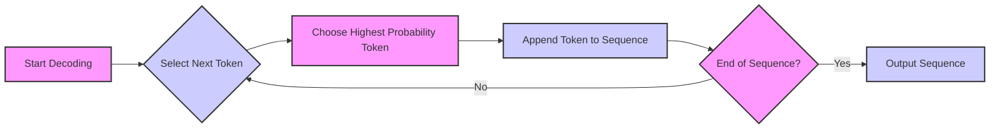
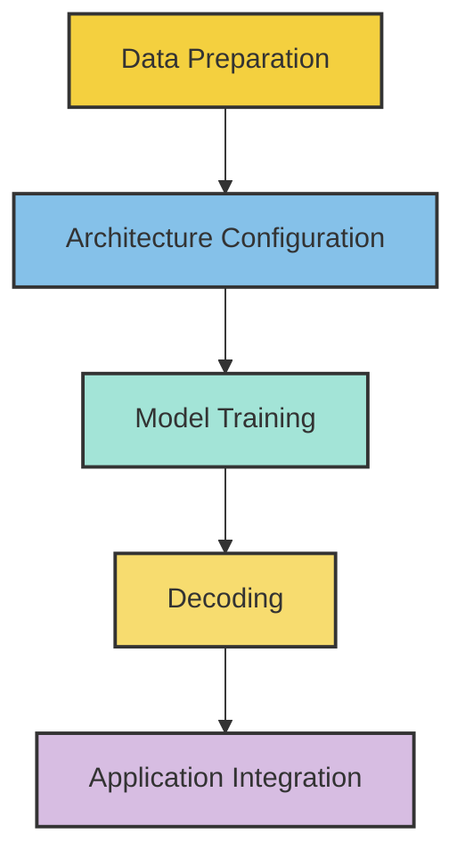

# 2. Large Language Modeling

## What the Blackbox Is

Let us first go through a typical procedure of loading and using a trained model. 

First, let us inspect the current working directory and organize dependent files accordingly.
```
current_path = os.getcwd()
print(f"Current Working Directory: {current_path}")
```

Load some necessary packages, which requires dependent python files/modules [model.py](https://github.com/JieGroup/GenAI/blob/50daed0b92c72e2d5a1ba882b0432acf85b10daf/llm/model.py) and [tokenizer.py](https://github.com/JieGroup/GenAI/blob/2fc13ea064f1cbc7e36f87b98ac875e63ab8c1a9/llm/tokenizer.py).
```
from contextlib import nullcontext
import torch
from model import ModelArgs, Transformer
from tokenizer import Tokenizer
import os
```

Put the trained language [model](https://github.com/JieGroup/GenAI/blob/9fc9ce870f6c23fee3a2224121d7a834c0bc0ecc/llm/trained_model_config1_tok32000.pt) and [tokenizer](https://github.com/JieGroup/GenAI/blob/50daed0b92c72e2d5a1ba882b0432acf85b10daf/llm/tokenizer.model) files under suitable directories
```
checkpoint = "models/trained_model.pt"
tokenizer = "data/trained_tokenizer.model"
```

We set the device to run the model. For large models, we typically need to use GPU for computational efficiency as it requires many matrix calculations.  The stage of using the model to perform tasks is often called `inference'. This does not mean the same as in statistics!
```
device = 'cuda' if torch.cuda.is_available() else 'cpu'
print(f"Use device: {device}")
```

Load the pretrained model:
```
checkpoint_dict = torch.load(checkpoint, map_location=device)
gptconf = ModelArgs(**checkpoint_dict['model_args'])
model = Transformer(gptconf)
state_dict = checkpoint_dict['model']
unwanted_prefix = '_orig_mod.' #the unwanted prefix was sometimes added during compiling
for k,v in list(state_dict.items()):
    if k.startswith(unwanted_prefix):
        state_dict[k[len(unwanted_prefix):]] = state_dict.pop(k)
model.load_state_dict(state_dict, strict=False)
```

 Now, we call model.eval() to ensure that model layers behave correctly during the inference phase. This specifically affects certain PyTorch layers that behave differently during training and inference, such as: 
> **Batch Normalization**: During training, batch normalization layers use batch statistics. In evaluation mode, these layers use running statistics computed during training.
> **Dropout Layers**: Dropout is active during training to prevent overfitting by randomly zeroing out neuron elements. During inference, dropout is deactivated to use the full capacity of the model.
```
model.eval()
model.to(device)
```

Load the pretrained tokenizer:
```
enc = Tokenizer(tokenizer_model=tokenizer)
```

Config the precision:
```
dtype = 'bfloat16' if torch.cuda.is_available() and torch.cuda.is_bf16_supported() else 'float16' # 'float32' or 'bfloat16' or 'float16'
torch.backends.cuda.matmul.allow_tf32 = True #enables the use of TF32 for matrix multiplication operations within PyTorch when using CUDA
torch.backends.cudnn.allow_tf32 = True #enables the use of TF32 precision within the cuDNN library
device_type = 'cuda' if 'cuda' in device else 'cpu'
ptdtype = {'float32': torch.float32, 'bfloat16': torch.bfloat16, 'float16': torch.float16}[dtype]
ctx = nullcontext() if device_type == 'cpu' else torch.amp.autocast(device_type=device_type, dtype=ptdtype)
```

> **TF32** is a new compute data type for NVIDIA Ampere GPUs that allows for performance similar to FP16 while maintaining the dynamic range close to that of FP32. The settings for TF32 are global and affect all applicable operations across PyTorch.
> **torch.amp.autocast** optimizes performance by using lower precision (like float16) for certain operations to speed up computing and reduce memory usage while maintaining the accuracy of calculations.
> The **ctx** context manager is for mixed precision where supported, enhancing computational efficiency without sacrificing accuracy when using GPUs

Prepare the config parameters for generation/decoding:
```
num_samples = 1 # number of samples to draw
max_new_tokens = 256 # number of tokens generated in each sample
temperature = 1.0 # 1.0 = no change, < 1.0 = less random, > 1.0 = more random, in predictions
top_k = 300 # retain only the top_k most likely tokens
```

Choose any prompt text, encode it, move to the right device (GPU if possible), and sequentially generate new texts:
```
start = "Once upon a time, there is a unicorn"
start_ids = enc.encode(start, bos=True, eos=False)
x = (torch.tensor(start_ids, dtype=torch.long, device=device)[None, ...])
with torch.no_grad():
    with ctx:
        for k in range(num_samples):
            y = model.generate(x, max_new_tokens, temperature=temperature, top_k=top_k)
            print(enc.decode(y[0].tolist()))
            print('---------------')
```
It will generate texts like:
```
"Once upon a time, there is a unicorn named Bobo. Bobo lived in a big red stable. He was a very nice toy. One day, Bobo had a bad dream to wake up. He was scared and did not know what to do.
Bobo was very sad. He wanted to have a friend like the other toy. He thought and thought about where he could be. Maybe his friend was in a scary place. He wanted a friend just like Bobo.
Bobo had an idea. He saw a big ball in the road. He knew that the big ball could help do its scary dream. So, he went very fast to the ball and pushed it off the road. The big ball rolled far away. Bobo was so happy. All his toy friends had a big smile on their face. He was very glad he had a brave friend like Bobo. One day, it started to rain. The sky was dark, and there was a lot of mist. A little boy named Tim saw the mist and wanted to see what was inside. He got his shoes and mittens. He opened the door and sneaked in.
As Tim walked through the mist, he started to become bitter. He did not like the"
```

Sometimes, you run into an error that says "Expected all tensors to be on the same device, but found at least two devices ..."
If that happens, check model and data are on the same device:
```
print("Device of model parameters:", next(model.parameters()).device)
print("Device of input tensor 'x':", x.device)
```

### Exercises
- Try different config parameters for decoding and sense the differences. Try to figure out the reasons.
- Try batching `num_samples=k` prompts into the decoding and compare the time cost with the alternative that runs the above code `k` times. Try to figure out the reasons. 
- Try to mess up with the codes and see what kind of errors you can get.
            
            
## Decoding from A Trained Model

Let us look into the decoding method of the model. 

The following `generate` is a method under the model class. It takes a conditioning sequence of indices idx, which is a LongTensor of shape `(batch_size, sentence_length)`, and completes the sequence `max_new_tokens` times, feeding the predictions back into the model each time. The function is often operated under `model.eval()` mode.

```
   @torch.inference_mode()
   def generate(self, idx, max_new_tokens, temperature=1.0, top_k=None):
       for _ in range(max_new_tokens):
           idx_cond = idx if idx.size(1) <= self.params.max_seq_len else idx[:, -self.params.max_seq_len:]
           logits = self(idx_cond)
           logits = logits[:, -1, :] # crop to just the final time step
           if temperature == 0.0:
               _, idx_next = torch.topk(logits, k=1, dim=-1)
           else:
               logits = logits / temperature
               if top_k is not None:
                   v, _ = torch.topk(logits, min(top_k, logits.size(-1)))
                   logits[logits < v[:, [-1]]] = -float('Inf')
               probs = F.softmax(logits, dim=-1)
               idx_next = torch.multinomial(probs, num_samples=1)
           idx = torch.cat((idx, idx_next), dim=1)

       return idx
```
> `@torch.inference_mode()` is a decorator in PyTorch that sets the context for the block of code under it to be optimized for inference. This is a newer alternative to using `torch.no_grad()`, which was commonly used to disable gradient calculations.  


Suppose we propose a new decoding approach, we can use the following way to change the `model.generate` function for the loaded model instance:
```
def custom_generate(self, idx, max_new_tokens, temperature=1.0, top_k=None):
    # Custom generation logic here
    for _ in range(max_new_tokens):
        ...
    return idx
    
# Assign the custom generate method to the model instance
model.generate = custom_generate.__get__(model, Transformer)
```
> `custom_generate.__get__(model, Transformer)` is used to bind the `custom_generate` function as a method to the `model` instance.  

Below, I'll outline various decoding strategies used in NLP for generating text, providing a context for each and how they can be implemented based on your provided `generate` method.

#### Greedy Decoding

Always picks the next word with the highest probability. This method can lead to repetitive and predictable text. Flowchart illustration:


Sample code:
```
if temperature == 0.0:
    _, idx_next = torch.topk(logits, k=1, dim=-1)
    idx = torch.cat((idx, idx_next), dim=1)
```

#### Temperature Scaling

Adjusts the "sharpness" of the probability distribution. A lower temperature makes the distribution peakier (more greedy), while a higher temperature makes the distribution flatter (more random).
```
logits = logits / temperature
probs = F.softmax(logits, dim=-1)
idx_next = torch.multinomial(probs, num_samples=1)
idx = torch.cat((idx, idx_next), dim=1)
```

#### Top-k Sampling

Limits the next word choices to the top k most probable words. Reduces the risk of choosing very low probability words and maintains diversity. The default decoding algorithm was set to be a combination of Top-k Sampling and Temperature Scaling.

```
if top_k is not None:
    values, indices = torch.topk(logits, k=top_k)
    logits[logits < values[:, [-1]]] = -float('Inf')
    probs = F.softmax(logits, dim=-1)
    idx_next = torch.multinomial(probs, num_samples=1)
    idx = torch.cat((idx, idx_next), dim=1)
```

#### Top-p (Nucleus) Sampling
Instead of cutting off at a specific number, this approach chooses the smallest set of words whose cumulative probability exceeds the probability p. This focuses on a dynamic number of high-probability words while maintaining diversity.
```
cum_probs = torch.cumsum(F.softmax(logits, dim=-1), dim=-1)
threshold = torch.rand(1).item()
idx_next = torch.min((cum_probs > threshold).nonzero(as_tuple=True)[1])
idx = torch.cat((idx, idx_next.unsqueeze(0)), dim=1)
```


#### Beam-search decoding
Beam search maintains multiple hypotheses (the "beam") at each step and expands them further by exploring several possible next steps. This strategy balances between breadth (diversity) and depth (accuracy).

```
beam_width = 5
candidates = [idx]
for _ in range(max_new_tokens):
    all_candidates = []
    for candidate in candidates:
        logits = self(candidate)
        probs = F.softmax(logits[:, -1, :], dim=-1)
        top_probs, top_idx = torch.topk(probs, k=beam_width)
        for i in range(beam_width):
            next_candidate = torch.cat((candidate, top_idx[:, i:i+1]), dim=1)
            all_candidates.append((next_candidate, top_probs[:, i].item()))
    ordered = sorted(all_candidates, key=lambda x: x[1], reverse=True)
    candidates = [x[0] for x in ordered[:beam_width]]
idx = candidates[0]
```
 
### Exercises
- Implement streaming generation for better visualization and UI experiences.
- Discuss when one decoding method might be preferred over the other.
- Generate text using different temperature values and discuss how the temperature affects text quality.
- Implement beam search decoding with different beam widths. Evaluate how increasing the beam width affects the computational cost and the quality of the generated text.
- Search and investigate how popular models like GPT-2 or Llama-2 utilize default decoding strategies. Discuss any custom modifications or optimizations they might use.
- Study other decoding strategies such as Speculative Decoding, and brainstorm new possibilities. 


## Tokenization and Vocabulary

Tokenization is the process of converting text into a series of tokens, which can be characters, words, or pieces of words from splitting the input text. This process is necessary for turning domain-specific problem into a quantities that can be mathematically modeled. Vocabulary refers to the set of unique tokens after tokenization. A trained model consists of a model itself and a corresponding vocabulary. 

### Vocabulary Construction

-  **Fixed Vocabulary**: Traditional language models use a fixed vocabulary, often created by selecting the most common words from a training corpus. Words not in the vocabulary are treated as out-of-vocabulary (OOV) and are often replaced with a special token like `<unk>` for "unknown".

-  **Subword Tokenization**: This approach, often used in modern LLMs like BERT and GPT, splits words into smaller, meaningful subunits. This method allows the model to handle a wide range of words with a more compact vocabulary.

**Note**: In transformer models, the vector representation of each token, often referred to as an "embedding," is learned automatically during the training process. Unlike static embeddings (like those from Word2Vec), embeddings in transformers are context-dependent. That is, the same word can have different embeddings based on its surrounding words.

**Example**: Byte Pair Encoding (BPE) is a popular subword tokenization method initially designed for data compression and later adapted for NLP tasks. BPE iteratively merges the most frequent pair of bytes or characters in a dataset into a single new token, continuing this process until a specified number of merges (vocabulary size) has been reached. Pseudocode:
```
Initialize vocabulary V with every unique character in the corpus
While desired vocabulary size not reached or merges are beneficial:
    Count frequency of adjacent pairs of symbols in the corpus
    Find the most frequent pair (a, b)
    Merge pair (a, b) into new symbol c
    Add c to V
    Replace all occurrences of (a, b) in the corpus with c
Return modified corpus and V
```
For example,  suppose we have the word "hello". The initial vocabulary is {h, e, l, o}. The most frequent pair is (l, l). The new vocabulary after first merge is {h, e, ll, o}.

> [**SentencePiece**](https://github.com/google/sentencepiece) is a package that implements subword tokenization. It is language-independent and can be used to train LLMs without requiring pre-tokenized text. SentencePiece can train models directly from raw, untokenized texts, and support both BPE and unigram language model tokenization methods.

Here is an example of using SentencePiece for training a tokenizer from raw text data.
```
import sentencepiece as spm
spm.SentencePieceTrainer.train(input=DATA_PATH, model_prefix=SAVE_PATH, model_type="bpe", vocab_size=VOCAB_SIZE, input_format="text")
```
It will create a file that contains a tokenizer model, such as [this one](https://github.com/JieGroup/GenAI/blob/50daed0b92c72e2d5a1ba882b0432acf85b10daf/llm/tok2048.model).  When we use it to encode or decode, we need to generate an instance of the following Tokenizer class.

```
import os
from sentencepiece import SentencePieceProcessor

class Tokenizer:
    def __init__(self, tokenizer_model):
        assert os.path.isfile(tokenizer_model), "Tokenizer model file not found."
        self.sp_model = SentencePieceProcessor(model_file=tokenizer_model)

        # Basic vocabulary properties
        self.n_words = self.sp_model.vocab_size()  # Total vocabulary size
        self.bos_id = self.sp_model.bos_id()       # Beginning of sentence token
        self.eos_id = self.sp_model.eos_id()       # End of sentence token
        self.pad_id = self.sp_model.pad_id()       # Padding token

    def encode(self, text, bos=True, eos=True):
        # Encodes text into a list of token ids
        tokens = self.sp_model.encode(text)
        if bos:
            tokens = [self.bos_id] + tokens
        if eos:
            tokens += [self.eos_id]
        return tokens

    def decode(self, tokens):
        # Decodes a list of token ids back into text
        return self.sp_model.decode(tokens)

tok = Tokenizer(tokenizer_model)
# use tok.encode(text, bos=True, eos=False)
# use tok.decode(list_of_integers)
```

### Exercises
- Inspect the encode and decode methods of the above tokenizer
- The earlier toy example used the same tokenizer used for Llama2. We also trained a custom [tokenizer](https://github.com/JieGroup/GenAI/blob/50daed0b92c72e2d5a1ba882b0432acf85b10daf/llm/tok2048.model) with 2048 merges, and trained a [model](https://github.com/JieGroup/GenAI/blob/9fc9ce870f6c23fee3a2224121d7a834c0bc0ecc/llm/trained_model_config4_tok2048.pt) based on that tokenizer. Now, play with this new pair of tokenizer and model for text generation. 
- Use a model that is trained from a mis-matched tokenizer and understand the error. 

### Intrinsic Tradeoffs in Tokenization

Tokenization can be considered a form of representation learning or lossless data compression, where the original textual content is encoded into tokens. The objective is to minimize redundancy while maximizing the information content of these tokens.

A larger vocabulary enhances the model's ability to capture more context and details, thus enriching the representational capacity of the tokens. However, this comes at the cost of reduced computational efficiency and increased complexity of the model. On the other hand, a smaller vocabulary, while computationally more efficient, may lead to a loss of information. This requires using more tokens to represent the same information, potentially increasing the context/sequence length necessary for interpreting the content. The above tradeoffs mirror the classical bias-variance tradeoffs found in statistics and learning theory. For further reading on the implications of these tradeoffs in model selection, see, e.g., this overview [article](https://wires.onlinelibrary.wiley.com/doi/epdf/10.1002/wics.1607) on model selection. 


## Transformer Structure


### Mermaid Diagram for Large Language Model Training Procedure

The diagram provides an overview of the typical steps involved in training a language model.




### Transformer Model Architecture

We will look into it through a toy model, which can be downloaded from [here]().  Its architecture is:

```mermaid
graph LR
    A[Input Embeddings] --> B[Decoder Block 1]
    B --> C[Decoder Block 2]
    C --> D[Decoder Block 3]
    D --> E[Decoder Block 4]
    E --> F[Decoder Block 5]
    F --> G[Decoder Block 6]
    G --> H[Output Layer]

    style A fill:#f9f,stroke:#333,stroke-width:2px
    style B fill:#ccf,stroke:#333,stroke-width:2px
    style C fill:#ccf,stroke:#333,stroke-width:2px
    style D fill:#ccf,stroke:#333,stroke-width:2px
    style E fill:#ccf,stroke:#333,stroke-width:2px
    style F fill:#ccf,stroke:#333,stroke-width:2px
    style G fill:#ccf,stroke:#333,stroke-width:2px
    style H fill:#f9f,stroke:#333,stroke-width:2px
```



```
Transformer(
  (tok_embeddings): Embedding(32000, 288)
  (dropout): Dropout(p=0.0, inplace=False)
  (layers): ModuleList(
    (0-5): 6 x TransformerBlock(
      (attention): Attention(
        (wq): Linear(in_features=288, out_features=288, bias=False)
        (wk): Linear(in_features=288, out_features=288, bias=False)
        (wv): Linear(in_features=288, out_features=288, bias=False)
        (wo): Linear(in_features=288, out_features=288, bias=False)
        (attn_dropout): Dropout(p=0.0, inplace=False)
        (resid_dropout): Dropout(p=0.0, inplace=False)
      )
      (feed_forward): FeedForward(
        (w1): Linear(in_features=288, out_features=768, bias=False)
        (w2): Linear(in_features=768, out_features=288, bias=False)
        (w3): Linear(in_features=288, out_features=768, bias=False)
        (dropout): Dropout(p=0.0, inplace=False)
      )
      (attention_norm): RMSNorm()
      (ffn_norm): RMSNorm()
    )
  )
  (norm): RMSNorm()
  (output): Linear(in_features=288, out_features=32000, bias=False)
)
```

As seen above, it consists of:

  - `Embedding(32000, 288)`: Maps input tokens from a vocabulary of 32,000 to 288-dimensional embeddings.
  - `Dropout(p=0.0)`: Applies dropout with a probability of 0.0 (effectively no dropout in this setup).
  - **6 x TransformerBlock**: Six layers of Transformer blocks, each containing:
    - **Attention Mechanism**
      - `Linear(in_features=288, out_features=288)`: Four linear transformations (for queries, keys, values, and output) in the multi-head attention mechanism, all with 288 features.
      - `Dropout(p=0.0)`: Two dropout layers for attention and residual dropout, both set to 0.0 probability.
    - **FeedForward Network**
      - `Linear(in_features=288, out_features=768)`: First linear layer of the feed-forward network.
      - `Linear(in_features=768, out_features=288)`: Second linear layer that projects back to 288 features.
      - `Dropout(p=0.0)`: Dropout layer in the feed-forward network.
    - **Normalization**
      - `RMSNorm()`: Normalization layer for both the output of the attention block and the feed-forward network.
- **Final Normalization**
  - `RMSNorm()`: Normalization layer after the last Transformer block.
- **Output Projection**
  - `Linear(in_features=288, out_features=32000)`: Linear layer that projects the output of the Transformer to a vocabulary size of 32,000.


## References

This notebook includes code examples and concepts adapted from the following sources:

- Andrej Karpathy's [llama.c project](https://github.com/karpathy/llama2.c). 
- Hugging Face blog on [introduction to tokenizers](https://huggingface.co/learn/nlp-course/en/chapter2/4?fw=pt).

We acknowledge and thank the original authors for their contributions to the open-source community.
