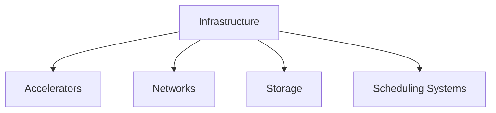
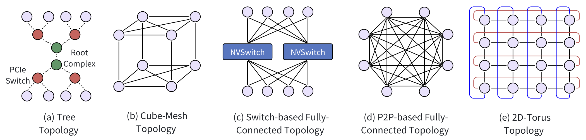
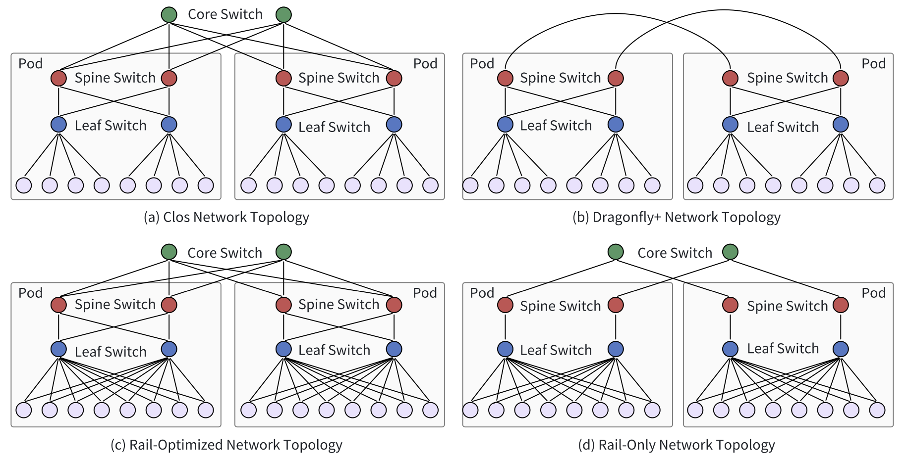
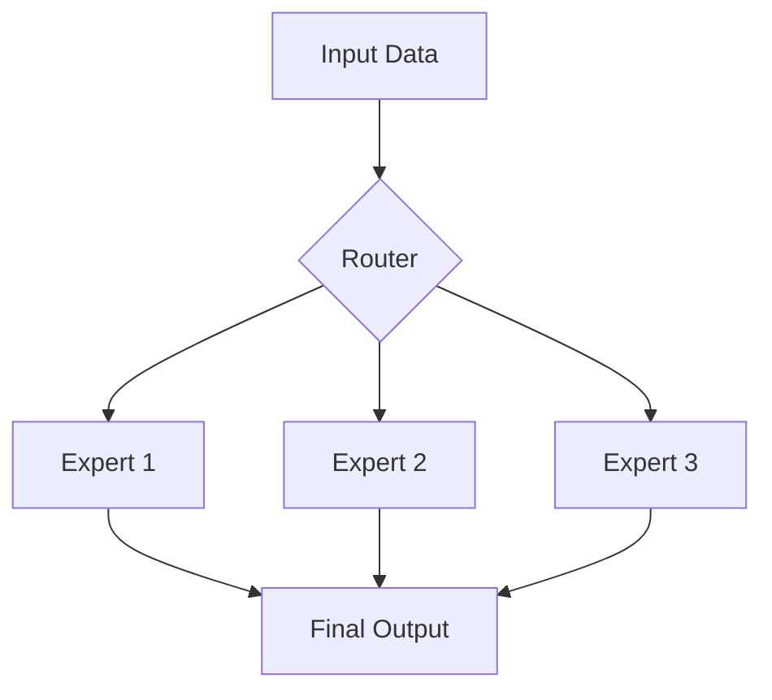

# 6. Computation- and Memory-Efficient Training of Large Language Models

We will explore efficient training strategies for Large Language Models like GPT and LLaMA. Training these models requires substantial computational resources and time. For instance, training a model like LLaMA-3 involves about 54 days on a 16K H100-80GB GPU cluster. This chapter introduces foundational concepts and practices in managing and optimizing these resources. We will cover the essentials of training infrastructure, including AI accelerators and system scheduling, and delve into strategies for enhancing computational efficiency across GPU clusters. 

Recall the [transformer-based LLM architecture](https://genai-course.jding.org/en/latest/training/index.html#transformer-model-architecture): The input text is first tokenized into individual tokens, which are then converted into token vectors X via an embedding layer. The token vectors are embedded with positional information to capture sequential dependency. The resulting token vectors are then fed into the transformer layer, which consists of an Attention block and a Feed-Forward block. Recent LLMs often retain the basic transformer architecture but include enhancements to increase efficiency and performance. The traditional Multi-Head Attention mechanism faces challenges with high computational and memory demands. To mitigate this, newer variants like Multi-Query Attention (MQA), Group-Query Attention (GQA), and Multi-Latent Attention (MLA) have been developed. Additionally, the Feed-Forward component has evolved with the Mixture-of-Experts (MoE) architecture, which activates only a selected subset of FFN layers for each input to reduce computational load while preserving the model capacity.

### Key Differences Between LLM Training and Traditional Deep Learning Training

**Unified Architecture**: Unlike traditional models that may use various architectures like CNNs or LSTMs for specific tasks, LLMs consistently utilize the Transformer architecture. This uniformity allows for specialized optimizations that can enhance system performance specifically tailored for these models.


**Training Paradigm**: Traditional deep learning models typically train on specific data for defined tasks. In contrast, LLMs learn from vast, varied datasets using a self-supervised method to develop versatile foundation models. This approach involves a multi-stage development pipeline that includes pretraining, Supervised Fine-Tuning (SFT), and alignment phases, which we discussed earlier. This shift requires new model development pipeline that includes how data annotations are conducted and models are trained.
 
**Efficient Use of Computation and Memory in LLM Training**: In training LLMs, efficiently utilizing computation and memory is crucial due to the immense size of these models. The concept of *FLOPS and MFU* is central here. The term FLOPS stands for Floating Point Operations Per Second, a measure of computer performance useful in fields like scientific computations where floating-point calculations are frequent. In the context of LLMs, MFU (Model FLOPs Utilization) measures how efficiently a model uses the available FLOPS. Essentially, it tells us how good the system is at utilizing its computational capacity.  

Maximizing MFU requires optimizing both computation and memory management across GPUs. Various forms of parallelism are key to distributing the workload efficiently, ensuring that all GPUs are fully engaged without idle time. From a computational perspective, techniques such as lower precision arithmetic are used to reduce the workload on each GPU, thereby improving FLOPS usage and overall efficiency.


**Scale**: LLMs operate on a massive scale, often involving models with hundreds of billions of parameters and terabyte-sized datasets. This requires distributed training across large GPU clusters for prolonged periods. This requires advanced fault tolerance and efficient checkpointing strategies to manage potential data loss and allow for recovery from interruptions.


## Infrastructure for Large Model Training
<!-- ```{mermaid} -->


### AI Accelerators

The rapid advancement of LLMs is heavily dependent on specialized hardware, particularly Graphics Processing Units (GPUs) and other AI accelerators that significantly enhance model training performance.


**Graphics Processing Unit (GPU)** are the cornerstone of most LLM training operations due to their architecture optimized for parallel processing:

- GPUs contain thousands of cores designed for efficient matrix and vector operations, which are fundamental to neural network computations1

- Memory Hierarchy: They feature high-bandwidth memory and large caches to handle the massive data requirements of LLM training.

- Precision Formats: Modern GPUs support various numerical precision formats (e.g., FP32, FP16, BF16) to allow for a balance between training speed and accuracy


|  | CPU | GPU |
|---------|-----|-----|
| **Definition** | Central Processing Unit | Graphics Processing Unit |
| **Core Count** | 4-8 Cores | Hundreds or thousands of cores |
| **Latency** | Low Latency | High Throughput |
| **Processing Type** | Good for Serial Processing | Good for Parallel Processing |
| **Task Management** | Quickly processes tasks that require interactivity | Breaks jobs into separate tasks to process simultaneously |
| **Programming** | Traditional programming is written for CPU sequential execution | Requires additional software to convert CPU functions to GPU functions for parallel execution |


NVIDIA GPUs, particularly their data center-focused lines like A100 and H100, are the de facto standard for LLM training due to their performance and software ecosystem (CUDA).

Other AI Accelerators are making significant inroads for LLM training. The AMD MI250X GPUs used in the Frontier supercomputer offer high memory capacity and bandwidth. Tensor Processing Units, particularly the TPUv4, are custom-built for machine learning workloads and offer substantial computational power. Cerebras CS-2 provides massive on-chip memory and specialized architecture for AI workloads.

The effectiveness of hardware accelerators for LLM training is significantly enhanced by specialized software frameworks and tools. NVIDIA's [CUDA](https://www.geeksforgeeks.org/introduction-to-cuda-programming/) parallel computing platform is widely used, providing a comprehensive ecosystem of libraries and tools optimized for their hardware. To expand options for LLM training on non-NVIDIA hardware, AMD has developed [ROCm](https://github.com/ROCm/ROCm), an open-source software stack aimed at providing CUDA compatibility.


### Network Infrastructure

Communication overhead is a major challenge in scaling LLM training. It is estimated that over 90% of the training time can be spent on communication between devices, primarily due to the process of reducing model gradients. Here, "reducing model gradients" refers to aggregating and compressing the gradients computed during training before sharing them across GPUs or nodes. While this process helps optimize memory and computation, it significantly increases the amount of data transferred over the network. To address these bottlenecks, researchers are actively improving network infrastructure to make these communications faster.


#### Chip-to-Chip Communications

Chip-to-chip communication is vital for efficient data transfer between AI accelerators within a node. The traditional standard for this communication is **PCI Express (PCIe)**, which uses a hierarchical tree topology for connecting multiple devices to a single root complex. While PCIe has improved bandwidth across versions (e.g., PCIe 5.0 offers 4 GB/s per lane), it still falls short for LLM training. As a result, newer interconnects like **NVLink** have become preferred alternatives due to their lower latency and higher bandwidth.

- **Cube-Mesh Topology:** NVLink, starting with version 1.0, offers a cube-mesh topology, allowing direct high-speed connections between GPUs. For example, in a DGX-1 server setup, a cube-mesh structure enhances data communication, improving GPU training performance by leveraging 160 GB/s of bandwidth per link.
  
- **Fully-Connected Topology:** In contrast to cube-mesh topologies that use partial or structured connections (like P2P links between a limited number of GPUs), fully-connected topologies aim to maximize direct communication between all chips in a system. For instance, NVIDIA's **NVSwitch** allows every GPU to communicate directly with every other GPU in a cluster via a central switch. This setup can provide 900 GB/s bidirectional bandwidth between GPUs in configurations like the DGX-2 system.
  
- **2D/3D-Torus Topology:** Google's TPU systems use a torus network topology to connect chips, ensuring low-latency, high-bandwidth communication. For example, TPUv4 uses a 3D-torus topology, where chips are interconnected into cubes to boost communication efficiency for LLM training.

**Figure: chip-to-chip communication topologies within a single server/node (the intra-node or internal physical layer)**
<div style="text-align:center;">
    
</div>


#### Node-to-Node Communications

Node-to-node communication involves transferring data between GPUs across different nodes in a cluster. **Remote Direct Memory Access (RDMA)** is a key technology that allows high-speed, low-latency data transfers by directly accessing the memory of one machine from another without involving the CPU. **GPUDirect-RDMA** extends this by enabling direct GPU communication across nodes, bypassing the CPU and further reducing overhead. A prevalent RDMA technology is **InfiniBand**, which can achieve speeds up to 400 Gbps.
  
- **RDMA over Converged Ethernet (RoCE):** Unlike InfiniBand, RoCE utilizes the existing Ethernet infrastructure, making it more cost-effective and easier to deploy, particularly in data centers that already rely on Ethernet.

#### Network Topology

The network topology in LLM training clusters is split into **frontend** and **backend** networks. The frontend manages tasks like job management and storage, while the backend handles high-volume traffic generated during training.

- **HPC Network Topologies:** Topologies commonly used in HPC environments are also leveraged for AI training clusters. Examples include **Clos**, **Dragonfly**, **BCube**, and **Torus** topologies. For instance, Meta's GPU cluster, used for training LLaMA 3, adopts a **Clos-based** architecture with 24,000 GPUs spread across multiple pods connected by high-bandwidth switches.
  
- **Training-Optimized Topologies:** Some topologies are co-designed with training algorithms to enhance performance. **Rail-optimized topologies**, for instance, improve communication by connecting GPUs in the same server index to the same leaf switch, optimizing data flow. 


**Figure: Network topologies for node-to-node communication across multiple servers/nodes (the inter-node or external physical layer in the larger cluster**
<div style="text-align:center;">
    
</div>


#### Load Balancing & Congestion Control

In large-scale GPU clusters, effective **load balancing** is crucial for managing the high traffic generated by LLM training. Traditional load-balancing methods like **ECMP (Equal-Cost Multi-Path routing)**, which uses hashing algorithms to distribute traffic, are inefficient for handling the large, periodic bursts of traffic common in LLM training. To address these challenges, **Enhanced-ECMP (E-ECMP)** introduces improvements by utilizing additional fields in packet headers to allow for more efficient distribution of traffic.  

In addition to load balancing, congestion control is essential for maintaining high network performance, particularly in RDMA (Remote Direct Memory Access) clusters. RDMA clusters enable direct memory access between nodes, bypassing the CPU and speeding up data transfers. To ensure lossless transmission in these environments, mechanisms like Priority-based Flow Control (PFC) are employed. PFC can pause traffic when congestion occurs, preventing packet loss, but it can also introduce issues such as head-of-line blocking, where stalled packets slow down other traffic.


### Storage

In distributed training, the **storage system** plays a critical role and must meet several key requirements. First, it needs to match the computing power of GPUs to avoid bottlenecks that could waste valuable computational resources. Second, it must handle the vast amounts of data required for training, both structured and unstructured, and scale well in a distributed environment. The system must also efficiently store and retrieve **model checkpoints**—snapshots of the model's state at various points during training. Finally, the storage system should meet enterprise-level needs such as **data protection**, **high availability**, and **security**.

#### Storage Systems for Checkpoints

**Model checkpoints** are large, especially for LLMs with billions of parameters. As model sizes grow, so does the amount of data that needs to be stored. For example, an LLM with 70 billion parameters can have a checkpoint size of 980GB. To handle this, the industry use distributed file systems like **Tectonic**, which allows thousands of GPUs to save and load checkpoints simultaneously. To avoid slowdowns when recovering checkpoints, a common approach involves having a single worker read the checkpoint and broadcast it to other workers. 

#### Storage Systems for Training Data

Training LLMs requires massive datasets. For example, **LLaMA 3** was trained on over 15 trillion tokens, which amounts to about 30 TB of data. Preparing datasets involves steps like **data crawling** and **cleaning**, and the total volume of raw data can be 100 times larger than the final training dataset. For instance, the **WanJuan-CC** dataset processes around 1 trillion high-quality tokens from 68 billion documents, which is about 2 TB of data after filtering out most of the raw data. 

To handle such large datasets efficiently, **parallel file systems** like **Lustre**, **GPFS**, and **BeeGFS** are used in high-performance computing environments. These systems ensure fast data input/output (I/O) and storage performance. Additionally, **data caching** helps reduce I/O bottlenecks by prefetching training data from slower storage systems to faster cache systems. 


### Scheduling

LLM training typically runs on large **multi-tenant infrastructures**, like GPU clusters or public clouds, where many users share the same resources. Efficient **scheduling mechanisms** are essential to manage these workloads.

### Scheduling

LLM training typically runs on large **multi-tenant infrastructures**, such as GPU clusters or public clouds, where many users share the same resources. To ensure that these resources are used efficiently, **scheduling mechanisms** are crucial for managing both the workloads and the underlying resources.

#### Workload Scheduling

Workload scheduling is concerned with managing the jobs (or tasks) running on the cluster to ensure that the system's computational power is fully utilized. The goal is to assign the right jobs to the right resources at the right time, maximizing GPU usage.

- **Heterogeneous-aware schedulers** (e.g., *Gavel*, *Gandivafair*) ensure that jobs are allocated to different generations or types of GPUs based on their specific needs, which helps in optimizing the performance of the cluster as a whole.
- **Job-packing schedulers** (e.g., *Lucid*, *FGD*) allow multiple smaller jobs to share a single GPU, ensuring that the GPU is fully utilized rather than leaving resources idle.
- **Adaptive-scaling schedulers** (e.g., *Pollux*, *Sia*) dynamically adjust the number of GPUs allocated to a job based on the job's current needs. This reduces training time by tuning the number of resources as the workload changes during different phases of training.

Recent research has focused on optimizing scheduling strategies specifically for LLM training. For example, one area aims to improve the management of parallelism and hardware allocation in heterogeneous environments. Another area of research focuses on tuning hyperparameters by using smaller, surrogate models to quickly test various configurations. Once the optimal settings are identified, they are applied to the larger models, reducing the time and computational resources required for full-scale testing.


#### Resource Scheduling

While workload scheduling deals with managing jobs, **resource scheduling** focuses on efficiently allocating and managing the underlying system resources such as **CPUs**, **memory**, **network bandwidth**, and **storage** to ensure that all hardware is fully utilized.

For **networking**, recent methods aim to balance data flow across different stages of training, preventing congestion and ensuring faster transfers. For **storage**, newer systems enhance CPU usage by allocating resources according to actual data processing needs, rather than simply based on GPU count, freeing up additional resources.  Some systems also prioritize **energy efficiency** by reducing power consumption during idle times and adjusting GPU power settings to the minimum required for training.


## Parallelism Schemes for LLM Training

| Parallelization Type        | Purpose                                              |
|-----------------------------|----------------------------------------------------------|
| **Data Parallelization**     | Divide training data into shards                       |
| **Tensor/Model Parallelization** | Divide single-layer operations or matrix multiplications |
| **Pipeline Parallelization** | Distribute transformer layers                          |
| **Model Parallelization**    | Distributes the model across GPUs                       |


### Hybrid Parallelism

Hybrid parallelism combines several parallelization strategies to partition different parts of a large language model (LLM). These strategies include data parallelism, tensor parallelism, pipeline parallelism, and sequence parallelism.  

#### Data Parallelism

**Data parallelism** is one of the most widely used methods for distributed training due to its simplicity. It splits the input training data among multiple GPUs, each processing a different part of the data. The full model is replicated across all GPUs, and during training, gradients are aggregated across GPUs for optimizer updates. This method can be fine-tuned with **sharding strategies** to reduce memory usage or communication overhead, depending on the specific hardware setup.

- **Full replication** involves copying the entire model to all GPUs, which is simple but can consume significant memory.
- **Full sharding** splits the model across all GPUs, reducing memory usage but increasing communication demands.
- **Hybrid sharding** combines both strategies for a flexible balance between memory consumption and communication overhead.


#### Code Example 

Recall the training script from [Chapter 3](https://genai-course.jding.org/en/latest/training/index.html#training). Here is a quick summary of updates you could apply to support Distributed Data Parallel (DDP) Training:

- DDP initialization using `torch.distributed.init_process_group()`, which sets up the communication between multiple GPUs across different processes

```python
ddp = int(os.environ.get("RANK", -1)) != -1  # Check if DDP is used
if ddp:
    init_process_group(backend="nccl")
    ddp_local_rank = int(os.environ["LOCAL_RANK"])
    torch.cuda.set_device(f"cuda:{ddp_local_rank}")
    ddp_world_size = int(os.environ["WORLD_SIZE"]) if ddp else 1 #the number of processes, or the number of GPUs
    device = f"cuda:{ddp_local_rank}"  # Device Assignment
```

- After the model is initialized, wrap it with `torch.nn.parallel.DistributedDataParallel` to handle gradient synchronization across GPUs
```python
if ddp: model = DDP(model, device_ids=[ddp_local_rank])
```

- Adjust `gradient_accumulation_steps`
```python
gradient_accumulation_steps //= ddp_world_size  # Adjust based on DDP world size
```

- Synchronize gradients across GPUs only at the last micro-step of gradient accumulation to reduce communication overhead
```python
model.require_backward_grad_sync = micro_step == gradient_accumulation_steps - 1
```

- Use `RANK == 0` to define the master process, which is responsible for logging and saving checkpoints
```python
master_process = int(os.environ["RANK"]) == 0 if ddp else True
if master_process:
    # Perform logging and checkpoint saving here
```

- Once training is complete, use `torch.distributed.destroy_process_group()` to properly clean up DDP processes
```python
if ddp: destroy_process_group()
```

#### Tensor Parallelism

**Tensor parallelism**, also called **intra-layer parallelism** or **model parallelism**, divides the parameters of each layer across multiple GPUs. Unlike data parallelism, which involves large data transfers, tensor parallelism mainly requires communication of smaller intermediate activations, making it more efficient in single-node environments. Tensor parallelism can be further divided into 1D, 2D, 2.5D, and 3D methods, each progressively improving memory and communication efficiency.

#### Pipeline Parallelism

**Pipeline parallelism** splits a model into stages, where each stage consists of several consecutive layers. Each stage is assigned to a different GPU or group of GPUs. Data flows through these stages in micro-batches, enabling larger models to be trained across multiple GPUs with less frequent communication. However, pipeline parallelism faces challenges like pipeline bubbles (where some GPUs are idle while waiting for others) and memory imbalances between stages.

#### Sequence Parallelism

**Sequence parallelism** addresses the challenges posed by long sequences in LLMs, which significantly increase memory and computational demands. It partitions the input sequence across GPUs to distribute the workload more efficiently. Sequence parallelism is often combined with tensor or pipeline parallelism to scale training across multiple GPUs. While this approach helps manage memory distribution, it can introduce communication and computation overhead in regions where tensor parallelism is not used. Additionally, long sequences with **causal masking** can lead to memory imbalances, as certain GPUs handle more complex attention patterns, creating load disparities.


#### Auto Parallelism

Designing effective hybrid parallelism strategies for deep neural networks on GPU clusters is a complex, time-consuming process. **Auto parallelism** aims to automatically determine the most efficient parallelization strategy for a given model on a specific GPU cluster. Auto parallelism systems can be categorized into **general frameworks** and **transformer-specific frameworks**, depending on the model architecture they target.

**General auto parallelism frameworks** automatically parallelize different types of DNNs on specific computation clusters. They typically follow three main steps: (1) defining a search space for parallelization strategies, (2) developing performance models to measure training efficiency, and (3) designing algorithms to efficiently identify the best parallelization strategy. Various works explore hybrid data and pipeline parallelism to improve DNN training.

Efficient system support is crucial for general auto parallelism frameworks due to the complexity of parallelization, especially for models that partition operators. Systems like [Mesh-TensorFlow](https://github.com/tensorflow/mesh) simplify the process by abstracting device clusters into multi-dimensional meshes, making hybrid data and model parallelism easier to implement. Other frameworks, like [OneFlow](https://github.com/Oneflow-Inc/oneflow), provide abstractions and scheduling systems to compose parallel strategies incrementally.


As LLMs are mostly based on the transformer architecture, recent works focus on building **automated parallelism systems specifically for transformers**. For example, [DeepSpeed-Autotuning](https://github.com/microsoft/DeepSpeed/blob/master/deepspeed/autotuning/autotuner.py) automatically tunes system configurations. 


### Expert Parallelism

**Mixture-of-Experts (MoE)** is a popular sparse model used in LLMs that significantly increases the number of parameters without proportionally increasing computation costs. MoE consists of multiple expert networks and a gate network that assigns input tokens to specific experts. This allows large models with trillions of parameters to be trained efficiently. 



However, due to the large size, all experts cannot fit on a single device, so frameworks like **GShard** distribute experts across multiple devices, using techniques like All-to-All communication to manage the data flow.

Different approaches have been developed to enhance expert parallelism. For example, the **Switch Transformer** assigns tokens to a single expert for better efficiency, while **DeepSpeed-MoE** optimizes communication and places more experts in deeper layers to balance accuracy and training costs. To further optimize MoE, some frameworks combine expert parallelism with other parallel methods like data and tensor parallelism. However, switching between parallelism strategies during training adds complexity and overhead.  

MoE training often faces challenges like **load imbalance**, where some experts handle more data than others. This happens when routing algorithms consistently send more tokens to certain experts, overwhelming them while other experts remain underutilized. To address this issue, one approach is to spread the workload of popular experts across multiple devices, distributing the computational load more evenly. Another method is to dynamically adjust the placement of experts based on real-time data processing needs, ensuring that resources are allocated where they are most needed. 


## Computation Optimizations

AI accelerators today offer exceptional computational power in terms of FLOPs. However, to utilize this power effectively, various computation optimization techniques are required. 

### Operator Optimizations

Operator optimizations can be manual or automatic. Manual optimizations are typically focused on specific operators like attention, while automatic optimizations are applied more broadly using compilers.

#### Manually Optimized Attention Operator

Attention mechanisms are computationally expensive with quadratic time and memory complexity relative to sequence length. A key optimization is **memory-efficient attention**, which reduces memory usage without sacrificing accuracy. In this direction, [FlashAttention](https://github.com/Dao-AILab/flash-attention) is a series of optimizations that use an IO-aware tiling algorithm to reduce memory reads/writes between slow high-bandwidth memory and fast on-chip memory. By breaking down large operations into smaller "tiles" (blocks of data), the algorithm ensures that each tile is processed in a way that makes the best use of fast memory, reducing the need for frequent, slower memory accesses. 

 
#### Automatic Optimizations via Compilers

Automatic optimizations focus on generating high-performance kernels for operators and improving data reuse between operations. Think of it like organizing a warehouse: these tools figure out how to store items (data) in the most accessible spots so workers (the computer) can move things (process tasks) as quickly as possible.
  

- **Kernel Generation**: Tools like [TVM](https://github.com/apache/tvm) and [Triton](https://github.com/triton-inference-server/server) automatically generate optimized operator implementations for various hardware backends. These compilers perform tasks such as hierarchical tiling and shared memory allocation to boost performance.

- **PyTorch Compilers**: PyTorch has introduced extensions like [TorchDynamo](https://github.com/pytorch/torchdynamo) that automatically optimize code as it runs. This technique, known as just-in-time (JIT) compilation, speeds up performance while keeping the flexibility of using Python for coding.


### Mixed-Precision Training

Mixed-precision training accelerates computations and reduces memory usage by utilizing lower precision data formats, such as 16-bit floating-point (FP16) or even 8-bit and sub-8-bit formats, instead of the standard 32-bit (FP32).

#### 16-Bit Floating Point
In mixed-precision training, 16-bit floating-point formats like FP16 and BF16 are commonly used to replace FP32, reducing both computation time and memory overhead. BF16, or bfloat16, offers **the same range as FP32 but requires less precision**. BF16 is favored for its ability to maintain numerical stability without extensive hyperparameter tuning, though it is primarily supported on newer GPUs and TPUs.

A key challenge in using FP16 is the risk of losing small gradient values, which can be addressed by **loss scaling**, where gradients are temporarily magnified to avoid underflow. 


#### Sub-8-Bit and Low-Bit Precision Training
Low-precision training techniques, such as sub-8-bit floating-point (FP8) and low-bit fixed-point (INT8, INT4), aim to reduce computational and memory overhead while maintaining accuracy. FP8 formats use methods like stochastic rounding and hybrid precision to balance range and precision during training. 

Fixed-point formats like INT8 and INT4 provide faster computation and lower memory use by representing data as integers rather than floating points. However, despite the efficiency gains, maintaining numerical stability and avoiding accuracy loss are key challenges in adopting lower-precision formats.


## Memory Optimizations

Training large language models (LLMs) consumes significant memory, and often leads to Out of Memory (OOM) errors due to hardware limitations. Memory usage can be broken down into four key components: model states, activations, temporary buffers, and memory fragmentation. We will focus on the first two.

- **Model States**: These include memory used by optimizer states, gradients, and model parameters. Mixed-precision training reduces the memory footprint by storing parameters and activations in lower precision (e.g., 16-bit instead of 32-bit). For a model with Φ parameters, storing parameters, gradients, momentum, and variance requires 16Φ bytes in total.
  
- **Activations**: Activations are the intermediate outputs generated during the forward pass and are necessary for computing gradients during the backward pass.


### Activation Recomputation and Gradient Checkpointing

Training large models can quickly exceed the memory capacity of GPUs due to the need to store activations during forward propagation. **Activation recomputation** (also known as [Gradient Checkpointing](https://pytorch.org/docs/stable/checkpoint.html)) offers a solution by reducing memory consumption. This method selectively stores intermediate activations during the forward pass, only keeping a subset in memory. The rest are recalculated during the backward pass to reduce memory usage at the cost of additional computation. This technique is particularly beneficial for environments with very limited memory.

There are two main approaches:
- **Static Evicting/Checkpointing**: A predefined strategy where specific activations are evicted or saved based on the model's architecture. This method is widely used and works well for most large models.
- **Dynamic Evicting**: Adapts in real-time based on the model’s needs, but is less commonly applied to LLM training due to its complexity.

### Redundancy Reduction

In traditional data parallelism, the entire model state is replicated across all GPUs, which wastes memory. Redundancy reduction techniques like **fully sharding** split model states across GPUs to reduce this duplication.

- **Fully Sharding**: Techniques like **ZeRO (Zero Redundancy Optimizer)** distribute optimizer states, gradients, and parameters across GPUs. This can reduce memory consumption significantly, allowing models to be trained with larger scales or batch sizes.

- **Partially Sharding**: In cases where full sharding causes communication bottlenecks, partial sharding within smaller groups of GPUs helps reduce communication costs while maintaining reasonable memory usage.

### Offloading

To train large models on fewer GPUs, parts of the data or computation can be offloaded to slower, but larger, external storage like CPUs or SSDs.

- **CPU Offloading**: Static methods pre-assign specific data to CPU memory, while dynamic methods adjust memory allocation based on real-time needs to optimize memory use without GPU stalls.
  
- **SSD Offloading**: For extremely large models, even CPU offloading might not suffice. Offloading to SSDs further increases the capacity for handling massive models, although slower than CPU memory.

Memory optimization strategies are crucial for enabling the training of massive LLMs, as they help alleviate the memory burden on GPUs by efficiently managing resources and redistributing computation and storage tasks.

### ZeRO (Zero Redundancy Optimizer)

The ZeRO optimizer has three stages, each progressively offloading more data to optimize memory usage:

- **Stage 1**: Shards optimizer states across data parallel workers/GPUs.
- **Stage 2**: Shards optimizer states and gradients across data parallel workers/GPUs.
- **Stage 3**: Shards optimizer states, gradients, and model parameters across data parallel workers/GPUs.
- **Optimizer Offload**: Offloads gradients and optimizer states to CPU/Disk (building on Stage 2).
- **Param Offload**: Offloads model parameters to CPU/Disk (building on Stage 3).


**Figure: Memory savings and communication volume for the three stages of ZeRO compared with standard data parallel baseline. In the memory consumption formula, $\Psi$ refers to the number of parameters in a model and $K$ is the optimizer-specific constant term. An example is shown for a 7.5B parameter model using [ADAM](https://arxiv.org/pdf/1412.6980.pdf) optimizer (K=12) on 64 GPUs. Communication volume measures how much data the GPUs need to share to keep the model in sync.** [image source](https://www.microsoft.com/en-us/research/blog/zero-deepspeed-new-system-optimizations-enable-training-models-with-over-100-billion-parameters/)
<div style="text-align:center;">
    
</div>


The video below shows how ZeRO (with all three stages) performs a training step including forward pass, backward pass, and parameter update: 
<div style="text-align:center;">
<video controls width="600" height="270">
  <source src="https://www.microsoft.com/en-us/research/uploads/prod/2020/02/Turing-Animation.mp4?_=1" type="video/mp4">
</video>
</div>


### Examples Using ZeRO implemented by DeepSpeed

**DeepSpeed**: a specialized optimization library designed for training large-scale models. It implements the ZeRO optimizer to significantly reduce memory usage by partitioning model states, gradients, and optimizer states across GPUs.

**Accelerate**: a higher-level library to simplify distributed training across different backends (like PyTorch's DDP, DeepSpeed, and FSDP)


#### Example 1: Using ZeRO Stage-2 to Finetune a Sequence-to-Sequence Chatbot

Suppose we aim to finetune `facebook/blenderbot-400M-distill` on the MuDoConv dataset using 2x24GB NVIDIA Titan RTX (GPU) and 60GB RAM.

First, create a `zero2_config_accelerate.json` file:
 
```json
{
  "fp16": { "enabled": "true", "loss_scale": 0, "loss_scale_window": 1000, "initial_scale_power": 15, "hysteresis": 2, "min_loss_scale": 1 },
  "optimizer": { "type": "AdamW", "params": { "lr": "auto", "weight_decay": "auto", "torch_adam": true, "adam_w_mode": true } },
  "scheduler": { "type": "WarmupDecayLR", "params": { "warmup_min_lr": "auto", "warmup_max_lr": "auto", "warmup_num_steps": "auto", "total_num_steps": "auto" } },
  "zero_optimization": { "stage": 2, "allgather_partitions": true, "allgather_bucket_size": 2e8, "overlap_comm": true, "reduce_scatter": true, "reduce_bucket_size": 2e8, "contiguous_gradients": true },
  "gradient_accumulation_steps": 1,
  "gradient_clipping": "auto",
  "steps_per_print": 2000,
  "train_batch_size": "auto",
  "train_micro_batch_size_per_gpu": "auto",
  "wall_clock_breakdown": false
}
```

To enable DeepSpeed ZeRO Stage-2 with above config, run  `accelerate config` and provide the config file path. For more details, refer to the [DeepSpeed Config File](https://huggingface.co/docs/accelerate/deepspeed#deepspeed-config-file).


Now, run below command to train using [run_seq2seq_no_trainer.py](https://github.com/pacman100/accelerate-deepspeed-test/blob/main/src/modeling/run_seq2seq_no_trainer.py).


```python
accelerate launch run_seq2seq_no_trainer.py --dataset_name "smangrul/MuDoConv" --max_source_length 128 --source_prefix "chatbot: " --max_target_length 64 --val_max_target_length 64 --val_min_target_length 20 --n_val_batch_generations 5 --n_train 10000 --n_val 1000 --pad_to_max_length --num_beams 10 --model_name_or_path "facebook/blenderbot-400M-distill" --per_device_train_batch_size 200 --per_device_eval_batch_size 100 --learning_rate 1e-6 --weight_decay 0.0 --num_train_epochs 1 --gradient_accumulation_steps 1 --num_warmup_steps 100 --output_dir "/tmp/deepspeed_zero_stage2_accelerate_test" --seed 25 --logging_steps 100
```

The following tabulated results (reported in this [blog](https://huggingface.co/blog/accelerate-deepspeed)) compare the performance of DeepSpeed ZeRO Stage-2 against the baseline method, DDP (Distributed Data Parallel).


| Method                      | Batch Size Max | Eval Size Max | Train time per epoch (s) | Eval time per epoch (s) |
|-----------------------------|----------------|---------------|-------------------------------|-------------------------------|
| DDP | 100            | 50            | 27.36                         | 48.41                         |
| DeepSpeed ZeRO Stage 2      | 200            | 100           | 19.06                         | 39.27                         |

#### Example 2: Using ZeRO Stage-3 to Train GPT-XL Model (1.5B)

Suppose we only have a single 24GB NVIDIA Titan RTX GPU. We cannot train GPT-XL (1.5B) model even with a batch size of 1. So we use DeepSpeed ZeRO Stage-3 with CPU offloading of optimizer states, gradients and parameters to train the same model.

First, create a `zero3_offload_config_accelerate.json` file:

```json
{
    "fp16": { "enabled": true, "loss_scale": 0, "loss_scale_window": 1000, "initial_scale_power": 16, "hysteresis": 2, "min_loss_scale": 1 },
    "optimizer": { "type": "AdamW", "params": { "lr": "auto", "weight_decay": "auto" }},
    "scheduler": { "type": "WarmupDecayLR", "params": { "warmup_min_lr": "auto", "warmup_max_lr": "auto", "warmup_num_steps": "auto", "total_num_steps": "auto" }},
    "zero_optimization": { "stage": 3, "offload_optimizer": { "device": "cpu" }}
}
```

Now, run below command to train using [run_clm_no_trainer.py](https://github.com/huggingface/transformers/blob/main/examples/pytorch/language-modeling/run_clm_no_trainer.py):

```python
accelerate launch run_clm_no_trainer.py --config_name "gpt2-xl" --tokenizer_name "gpt2-xl" --dataset_name "wikitext" --dataset_config_name "wikitext-2-raw-v1" --block_size 128 --output_dir "/tmp/clm_deepspeed_stage3_offload__accelerate" --learning_rate 5e-4 --per_device_train_batch_size 16 --per_device_eval_batch_size 1 --num_train_epochs 1
```

The following tabulated results (reported in this [blog](https://huggingface.co/blog/accelerate-deepspeed)) show that DDP will result in OOM error even with batch size 1, but DeepSpeed ZeRO Stage-3 CPU offload can train a batch size of 16.

| Method            | Batch Size Max | Train time per epoch (s) | Notes       |
|-------------------|----------------|--------------------------|-------------|
| DDP               | -              | -                        | OOM Error   |
| DeepSpeed ZeRO Stage 3 | 16             | 6608.35                 |             |
 
 
### Differences Between DeepSpeed and FSDP

DeepSpeed and PyTorch's Fully Sharded Data Parallel (FSDP) are two popular implementations of the ZeRO Redundancy Optimizer algorithm, but they handle precision and memory management differently:

- **Parameter Handling**
  - **DeepSpeed**: Converts parameters to float32 during training, which can increase memory usage.
  - **FSDP**: Uses the precision set by the user (e.g., bfloat16)

- **Optimizer Initialization**
  - **DeepSpeed**: Always initializes optimizer parameters in float32, regardless of training precision.
  - **FSDP**: Initializes optimizer parameters based on the chosen precision

- **Mixed Precision**
  - **DeepSpeed**: Uses a fixed mixed precision strategy.
  - **FSDP**: Adapts mixed precision to the user's specified precision

**Precision Configuration Comparison**

| Framework             | Model Loading Precision | Mixed Precision | Local Preparation | Training | Local Optimizer |
|-----------------------|--------------------------|-----------------|-------------------|----------|-----------------|
| FSDP (memory-constrained) | bfloat16               | None (default)  | bfloat16          | bfloat16 | bfloat16        |
| FSDP (mixed precision)    | bfloat16               | bfloat16        | float32           | bfloat16 | float32         |
| DeepSpeed                 | bfloat16               | bfloat16        | float32           | bfloat16 | float32         |

In summary, DeepSpeed upcasts to float32, which uses more memory but ensures stable convergence. FSDP allows users to control precision more directly, reducing memory usage and potentially speeding up training in constrained environments. 


### References


- Adaptive mixtures of local experts. [paper](https://www.cs.toronto.edu/~fritz/absps/jjnh91.pdf)
- Mixture of Experts (MoE) model for PyTorch. [code](https://github.com/laekov/fastmoe)
- ZeRO Redundancy Optimizer (Zero). [paper](https://arxiv.org/abs/1910.02054)
- DeepSpeed GitHub. [code](https://github.com/microsoft/DeepSpeed)
- Accelerate Large Model Training using DeepSpeed. [blog](https://huggingface.co/blog/accelerate-deepspeed)
- PyTorch Fully Sharded Data Parallel (FSDP). [code](https://pytorch.org/docs/stable/fsdp.html)
- Accelerate package. [code](https://huggingface.co/docs/accelerate/en/index)
- FSDP vs DeepSpeed. [blog](https://huggingface.co/blog/deepspeed-to-fsdp-and-back)
